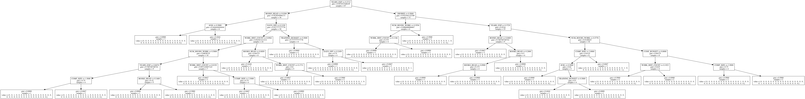

## Getting Started


```python
import numpy as np
import pandas as pd
from pandas import Series, DataFrame

pd.set_option('display.max_columns', 200)
```


```python
# Data cleaning: standardization, missing data done on the cheap outside of the Python environment
```


```python
survey_df_raw = pd.read_csv(filepath_or_buffer='chadev_survey_cleaned.csv', true_values=['Yes'], false_values=['No'], na_values=['-1'])
```


```python
survey_df_raw.tail()
```


<div>
<table border="1" class="dataframe">
  <thead>
    <tr style="text-align: right;">
      <th></th>
      <th>Timestamp</th>
      <th>YEARS_EXP</th>
      <th>NUM_HOURS_WORK</th>
      <th>DES_NUM_HOURS_WORK</th>
      <th>DAYS_OFF</th>
      <th>SALARY</th>
      <th>COMP_SIZE</th>
      <th>HEALTH_INS</th>
      <th>HEALTH_INS_PCT</th>
      <th>STACK</th>
      <th>COMP_MEALS</th>
      <th>CONF_BUDGET</th>
      <th>PAID_LUNCH_HOUR</th>
      <th>PUBLIC_SPEAKING</th>
      <th>FREE_TESLA</th>
      <th>401K</th>
      <th>TRAINING_BUDGET</th>
      <th>RIGHT_LEFT_BRAIN</th>
      <th>BOOKS_READ</th>
      <th>HIGH_SCHOOL</th>
      <th>DEGREE</th>
      <th>CAREER_DEGREE</th>
      <th>WORK_HIST_COUNT</th>
    </tr>
  </thead>
  <tbody>
    <tr>
      <th>62</th>
      <td>12/12/2015 23:22:47</td>
      <td>11.0</td>
      <td>45</td>
      <td>35</td>
      <td>20</td>
      <td>115000</td>
      <td>250</td>
      <td>True</td>
      <td>80</td>
      <td>.net; JavaScript; Linux; Clojure; Java; Csharp...</td>
      <td>4</td>
      <td>5000</td>
      <td>True</td>
      <td>True</td>
      <td>True</td>
      <td>True</td>
      <td>True</td>
      <td>True</td>
      <td>20</td>
      <td>True</td>
      <td>True</td>
      <td>True</td>
      <td>5</td>
    </tr>
    <tr>
      <th>63</th>
      <td>12/13/2015 15:11:48</td>
      <td>12.0</td>
      <td>45</td>
      <td>45</td>
      <td>15</td>
      <td>95000</td>
      <td>10</td>
      <td>True</td>
      <td>90</td>
      <td>NaN</td>
      <td>2</td>
      <td>0</td>
      <td>True</td>
      <td>True</td>
      <td>True</td>
      <td>True</td>
      <td>True</td>
      <td>True</td>
      <td>50</td>
      <td>True</td>
      <td>True</td>
      <td>True</td>
      <td>6</td>
    </tr>
    <tr>
      <th>64</th>
      <td>12/13/2015 16:44:02</td>
      <td>7.0</td>
      <td>30</td>
      <td>0</td>
      <td>0</td>
      <td>96000</td>
      <td>1</td>
      <td>False</td>
      <td>0</td>
      <td>Postgres; Node; Rails.js; Xcode; Android; Java...</td>
      <td>0</td>
      <td>2000</td>
      <td>False</td>
      <td>True</td>
      <td>True</td>
      <td>False</td>
      <td>False</td>
      <td>True</td>
      <td>16</td>
      <td>True</td>
      <td>False</td>
      <td>False</td>
      <td>4</td>
    </tr>
    <tr>
      <th>65</th>
      <td>12/15/2015 13:18:14</td>
      <td>0.5</td>
      <td>40</td>
      <td>30</td>
      <td>12</td>
      <td>40000</td>
      <td>1</td>
      <td>True</td>
      <td>NaN</td>
      <td>NaN</td>
      <td>0</td>
      <td>0</td>
      <td>True</td>
      <td>False</td>
      <td>True</td>
      <td>False</td>
      <td>False</td>
      <td>False</td>
      <td>4</td>
      <td>True</td>
      <td>True</td>
      <td>True</td>
      <td>1</td>
    </tr>
    <tr>
      <th>66</th>
      <td>1/4/2016 13:18:12</td>
      <td>2.0</td>
      <td>40</td>
      <td>40</td>
      <td>10</td>
      <td>30000</td>
      <td>10</td>
      <td>False</td>
      <td>0</td>
      <td>Angular; MySQL; Javascript</td>
      <td>0</td>
      <td>0</td>
      <td>False</td>
      <td>False</td>
      <td>True</td>
      <td>False</td>
      <td>False</td>
      <td>True</td>
      <td>3</td>
      <td>True</td>
      <td>False</td>
      <td>False</td>
      <td>2</td>
    </tr>
  </tbody>
</table>
</div>


```python
# Binning: Categorize company size by number of employees
```


```python
def companySizeCat(numEmployees):
    if numEmployees < 7: # micro
        return 1
    elif numEmployees < 250: # small
        return 2
    elif numEmployees < 500: # medium
        return 3
    elif numEmployees < 1000: # large
        return 4
    else: # enterprise
        return 5 
```


```python
survey_df_raw['COMP_SIZE'] = survey_df_raw['COMP_SIZE'].apply(lambda x: companySizeCat(x))
```


```python
survey_df_raw.head()
```


<div>
<table border="1" class="dataframe">
  <thead>
    <tr style="text-align: right;">
      <th></th>
      <th>YEARS_EXP</th>
      <th>NUM_HOURS_WORK</th>
      <th>DAYS_OFF</th>
      <th>SALARY</th>
      <th>COMP_SIZE</th>
      <th>HEALTH_INS</th>
      <th>STACK</th>
      <th>COMP_MEALS</th>
      <th>CONF_BUDGET</th>
      <th>401K</th>
      <th>TRAINING_BUDGET</th>
      <th>BOOKS_READ</th>
      <th>DEGREE</th>
      <th>CAREER_DEGREE</th>
      <th>WORK_HIST_COUNT</th>
    </tr>
  </thead>
  <tbody>
    <tr>
      <th>0</th>
      <td>5</td>
      <td>35</td>
      <td>20</td>
      <td>70000</td>
      <td>1</td>
      <td>True</td>
      <td>rails; angular; javascript; ruby</td>
      <td>4</td>
      <td>0</td>
      <td>False</td>
      <td>False</td>
      <td>0</td>
      <td>True</td>
      <td>True</td>
      <td>8</td>
    </tr>
    <tr>
      <th>1</th>
      <td>10</td>
      <td>40</td>
      <td>0</td>
      <td>120000</td>
      <td>1</td>
      <td>False</td>
      <td>linux; apache; mysql; php; lemp; javascript; f...</td>
      <td>4</td>
      <td>3000</td>
      <td>False</td>
      <td>True</td>
      <td>3</td>
      <td>False</td>
      <td>False</td>
      <td>6</td>
    </tr>
    <tr>
      <th>2</th>
      <td>11</td>
      <td>45</td>
      <td>15</td>
      <td>75000</td>
      <td>2</td>
      <td>True</td>
      <td>.NET; Puppet; Java; Windows; Debian; Node; Jav...</td>
      <td>0</td>
      <td>0</td>
      <td>False</td>
      <td>False</td>
      <td>2</td>
      <td>True</td>
      <td>True</td>
      <td>6</td>
    </tr>
    <tr>
      <th>3</th>
      <td>6</td>
      <td>40</td>
      <td>16</td>
      <td>77000</td>
      <td>2</td>
      <td>True</td>
      <td>Linux; PHP; Nginx; Postgresql</td>
      <td>0</td>
      <td>0</td>
      <td>False</td>
      <td>False</td>
      <td>10</td>
      <td>True</td>
      <td>True</td>
      <td>3</td>
    </tr>
    <tr>
      <th>4</th>
      <td>6</td>
      <td>50</td>
      <td>14</td>
      <td>70000</td>
      <td>2</td>
      <td>True</td>
      <td>Ruby; Rails; PHP; Magento; Nginx; Linux; OS X</td>
      <td>0</td>
      <td>0</td>
      <td>False</td>
      <td>False</td>
      <td>3</td>
      <td>False</td>
      <td>False</td>
      <td>3</td>
    </tr>
  </tbody>
</table>
</div>


```python
# Drop columns that don't give any particular insight (subjectively chosen)
```


```python
survey_df_raw.drop(['Timestamp', 'DES_NUM_HOURS_WORK', 'HEALTH_INS_PCT', 'PAID_LUNCH_HOUR', 
                    'PUBLIC_SPEAKING', 'FREE_TESLA', 'RIGHT_LEFT_BRAIN', 'HIGH_SCHOOL'], axis=1, inplace=True);
```


```python
survey_df_raw.columns
```


    Index([u'YEARS_EXP', u'NUM_HOURS_WORK', u'DAYS_OFF', u'SALARY', u'COMP_SIZE',
           u'HEALTH_INS', u'STACK', u'COMP_MEALS', u'CONF_BUDGET', u'401K',
           u'TRAINING_BUDGET', u'BOOKS_READ', u'DEGREE', u'CAREER_DEGREE',
           u'WORK_HIST_COUNT'],
          dtype='object')


```python
# Let's try to understand the data
```


```python
survey_df_raw.describe()
```


<div>
<table border="1" class="dataframe">
  <thead>
    <tr style="text-align: right;">
      <th></th>
      <th>YEARS_EXP</th>
      <th>NUM_HOURS_WORK</th>
      <th>DAYS_OFF</th>
      <th>SALARY</th>
      <th>COMP_SIZE</th>
      <th>HEALTH_INS</th>
      <th>COMP_MEALS</th>
      <th>CONF_BUDGET</th>
      <th>401K</th>
      <th>TRAINING_BUDGET</th>
      <th>BOOKS_READ</th>
      <th>DEGREE</th>
      <th>CAREER_DEGREE</th>
      <th>WORK_HIST_COUNT</th>
    </tr>
  </thead>
  <tbody>
    <tr>
      <th>count</th>
      <td>67.000000</td>
      <td>67.000000</td>
      <td>67.000000</td>
      <td>67.000000</td>
      <td>67.000000</td>
      <td>67</td>
      <td>67.000000</td>
      <td>67.000000</td>
      <td>67</td>
      <td>67</td>
      <td>67.000000</td>
      <td>67</td>
      <td>67</td>
      <td>67.000000</td>
    </tr>
    <tr>
      <th>mean</th>
      <td>9.305970</td>
      <td>43.044776</td>
      <td>21.059701</td>
      <td>82020.149254</td>
      <td>198.925373</td>
      <td>0.880597</td>
      <td>1.343284</td>
      <td>5302.238806</td>
      <td>0.6268657</td>
      <td>0.3731343</td>
      <td>8.828358</td>
      <td>0.7761194</td>
      <td>0.6119403</td>
      <td>5.328358</td>
    </tr>
    <tr>
      <th>std</th>
      <td>7.335032</td>
      <td>6.883077</td>
      <td>16.737619</td>
      <td>28621.548435</td>
      <td>329.753595</td>
      <td>0.3267094</td>
      <td>2.421821</td>
      <td>27144.660774</td>
      <td>0.4872875</td>
      <td>0.4872875</td>
      <td>10.460804</td>
      <td>0.419989</td>
      <td>0.4909861</td>
      <td>4.247595</td>
    </tr>
    <tr>
      <th>min</th>
      <td>0.500000</td>
      <td>20.000000</td>
      <td>0.000000</td>
      <td>20000.000000</td>
      <td>1.000000</td>
      <td>False</td>
      <td>0.000000</td>
      <td>0.000000</td>
      <td>False</td>
      <td>False</td>
      <td>0.000000</td>
      <td>False</td>
      <td>False</td>
      <td>1.000000</td>
    </tr>
    <tr>
      <th>25%</th>
      <td>4.000000</td>
      <td>40.000000</td>
      <td>14.000000</td>
      <td>65000.000000</td>
      <td>10.000000</td>
      <td>1</td>
      <td>0.000000</td>
      <td>0.000000</td>
      <td>0</td>
      <td>0</td>
      <td>2.500000</td>
      <td>1</td>
      <td>0</td>
      <td>3.000000</td>
    </tr>
    <tr>
      <th>50%</th>
      <td>7.000000</td>
      <td>40.000000</td>
      <td>20.000000</td>
      <td>77000.000000</td>
      <td>30.000000</td>
      <td>1</td>
      <td>0.000000</td>
      <td>0.000000</td>
      <td>1</td>
      <td>0</td>
      <td>5.000000</td>
      <td>1</td>
      <td>1</td>
      <td>4.000000</td>
    </tr>
    <tr>
      <th>75%</th>
      <td>12.000000</td>
      <td>47.000000</td>
      <td>23.500000</td>
      <td>95000.000000</td>
      <td>250.000000</td>
      <td>1</td>
      <td>2.000000</td>
      <td>475.000000</td>
      <td>1</td>
      <td>1</td>
      <td>10.000000</td>
      <td>1</td>
      <td>1</td>
      <td>6.000000</td>
    </tr>
    <tr>
      <th>max</th>
      <td>30.000000</td>
      <td>65.000000</td>
      <td>100.000000</td>
      <td>185000.000000</td>
      <td>1001.000000</td>
      <td>True</td>
      <td>10.000000</td>
      <td>200000.000000</td>
      <td>True</td>
      <td>True</td>
      <td>50.000000</td>
      <td>True</td>
      <td>True</td>
      <td>27.000000</td>
    </tr>
  </tbody>
</table>
</div>


## Now on to questions

### Question 1: What is the most common company size, years of experience, number of jobs, number of books read, salary


```python
sel_columns_df = survey_df_raw[['COMP_SIZE','YEARS_EXP', 'WORK_HIST_COUNT', 'BOOKS_READ', 'SALARY']]
sel_columns_df.mode()
```


<div>
<table border="1" class="dataframe">
  <thead>
    <tr style="text-align: right;">
      <th></th>
      <th>COMP_SIZE</th>
      <th>YEARS_EXP</th>
      <th>WORK_HIST_COUNT</th>
      <th>BOOKS_READ</th>
      <th>SALARY</th>
    </tr>
  </thead>
  <tbody>
    <tr>
      <th>0</th>
      <td>2</td>
      <td>10</td>
      <td>3</td>
      <td>3</td>
      <td>75000</td>
    </tr>
    <tr>
      <th>1</th>
      <td>NaN</td>
      <td>NaN</td>
      <td>4</td>
      <td>NaN</td>
      <td>NaN</td>
    </tr>
  </tbody>
</table>
</div>


### Question 2: What are the most common stack tools?

To answer this we need to first vectorize the free-text in the stack


```python
# Define a function to tokenize the raw text entered by the users 
def tokenizr(text):
    tokens = text.split(";");
    return [ token.strip() for token in tokens if token.isspace() == False ]
    
```


```python
# Vectorize the text using sklearn provided CountVectorizer
from sklearn.feature_extraction.text import TfidfVectorizer, CountVectorizer

tools = survey_df_raw['STACK'];
tools.fillna('', inplace=True);

tf_vectorizer = CountVectorizer(tokenizer=tokenizr);
tools_matrix = tf_vectorizer.fit_transform(tools);
```


```python
# Produces a matrix
tools_matrix.shape
```


    (67, 161)


```python
tf_vectorizer.get_feature_names()
```


    [u'',
     u'.net',
     u'airflow',
     u'android',
     u'anger',
     u'angular',
     u'ansible',
     u'apache',
     u'apex',
     u'asp .net',
     u'asp mvc',
     u'atom',
     u'aws',
     u'baby bottles & burping cloths.',
     u'bash',
     u'bootstrap',
     u'brainpower',
     u'c++',
     u'centos',
     u'chairs',
     u'classic asp',
     u'clojure',
     u'cognos',
     u'computers',
     u'consul',
     u'csharp',
     u'css',
     u'css3',
     u'db2 for z/os',
     u'db2 luw',
     u'debian',
     u'digitalocean',
     u'divshot',
     u'django',
     u'docker',
     u'drupal',
     u'ec2',
     u'eclipse ide',
     u'elasticache',
     u'elasticsearch',
     u'elixir',
     u'ember',
     u'es6',
     u'excel',
     u'express',
     u'express.js',
     u'flask',
     u'flux',
     u'force.com platform',
     u'fsharp',
     u'giphy',
     u'git',
     u'github',
     u'go',
     u'google',
     u'google docs',
     u'google drive',
     u'google hangouts',
     u'gotomeeting',
     u'graphite',
     u'gulp',
     u'hand tools',
     u'hate',
     u'heroku',
     u'hipchat',
     u'hl7',
     u'html',
     u'html5',
     u'iis',
     u'ims',
     u'internet',
     u'java',
     u'javascript',
     u'jekyll',
     u'jenkins',
     u'jira',
     u'jquery',
     u'jruby',
     u'keras',
     u'kibana',
     u'knockout',
     u'knockout.js',
     u'kubernetes',
     u'lasers',
     u'lemp',
     u'line scan cameras',
     u'linux',
     u'magento',
     u'mercurial',
     u'mesos',
     u'microsoft',
     u'mongodb',
     u'mssql',
     u'mysql',
     u'netezza',
     u'nginx',
     u'node',
     u'obj c',
     u'oracle',
     u'os x',
     u'outlook',
     u'perl',
     u'phone',
     u'php',
     u'plc/mlc',
     u'postgres',
     u'postgresql',
     u'power tools',
     u'powershell',
     u'puppet',
     u'python',
     u'rabbitmq',
     u'rackspace',
     u'rails',
     u'rails.js',
     u'rds',
     u'react',
     u'redis',
     u'redshift',
     u'redux',
     u'rhel',
     u'ruby',
     u's3',
     u'sails',
     u'salesforce',
     u'sass',
     u'scikit-learn',
     u'scss',
     u'segment.io',
     u'selenium',
     u'server 2012',
     u'sinatra',
     u'skype',
     u'slack',
     u'sql',
     u'sql server',
     u'ssh',
     u'stack overflow',
     u'sublime text',
     u'surreal.cms',
     u'swift',
     u'teamcity',
     u'teradata',
     u'terminals',
     u'torquebox',
     u'ubuntu',
     u'vagrant',
     u'vb',
     u'vba',
     u'vero',
     u'vim',
     u'visual studio',
     u'visual studio 2012',
     u'vmware',
     u'windows',
     u'windows batch files',
     u'windows server',
     u'wordpress',
     u'wp',
     u'xcode',
     u'xslt']


```python
# Turn the matrix into a dataframe
tools_matrix_df = DataFrame(data=tools_matrix.toarray(), columns=tf_vectorizer.get_feature_names())

# Join the dataframe to the survey data frame
survey_df_wTM = survey_df_raw.join(tools_matrix_df)
survey_df_wTM.drop(['STACK'], axis=1, inplace=True)

# visualize
survey_df_wTM.head()
```


<div>
<table border="1" class="dataframe">
  <thead>
    <tr style="text-align: right;">
      <th></th>
      <th>YEARS_EXP</th>
      <th>NUM_HOURS_WORK</th>
      <th>DAYS_OFF</th>
      <th>SALARY</th>
      <th>COMP_SIZE</th>
      <th>HEALTH_INS</th>
      <th>COMP_MEALS</th>
      <th>CONF_BUDGET</th>
      <th>401K</th>
      <th>TRAINING_BUDGET</th>
      <th>BOOKS_READ</th>
      <th>DEGREE</th>
      <th>CAREER_DEGREE</th>
      <th>WORK_HIST_COUNT</th>
      <th></th>
      <th>.net</th>
      <th>airflow</th>
      <th>android</th>
      <th>anger</th>
      <th>angular</th>
      <th>ansible</th>
      <th>apache</th>
      <th>apex</th>
      <th>asp .net</th>
      <th>asp mvc</th>
      <th>atom</th>
      <th>aws</th>
      <th>baby bottles &amp; burping cloths.</th>
      <th>bash</th>
      <th>bootstrap</th>
      <th>brainpower</th>
      <th>c++</th>
      <th>centos</th>
      <th>chairs</th>
      <th>classic asp</th>
      <th>clojure</th>
      <th>cognos</th>
      <th>computers</th>
      <th>consul</th>
      <th>csharp</th>
      <th>css</th>
      <th>css3</th>
      <th>db2 for z/os</th>
      <th>db2 luw</th>
      <th>debian</th>
      <th>digitalocean</th>
      <th>divshot</th>
      <th>django</th>
      <th>docker</th>
      <th>drupal</th>
      <th>ec2</th>
      <th>eclipse ide</th>
      <th>elasticache</th>
      <th>elasticsearch</th>
      <th>elixir</th>
      <th>ember</th>
      <th>es6</th>
      <th>excel</th>
      <th>express</th>
      <th>express.js</th>
      <th>flask</th>
      <th>flux</th>
      <th>force.com platform</th>
      <th>fsharp</th>
      <th>giphy</th>
      <th>git</th>
      <th>github</th>
      <th>go</th>
      <th>google</th>
      <th>google docs</th>
      <th>google drive</th>
      <th>google hangouts</th>
      <th>gotomeeting</th>
      <th>graphite</th>
      <th>gulp</th>
      <th>hand tools</th>
      <th>hate</th>
      <th>heroku</th>
      <th>hipchat</th>
      <th>hl7</th>
      <th>html</th>
      <th>html5</th>
      <th>iis</th>
      <th>ims</th>
      <th>internet</th>
      <th>java</th>
      <th>javascript</th>
      <th>jekyll</th>
      <th>jenkins</th>
      <th>jira</th>
      <th>jquery</th>
      <th>jruby</th>
      <th>keras</th>
      <th>kibana</th>
      <th>knockout</th>
      <th>knockout.js</th>
      <th>kubernetes</th>
      <th>lasers</th>
      <th>lemp</th>
      <th>line scan cameras</th>
      <th>linux</th>
      <th>magento</th>
      <th>mercurial</th>
      <th>mesos</th>
      <th>microsoft</th>
      <th>mongodb</th>
      <th>mssql</th>
      <th>mysql</th>
      <th>netezza</th>
      <th>nginx</th>
      <th>node</th>
      <th>obj c</th>
      <th>oracle</th>
      <th>os x</th>
      <th>outlook</th>
      <th>perl</th>
      <th>phone</th>
      <th>php</th>
      <th>plc/mlc</th>
      <th>postgres</th>
      <th>postgresql</th>
      <th>power tools</th>
      <th>powershell</th>
      <th>puppet</th>
      <th>python</th>
      <th>rabbitmq</th>
      <th>rackspace</th>
      <th>rails</th>
      <th>rails.js</th>
      <th>rds</th>
      <th>react</th>
      <th>redis</th>
      <th>redshift</th>
      <th>redux</th>
      <th>rhel</th>
      <th>ruby</th>
      <th>s3</th>
      <th>sails</th>
      <th>salesforce</th>
      <th>sass</th>
      <th>scikit-learn</th>
      <th>scss</th>
      <th>segment.io</th>
      <th>selenium</th>
      <th>server 2012</th>
      <th>sinatra</th>
      <th>skype</th>
      <th>slack</th>
      <th>sql</th>
      <th>sql server</th>
      <th>ssh</th>
      <th>stack overflow</th>
      <th>sublime text</th>
      <th>surreal.cms</th>
      <th>swift</th>
      <th>teamcity</th>
      <th>teradata</th>
      <th>terminals</th>
      <th>torquebox</th>
      <th>ubuntu</th>
      <th>vagrant</th>
      <th>vb</th>
      <th>vba</th>
      <th>vero</th>
      <th>vim</th>
      <th>visual studio</th>
      <th>visual studio 2012</th>
      <th>vmware</th>
      <th>windows</th>
      <th>windows batch files</th>
      <th>windows server</th>
      <th>wordpress</th>
      <th>wp</th>
      <th>xcode</th>
      <th>xslt</th>
    </tr>
  </thead>
  <tbody>
    <tr>
      <th>0</th>
      <td>5</td>
      <td>35</td>
      <td>20</td>
      <td>70000</td>
      <td>1</td>
      <td>True</td>
      <td>4</td>
      <td>0</td>
      <td>False</td>
      <td>False</td>
      <td>0</td>
      <td>True</td>
      <td>True</td>
      <td>8</td>
      <td>0</td>
      <td>0</td>
      <td>0</td>
      <td>0</td>
      <td>0</td>
      <td>1</td>
      <td>0</td>
      <td>0</td>
      <td>0</td>
      <td>0</td>
      <td>0</td>
      <td>0</td>
      <td>0</td>
      <td>0</td>
      <td>0</td>
      <td>0</td>
      <td>0</td>
      <td>0</td>
      <td>0</td>
      <td>0</td>
      <td>0</td>
      <td>0</td>
      <td>0</td>
      <td>0</td>
      <td>0</td>
      <td>0</td>
      <td>0</td>
      <td>0</td>
      <td>0</td>
      <td>0</td>
      <td>0</td>
      <td>0</td>
      <td>0</td>
      <td>0</td>
      <td>0</td>
      <td>0</td>
      <td>0</td>
      <td>0</td>
      <td>0</td>
      <td>0</td>
      <td>0</td>
      <td>0</td>
      <td>0</td>
      <td>0</td>
      <td>0</td>
      <td>0</td>
      <td>0</td>
      <td>0</td>
      <td>0</td>
      <td>0</td>
      <td>0</td>
      <td>0</td>
      <td>0</td>
      <td>0</td>
      <td>0</td>
      <td>0</td>
      <td>0</td>
      <td>0</td>
      <td>0</td>
      <td>0</td>
      <td>0</td>
      <td>0</td>
      <td>0</td>
      <td>0</td>
      <td>0</td>
      <td>0</td>
      <td>0</td>
      <td>0</td>
      <td>0</td>
      <td>0</td>
      <td>0</td>
      <td>0</td>
      <td>1</td>
      <td>0</td>
      <td>0</td>
      <td>0</td>
      <td>0</td>
      <td>0</td>
      <td>0</td>
      <td>0</td>
      <td>0</td>
      <td>0</td>
      <td>0</td>
      <td>0</td>
      <td>0</td>
      <td>0</td>
      <td>0</td>
      <td>0</td>
      <td>0</td>
      <td>0</td>
      <td>0</td>
      <td>0</td>
      <td>0</td>
      <td>0</td>
      <td>0</td>
      <td>0</td>
      <td>0</td>
      <td>0</td>
      <td>0</td>
      <td>0</td>
      <td>0</td>
      <td>0</td>
      <td>0</td>
      <td>0</td>
      <td>0</td>
      <td>0</td>
      <td>0</td>
      <td>0</td>
      <td>0</td>
      <td>0</td>
      <td>0</td>
      <td>0</td>
      <td>0</td>
      <td>1</td>
      <td>0</td>
      <td>0</td>
      <td>0</td>
      <td>0</td>
      <td>0</td>
      <td>0</td>
      <td>0</td>
      <td>1</td>
      <td>0</td>
      <td>0</td>
      <td>0</td>
      <td>0</td>
      <td>0</td>
      <td>0</td>
      <td>0</td>
      <td>0</td>
      <td>0</td>
      <td>0</td>
      <td>0</td>
      <td>0</td>
      <td>0</td>
      <td>0</td>
      <td>0</td>
      <td>0</td>
      <td>0</td>
      <td>0</td>
      <td>0</td>
      <td>0</td>
      <td>0</td>
      <td>0</td>
      <td>0</td>
      <td>0</td>
      <td>0</td>
      <td>0</td>
      <td>0</td>
      <td>0</td>
      <td>0</td>
      <td>0</td>
      <td>0</td>
      <td>0</td>
      <td>0</td>
      <td>0</td>
      <td>0</td>
      <td>0</td>
      <td>0</td>
      <td>0</td>
      <td>0</td>
    </tr>
    <tr>
      <th>1</th>
      <td>10</td>
      <td>40</td>
      <td>0</td>
      <td>120000</td>
      <td>1</td>
      <td>False</td>
      <td>4</td>
      <td>3000</td>
      <td>False</td>
      <td>True</td>
      <td>3</td>
      <td>False</td>
      <td>False</td>
      <td>6</td>
      <td>0</td>
      <td>0</td>
      <td>0</td>
      <td>0</td>
      <td>0</td>
      <td>0</td>
      <td>0</td>
      <td>1</td>
      <td>0</td>
      <td>0</td>
      <td>0</td>
      <td>0</td>
      <td>0</td>
      <td>0</td>
      <td>0</td>
      <td>0</td>
      <td>0</td>
      <td>0</td>
      <td>0</td>
      <td>0</td>
      <td>0</td>
      <td>0</td>
      <td>0</td>
      <td>0</td>
      <td>0</td>
      <td>0</td>
      <td>0</td>
      <td>0</td>
      <td>0</td>
      <td>0</td>
      <td>0</td>
      <td>0</td>
      <td>0</td>
      <td>0</td>
      <td>0</td>
      <td>0</td>
      <td>0</td>
      <td>0</td>
      <td>0</td>
      <td>0</td>
      <td>0</td>
      <td>0</td>
      <td>0</td>
      <td>0</td>
      <td>0</td>
      <td>0</td>
      <td>1</td>
      <td>0</td>
      <td>0</td>
      <td>0</td>
      <td>0</td>
      <td>0</td>
      <td>0</td>
      <td>0</td>
      <td>0</td>
      <td>0</td>
      <td>0</td>
      <td>0</td>
      <td>0</td>
      <td>0</td>
      <td>0</td>
      <td>0</td>
      <td>0</td>
      <td>0</td>
      <td>0</td>
      <td>0</td>
      <td>0</td>
      <td>0</td>
      <td>0</td>
      <td>0</td>
      <td>0</td>
      <td>0</td>
      <td>1</td>
      <td>0</td>
      <td>0</td>
      <td>0</td>
      <td>0</td>
      <td>0</td>
      <td>0</td>
      <td>0</td>
      <td>0</td>
      <td>0</td>
      <td>0</td>
      <td>0</td>
      <td>1</td>
      <td>0</td>
      <td>1</td>
      <td>0</td>
      <td>0</td>
      <td>0</td>
      <td>0</td>
      <td>0</td>
      <td>0</td>
      <td>1</td>
      <td>0</td>
      <td>0</td>
      <td>0</td>
      <td>0</td>
      <td>0</td>
      <td>0</td>
      <td>0</td>
      <td>0</td>
      <td>0</td>
      <td>1</td>
      <td>0</td>
      <td>0</td>
      <td>0</td>
      <td>0</td>
      <td>0</td>
      <td>0</td>
      <td>1</td>
      <td>0</td>
      <td>0</td>
      <td>0</td>
      <td>0</td>
      <td>0</td>
      <td>0</td>
      <td>0</td>
      <td>0</td>
      <td>0</td>
      <td>0</td>
      <td>0</td>
      <td>0</td>
      <td>0</td>
      <td>0</td>
      <td>0</td>
      <td>0</td>
      <td>0</td>
      <td>0</td>
      <td>0</td>
      <td>0</td>
      <td>0</td>
      <td>0</td>
      <td>0</td>
      <td>0</td>
      <td>0</td>
      <td>0</td>
      <td>0</td>
      <td>0</td>
      <td>0</td>
      <td>0</td>
      <td>0</td>
      <td>0</td>
      <td>0</td>
      <td>0</td>
      <td>0</td>
      <td>0</td>
      <td>0</td>
      <td>0</td>
      <td>0</td>
      <td>0</td>
      <td>0</td>
      <td>0</td>
      <td>0</td>
      <td>0</td>
      <td>0</td>
      <td>0</td>
      <td>0</td>
      <td>0</td>
      <td>0</td>
      <td>0</td>
    </tr>
    <tr>
      <th>2</th>
      <td>11</td>
      <td>45</td>
      <td>15</td>
      <td>75000</td>
      <td>2</td>
      <td>True</td>
      <td>0</td>
      <td>0</td>
      <td>False</td>
      <td>False</td>
      <td>2</td>
      <td>True</td>
      <td>True</td>
      <td>6</td>
      <td>0</td>
      <td>1</td>
      <td>0</td>
      <td>0</td>
      <td>0</td>
      <td>0</td>
      <td>0</td>
      <td>0</td>
      <td>0</td>
      <td>0</td>
      <td>0</td>
      <td>0</td>
      <td>0</td>
      <td>0</td>
      <td>0</td>
      <td>0</td>
      <td>0</td>
      <td>0</td>
      <td>0</td>
      <td>0</td>
      <td>0</td>
      <td>0</td>
      <td>0</td>
      <td>0</td>
      <td>0</td>
      <td>0</td>
      <td>0</td>
      <td>0</td>
      <td>0</td>
      <td>0</td>
      <td>1</td>
      <td>0</td>
      <td>0</td>
      <td>0</td>
      <td>0</td>
      <td>0</td>
      <td>0</td>
      <td>0</td>
      <td>0</td>
      <td>0</td>
      <td>0</td>
      <td>0</td>
      <td>0</td>
      <td>0</td>
      <td>0</td>
      <td>0</td>
      <td>0</td>
      <td>0</td>
      <td>0</td>
      <td>0</td>
      <td>0</td>
      <td>0</td>
      <td>0</td>
      <td>0</td>
      <td>0</td>
      <td>0</td>
      <td>0</td>
      <td>0</td>
      <td>0</td>
      <td>0</td>
      <td>0</td>
      <td>0</td>
      <td>0</td>
      <td>0</td>
      <td>0</td>
      <td>0</td>
      <td>0</td>
      <td>0</td>
      <td>0</td>
      <td>0</td>
      <td>0</td>
      <td>1</td>
      <td>1</td>
      <td>0</td>
      <td>0</td>
      <td>0</td>
      <td>0</td>
      <td>0</td>
      <td>0</td>
      <td>0</td>
      <td>0</td>
      <td>0</td>
      <td>0</td>
      <td>0</td>
      <td>0</td>
      <td>0</td>
      <td>1</td>
      <td>0</td>
      <td>0</td>
      <td>0</td>
      <td>0</td>
      <td>0</td>
      <td>1</td>
      <td>1</td>
      <td>0</td>
      <td>0</td>
      <td>1</td>
      <td>0</td>
      <td>0</td>
      <td>0</td>
      <td>0</td>
      <td>0</td>
      <td>0</td>
      <td>0</td>
      <td>0</td>
      <td>1</td>
      <td>0</td>
      <td>0</td>
      <td>0</td>
      <td>1</td>
      <td>0</td>
      <td>0</td>
      <td>0</td>
      <td>0</td>
      <td>0</td>
      <td>0</td>
      <td>0</td>
      <td>0</td>
      <td>0</td>
      <td>0</td>
      <td>0</td>
      <td>0</td>
      <td>0</td>
      <td>0</td>
      <td>0</td>
      <td>0</td>
      <td>0</td>
      <td>0</td>
      <td>0</td>
      <td>0</td>
      <td>0</td>
      <td>0</td>
      <td>0</td>
      <td>0</td>
      <td>0</td>
      <td>0</td>
      <td>0</td>
      <td>0</td>
      <td>0</td>
      <td>0</td>
      <td>0</td>
      <td>0</td>
      <td>0</td>
      <td>0</td>
      <td>0</td>
      <td>0</td>
      <td>0</td>
      <td>0</td>
      <td>0</td>
      <td>0</td>
      <td>0</td>
      <td>0</td>
      <td>0</td>
      <td>0</td>
      <td>1</td>
      <td>0</td>
      <td>0</td>
      <td>0</td>
      <td>0</td>
      <td>0</td>
      <td>0</td>
    </tr>
    <tr>
      <th>3</th>
      <td>6</td>
      <td>40</td>
      <td>16</td>
      <td>77000</td>
      <td>2</td>
      <td>True</td>
      <td>0</td>
      <td>0</td>
      <td>False</td>
      <td>False</td>
      <td>10</td>
      <td>True</td>
      <td>True</td>
      <td>3</td>
      <td>0</td>
      <td>0</td>
      <td>0</td>
      <td>0</td>
      <td>0</td>
      <td>0</td>
      <td>0</td>
      <td>0</td>
      <td>0</td>
      <td>0</td>
      <td>0</td>
      <td>0</td>
      <td>0</td>
      <td>0</td>
      <td>0</td>
      <td>0</td>
      <td>0</td>
      <td>0</td>
      <td>0</td>
      <td>0</td>
      <td>0</td>
      <td>0</td>
      <td>0</td>
      <td>0</td>
      <td>0</td>
      <td>0</td>
      <td>0</td>
      <td>0</td>
      <td>0</td>
      <td>0</td>
      <td>0</td>
      <td>0</td>
      <td>0</td>
      <td>0</td>
      <td>0</td>
      <td>0</td>
      <td>0</td>
      <td>0</td>
      <td>0</td>
      <td>0</td>
      <td>0</td>
      <td>0</td>
      <td>0</td>
      <td>0</td>
      <td>0</td>
      <td>0</td>
      <td>0</td>
      <td>0</td>
      <td>0</td>
      <td>0</td>
      <td>0</td>
      <td>0</td>
      <td>0</td>
      <td>0</td>
      <td>0</td>
      <td>0</td>
      <td>0</td>
      <td>0</td>
      <td>0</td>
      <td>0</td>
      <td>0</td>
      <td>0</td>
      <td>0</td>
      <td>0</td>
      <td>0</td>
      <td>0</td>
      <td>0</td>
      <td>0</td>
      <td>0</td>
      <td>0</td>
      <td>0</td>
      <td>0</td>
      <td>0</td>
      <td>0</td>
      <td>0</td>
      <td>0</td>
      <td>0</td>
      <td>0</td>
      <td>0</td>
      <td>0</td>
      <td>0</td>
      <td>0</td>
      <td>0</td>
      <td>0</td>
      <td>0</td>
      <td>0</td>
      <td>1</td>
      <td>0</td>
      <td>0</td>
      <td>0</td>
      <td>0</td>
      <td>0</td>
      <td>0</td>
      <td>0</td>
      <td>0</td>
      <td>1</td>
      <td>0</td>
      <td>0</td>
      <td>0</td>
      <td>0</td>
      <td>0</td>
      <td>0</td>
      <td>0</td>
      <td>1</td>
      <td>0</td>
      <td>0</td>
      <td>1</td>
      <td>0</td>
      <td>0</td>
      <td>0</td>
      <td>0</td>
      <td>0</td>
      <td>0</td>
      <td>0</td>
      <td>0</td>
      <td>0</td>
      <td>0</td>
      <td>0</td>
      <td>0</td>
      <td>0</td>
      <td>0</td>
      <td>0</td>
      <td>0</td>
      <td>0</td>
      <td>0</td>
      <td>0</td>
      <td>0</td>
      <td>0</td>
      <td>0</td>
      <td>0</td>
      <td>0</td>
      <td>0</td>
      <td>0</td>
      <td>0</td>
      <td>0</td>
      <td>0</td>
      <td>0</td>
      <td>0</td>
      <td>0</td>
      <td>0</td>
      <td>0</td>
      <td>0</td>
      <td>0</td>
      <td>0</td>
      <td>0</td>
      <td>0</td>
      <td>0</td>
      <td>0</td>
      <td>0</td>
      <td>0</td>
      <td>0</td>
      <td>0</td>
      <td>0</td>
      <td>0</td>
      <td>0</td>
      <td>0</td>
      <td>0</td>
      <td>0</td>
      <td>0</td>
      <td>0</td>
      <td>0</td>
    </tr>
    <tr>
      <th>4</th>
      <td>6</td>
      <td>50</td>
      <td>14</td>
      <td>70000</td>
      <td>2</td>
      <td>True</td>
      <td>0</td>
      <td>0</td>
      <td>False</td>
      <td>False</td>
      <td>3</td>
      <td>False</td>
      <td>False</td>
      <td>3</td>
      <td>0</td>
      <td>0</td>
      <td>0</td>
      <td>0</td>
      <td>0</td>
      <td>0</td>
      <td>0</td>
      <td>0</td>
      <td>0</td>
      <td>0</td>
      <td>0</td>
      <td>0</td>
      <td>0</td>
      <td>0</td>
      <td>0</td>
      <td>0</td>
      <td>0</td>
      <td>0</td>
      <td>0</td>
      <td>0</td>
      <td>0</td>
      <td>0</td>
      <td>0</td>
      <td>0</td>
      <td>0</td>
      <td>0</td>
      <td>0</td>
      <td>0</td>
      <td>0</td>
      <td>0</td>
      <td>0</td>
      <td>0</td>
      <td>0</td>
      <td>0</td>
      <td>0</td>
      <td>0</td>
      <td>0</td>
      <td>0</td>
      <td>0</td>
      <td>0</td>
      <td>0</td>
      <td>0</td>
      <td>0</td>
      <td>0</td>
      <td>0</td>
      <td>0</td>
      <td>0</td>
      <td>0</td>
      <td>0</td>
      <td>0</td>
      <td>0</td>
      <td>0</td>
      <td>0</td>
      <td>0</td>
      <td>0</td>
      <td>0</td>
      <td>0</td>
      <td>0</td>
      <td>0</td>
      <td>0</td>
      <td>0</td>
      <td>0</td>
      <td>0</td>
      <td>0</td>
      <td>0</td>
      <td>0</td>
      <td>0</td>
      <td>0</td>
      <td>0</td>
      <td>0</td>
      <td>0</td>
      <td>0</td>
      <td>0</td>
      <td>0</td>
      <td>0</td>
      <td>0</td>
      <td>0</td>
      <td>0</td>
      <td>0</td>
      <td>0</td>
      <td>0</td>
      <td>0</td>
      <td>0</td>
      <td>0</td>
      <td>0</td>
      <td>0</td>
      <td>1</td>
      <td>1</td>
      <td>0</td>
      <td>0</td>
      <td>0</td>
      <td>0</td>
      <td>0</td>
      <td>0</td>
      <td>0</td>
      <td>1</td>
      <td>0</td>
      <td>0</td>
      <td>0</td>
      <td>1</td>
      <td>0</td>
      <td>0</td>
      <td>0</td>
      <td>1</td>
      <td>0</td>
      <td>0</td>
      <td>0</td>
      <td>0</td>
      <td>0</td>
      <td>0</td>
      <td>0</td>
      <td>0</td>
      <td>0</td>
      <td>1</td>
      <td>0</td>
      <td>0</td>
      <td>0</td>
      <td>0</td>
      <td>0</td>
      <td>0</td>
      <td>0</td>
      <td>1</td>
      <td>0</td>
      <td>0</td>
      <td>0</td>
      <td>0</td>
      <td>0</td>
      <td>0</td>
      <td>0</td>
      <td>0</td>
      <td>0</td>
      <td>0</td>
      <td>0</td>
      <td>0</td>
      <td>0</td>
      <td>0</td>
      <td>0</td>
      <td>0</td>
      <td>0</td>
      <td>0</td>
      <td>0</td>
      <td>0</td>
      <td>0</td>
      <td>0</td>
      <td>0</td>
      <td>0</td>
      <td>0</td>
      <td>0</td>
      <td>0</td>
      <td>0</td>
      <td>0</td>
      <td>0</td>
      <td>0</td>
      <td>0</td>
      <td>0</td>
      <td>0</td>
      <td>0</td>
      <td>0</td>
      <td>0</td>
      <td>0</td>
      <td>0</td>
    </tr>
  </tbody>
</table>
</div>


```python
# Get the most mentioned stack tools by summing the values of the tools_matrix_df
# Results show we have a very webby crowd (or at the very least, lots of full-stack developers)
X = tools_matrix_df.sum()

X.sort(ascending=False)
X.head(10)
```


    javascript    39
    linux         23
    node          22
    ruby          22
    rails         19
    postgres      19
    nginx         16
    php           15
    mysql         14
    angular       12
    dtype: int64


### Question 3: Are there commonalities in groups of responders that machine learning can sniff out on our behalf?

Cluster the survey responses together to see if there are common groups of responders. See what the characteristics of those groups are.


```python
# Using a basic KMeans algorithm
from sklearn.cluster import KMeans
kmeans = KMeans(n_clusters=5, max_iter=500)

# Attempt 1: Just give it all the data in its raw, naked glory and see what it comes up with
kmeans.fit(survey_df_wTM)
kmeans.labels_
```


    array([0, 2, 0, 0, 0, 3, 0, 3, 2, 2, 0, 0, 2, 0, 0, 0, 0, 0, 0, 0, 3, 0, 1,
           4, 0, 0, 0, 0, 0, 3, 3, 0, 2, 0, 0, 0, 0, 3, 2, 3, 0, 0, 2, 0, 0, 0,
           3, 0, 0, 0, 2, 3, 3, 3, 3, 3, 3, 2, 2, 0, 3, 2, 2, 0, 0, 3, 3], dtype=int32)


```python
# Taking a look at what records were assigned to what cluster, I notice a disturbing trend: Salary is outweighing 
#   all other features
survey_df_c1 = survey_df_wTM.copy()
survey_df_c1.insert(0, 'CLUSTER1_LABEL', kmeans.labels_)
survey_df_c1.head(10)
```


<div>
<table border="1" class="dataframe">
  <thead>
    <tr style="text-align: right;">
      <th></th>
      <th>CLUSTER1_LABEL</th>
      <th>YEARS_EXP</th>
      <th>NUM_HOURS_WORK</th>
      <th>DAYS_OFF</th>
      <th>SALARY</th>
      <th>COMP_SIZE</th>
      <th>HEALTH_INS</th>
      <th>COMP_MEALS</th>
      <th>CONF_BUDGET</th>
      <th>401K</th>
      <th>TRAINING_BUDGET</th>
      <th>BOOKS_READ</th>
      <th>DEGREE</th>
      <th>CAREER_DEGREE</th>
      <th>WORK_HIST_COUNT</th>
      <th></th>
      <th>.net</th>
      <th>airflow</th>
      <th>android</th>
      <th>anger</th>
      <th>angular</th>
      <th>ansible</th>
      <th>apache</th>
      <th>apex</th>
      <th>asp .net</th>
      <th>asp mvc</th>
      <th>atom</th>
      <th>aws</th>
      <th>baby bottles &amp; burping cloths.</th>
      <th>bash</th>
      <th>bootstrap</th>
      <th>brainpower</th>
      <th>c++</th>
      <th>centos</th>
      <th>chairs</th>
      <th>classic asp</th>
      <th>clojure</th>
      <th>cognos</th>
      <th>computers</th>
      <th>consul</th>
      <th>csharp</th>
      <th>css</th>
      <th>css3</th>
      <th>db2 for z/os</th>
      <th>db2 luw</th>
      <th>debian</th>
      <th>digitalocean</th>
      <th>divshot</th>
      <th>django</th>
      <th>docker</th>
      <th>drupal</th>
      <th>ec2</th>
      <th>eclipse ide</th>
      <th>elasticache</th>
      <th>elasticsearch</th>
      <th>elixir</th>
      <th>ember</th>
      <th>es6</th>
      <th>excel</th>
      <th>express</th>
      <th>express.js</th>
      <th>flask</th>
      <th>flux</th>
      <th>force.com platform</th>
      <th>fsharp</th>
      <th>giphy</th>
      <th>git</th>
      <th>github</th>
      <th>go</th>
      <th>google</th>
      <th>google docs</th>
      <th>google drive</th>
      <th>google hangouts</th>
      <th>gotomeeting</th>
      <th>graphite</th>
      <th>gulp</th>
      <th>hand tools</th>
      <th>hate</th>
      <th>heroku</th>
      <th>hipchat</th>
      <th>hl7</th>
      <th>html</th>
      <th>html5</th>
      <th>iis</th>
      <th>ims</th>
      <th>internet</th>
      <th>java</th>
      <th>javascript</th>
      <th>jekyll</th>
      <th>jenkins</th>
      <th>jira</th>
      <th>jquery</th>
      <th>jruby</th>
      <th>keras</th>
      <th>kibana</th>
      <th>knockout</th>
      <th>knockout.js</th>
      <th>kubernetes</th>
      <th>lasers</th>
      <th>lemp</th>
      <th>line scan cameras</th>
      <th>linux</th>
      <th>magento</th>
      <th>mercurial</th>
      <th>mesos</th>
      <th>microsoft</th>
      <th>mongodb</th>
      <th>mssql</th>
      <th>mysql</th>
      <th>netezza</th>
      <th>nginx</th>
      <th>node</th>
      <th>obj c</th>
      <th>oracle</th>
      <th>os x</th>
      <th>outlook</th>
      <th>perl</th>
      <th>phone</th>
      <th>php</th>
      <th>plc/mlc</th>
      <th>postgres</th>
      <th>postgresql</th>
      <th>power tools</th>
      <th>powershell</th>
      <th>puppet</th>
      <th>python</th>
      <th>rabbitmq</th>
      <th>rackspace</th>
      <th>rails</th>
      <th>rails.js</th>
      <th>rds</th>
      <th>react</th>
      <th>redis</th>
      <th>redshift</th>
      <th>redux</th>
      <th>rhel</th>
      <th>ruby</th>
      <th>s3</th>
      <th>sails</th>
      <th>salesforce</th>
      <th>sass</th>
      <th>scikit-learn</th>
      <th>scss</th>
      <th>segment.io</th>
      <th>selenium</th>
      <th>server 2012</th>
      <th>sinatra</th>
      <th>skype</th>
      <th>slack</th>
      <th>sql</th>
      <th>sql server</th>
      <th>ssh</th>
      <th>stack overflow</th>
      <th>sublime text</th>
      <th>surreal.cms</th>
      <th>swift</th>
      <th>teamcity</th>
      <th>teradata</th>
      <th>terminals</th>
      <th>torquebox</th>
      <th>ubuntu</th>
      <th>vagrant</th>
      <th>vb</th>
      <th>vba</th>
      <th>vero</th>
      <th>vim</th>
      <th>visual studio</th>
      <th>visual studio 2012</th>
      <th>vmware</th>
      <th>windows</th>
      <th>windows batch files</th>
      <th>windows server</th>
      <th>wordpress</th>
      <th>wp</th>
      <th>xcode</th>
      <th>xslt</th>
    </tr>
  </thead>
  <tbody>
    <tr>
      <th>0</th>
      <td>0</td>
      <td>5</td>
      <td>35</td>
      <td>20</td>
      <td>70000</td>
      <td>1</td>
      <td>True</td>
      <td>4</td>
      <td>0</td>
      <td>False</td>
      <td>False</td>
      <td>0</td>
      <td>True</td>
      <td>True</td>
      <td>8</td>
      <td>0</td>
      <td>0</td>
      <td>0</td>
      <td>0</td>
      <td>0</td>
      <td>1</td>
      <td>0</td>
      <td>0</td>
      <td>0</td>
      <td>0</td>
      <td>0</td>
      <td>0</td>
      <td>0</td>
      <td>0</td>
      <td>0</td>
      <td>0</td>
      <td>0</td>
      <td>0</td>
      <td>0</td>
      <td>0</td>
      <td>0</td>
      <td>0</td>
      <td>0</td>
      <td>0</td>
      <td>0</td>
      <td>0</td>
      <td>0</td>
      <td>0</td>
      <td>0</td>
      <td>0</td>
      <td>0</td>
      <td>0</td>
      <td>0</td>
      <td>0</td>
      <td>0</td>
      <td>0</td>
      <td>0</td>
      <td>0</td>
      <td>0</td>
      <td>0</td>
      <td>0</td>
      <td>0</td>
      <td>0</td>
      <td>0</td>
      <td>0</td>
      <td>0</td>
      <td>0</td>
      <td>0</td>
      <td>0</td>
      <td>0</td>
      <td>0</td>
      <td>0</td>
      <td>0</td>
      <td>0</td>
      <td>0</td>
      <td>0</td>
      <td>0</td>
      <td>0</td>
      <td>0</td>
      <td>0</td>
      <td>0</td>
      <td>0</td>
      <td>0</td>
      <td>0</td>
      <td>0</td>
      <td>0</td>
      <td>0</td>
      <td>0</td>
      <td>0</td>
      <td>0</td>
      <td>0</td>
      <td>0</td>
      <td>1</td>
      <td>0</td>
      <td>0</td>
      <td>0</td>
      <td>0</td>
      <td>0</td>
      <td>0</td>
      <td>0</td>
      <td>0</td>
      <td>0</td>
      <td>0</td>
      <td>0</td>
      <td>0</td>
      <td>0</td>
      <td>0</td>
      <td>0</td>
      <td>0</td>
      <td>0</td>
      <td>0</td>
      <td>0</td>
      <td>0</td>
      <td>0</td>
      <td>0</td>
      <td>0</td>
      <td>0</td>
      <td>0</td>
      <td>0</td>
      <td>0</td>
      <td>0</td>
      <td>0</td>
      <td>0</td>
      <td>0</td>
      <td>0</td>
      <td>0</td>
      <td>0</td>
      <td>0</td>
      <td>0</td>
      <td>0</td>
      <td>0</td>
      <td>0</td>
      <td>0</td>
      <td>1</td>
      <td>0</td>
      <td>0</td>
      <td>0</td>
      <td>0</td>
      <td>0</td>
      <td>0</td>
      <td>0</td>
      <td>1</td>
      <td>0</td>
      <td>0</td>
      <td>0</td>
      <td>0</td>
      <td>0</td>
      <td>0</td>
      <td>0</td>
      <td>0</td>
      <td>0</td>
      <td>0</td>
      <td>0</td>
      <td>0</td>
      <td>0</td>
      <td>0</td>
      <td>0</td>
      <td>0</td>
      <td>0</td>
      <td>0</td>
      <td>0</td>
      <td>0</td>
      <td>0</td>
      <td>0</td>
      <td>0</td>
      <td>0</td>
      <td>0</td>
      <td>0</td>
      <td>0</td>
      <td>0</td>
      <td>0</td>
      <td>0</td>
      <td>0</td>
      <td>0</td>
      <td>0</td>
      <td>0</td>
      <td>0</td>
      <td>0</td>
      <td>0</td>
      <td>0</td>
      <td>0</td>
    </tr>
    <tr>
      <th>1</th>
      <td>2</td>
      <td>10</td>
      <td>40</td>
      <td>0</td>
      <td>120000</td>
      <td>1</td>
      <td>False</td>
      <td>4</td>
      <td>3000</td>
      <td>False</td>
      <td>True</td>
      <td>3</td>
      <td>False</td>
      <td>False</td>
      <td>6</td>
      <td>0</td>
      <td>0</td>
      <td>0</td>
      <td>0</td>
      <td>0</td>
      <td>0</td>
      <td>0</td>
      <td>1</td>
      <td>0</td>
      <td>0</td>
      <td>0</td>
      <td>0</td>
      <td>0</td>
      <td>0</td>
      <td>0</td>
      <td>0</td>
      <td>0</td>
      <td>0</td>
      <td>0</td>
      <td>0</td>
      <td>0</td>
      <td>0</td>
      <td>0</td>
      <td>0</td>
      <td>0</td>
      <td>0</td>
      <td>0</td>
      <td>0</td>
      <td>0</td>
      <td>0</td>
      <td>0</td>
      <td>0</td>
      <td>0</td>
      <td>0</td>
      <td>0</td>
      <td>0</td>
      <td>0</td>
      <td>0</td>
      <td>0</td>
      <td>0</td>
      <td>0</td>
      <td>0</td>
      <td>0</td>
      <td>0</td>
      <td>0</td>
      <td>0</td>
      <td>1</td>
      <td>0</td>
      <td>0</td>
      <td>0</td>
      <td>0</td>
      <td>0</td>
      <td>0</td>
      <td>0</td>
      <td>0</td>
      <td>0</td>
      <td>0</td>
      <td>0</td>
      <td>0</td>
      <td>0</td>
      <td>0</td>
      <td>0</td>
      <td>0</td>
      <td>0</td>
      <td>0</td>
      <td>0</td>
      <td>0</td>
      <td>0</td>
      <td>0</td>
      <td>0</td>
      <td>0</td>
      <td>0</td>
      <td>1</td>
      <td>0</td>
      <td>0</td>
      <td>0</td>
      <td>0</td>
      <td>0</td>
      <td>0</td>
      <td>0</td>
      <td>0</td>
      <td>0</td>
      <td>0</td>
      <td>0</td>
      <td>1</td>
      <td>0</td>
      <td>1</td>
      <td>0</td>
      <td>0</td>
      <td>0</td>
      <td>0</td>
      <td>0</td>
      <td>0</td>
      <td>1</td>
      <td>0</td>
      <td>0</td>
      <td>0</td>
      <td>0</td>
      <td>0</td>
      <td>0</td>
      <td>0</td>
      <td>0</td>
      <td>0</td>
      <td>1</td>
      <td>0</td>
      <td>0</td>
      <td>0</td>
      <td>0</td>
      <td>0</td>
      <td>0</td>
      <td>1</td>
      <td>0</td>
      <td>0</td>
      <td>0</td>
      <td>0</td>
      <td>0</td>
      <td>0</td>
      <td>0</td>
      <td>0</td>
      <td>0</td>
      <td>0</td>
      <td>0</td>
      <td>0</td>
      <td>0</td>
      <td>0</td>
      <td>0</td>
      <td>0</td>
      <td>0</td>
      <td>0</td>
      <td>0</td>
      <td>0</td>
      <td>0</td>
      <td>0</td>
      <td>0</td>
      <td>0</td>
      <td>0</td>
      <td>0</td>
      <td>0</td>
      <td>0</td>
      <td>0</td>
      <td>0</td>
      <td>0</td>
      <td>0</td>
      <td>0</td>
      <td>0</td>
      <td>0</td>
      <td>0</td>
      <td>0</td>
      <td>0</td>
      <td>0</td>
      <td>0</td>
      <td>0</td>
      <td>0</td>
      <td>0</td>
      <td>0</td>
      <td>0</td>
      <td>0</td>
      <td>0</td>
      <td>0</td>
      <td>0</td>
      <td>0</td>
    </tr>
    <tr>
      <th>2</th>
      <td>0</td>
      <td>11</td>
      <td>45</td>
      <td>15</td>
      <td>75000</td>
      <td>2</td>
      <td>True</td>
      <td>0</td>
      <td>0</td>
      <td>False</td>
      <td>False</td>
      <td>2</td>
      <td>True</td>
      <td>True</td>
      <td>6</td>
      <td>0</td>
      <td>1</td>
      <td>0</td>
      <td>0</td>
      <td>0</td>
      <td>0</td>
      <td>0</td>
      <td>0</td>
      <td>0</td>
      <td>0</td>
      <td>0</td>
      <td>0</td>
      <td>0</td>
      <td>0</td>
      <td>0</td>
      <td>0</td>
      <td>0</td>
      <td>0</td>
      <td>0</td>
      <td>0</td>
      <td>0</td>
      <td>0</td>
      <td>0</td>
      <td>0</td>
      <td>0</td>
      <td>0</td>
      <td>0</td>
      <td>0</td>
      <td>0</td>
      <td>0</td>
      <td>1</td>
      <td>0</td>
      <td>0</td>
      <td>0</td>
      <td>0</td>
      <td>0</td>
      <td>0</td>
      <td>0</td>
      <td>0</td>
      <td>0</td>
      <td>0</td>
      <td>0</td>
      <td>0</td>
      <td>0</td>
      <td>0</td>
      <td>0</td>
      <td>0</td>
      <td>0</td>
      <td>0</td>
      <td>0</td>
      <td>0</td>
      <td>0</td>
      <td>0</td>
      <td>0</td>
      <td>0</td>
      <td>0</td>
      <td>0</td>
      <td>0</td>
      <td>0</td>
      <td>0</td>
      <td>0</td>
      <td>0</td>
      <td>0</td>
      <td>0</td>
      <td>0</td>
      <td>0</td>
      <td>0</td>
      <td>0</td>
      <td>0</td>
      <td>0</td>
      <td>0</td>
      <td>1</td>
      <td>1</td>
      <td>0</td>
      <td>0</td>
      <td>0</td>
      <td>0</td>
      <td>0</td>
      <td>0</td>
      <td>0</td>
      <td>0</td>
      <td>0</td>
      <td>0</td>
      <td>0</td>
      <td>0</td>
      <td>0</td>
      <td>1</td>
      <td>0</td>
      <td>0</td>
      <td>0</td>
      <td>0</td>
      <td>0</td>
      <td>1</td>
      <td>1</td>
      <td>0</td>
      <td>0</td>
      <td>1</td>
      <td>0</td>
      <td>0</td>
      <td>0</td>
      <td>0</td>
      <td>0</td>
      <td>0</td>
      <td>0</td>
      <td>0</td>
      <td>1</td>
      <td>0</td>
      <td>0</td>
      <td>0</td>
      <td>1</td>
      <td>0</td>
      <td>0</td>
      <td>0</td>
      <td>0</td>
      <td>0</td>
      <td>0</td>
      <td>0</td>
      <td>0</td>
      <td>0</td>
      <td>0</td>
      <td>0</td>
      <td>0</td>
      <td>0</td>
      <td>0</td>
      <td>0</td>
      <td>0</td>
      <td>0</td>
      <td>0</td>
      <td>0</td>
      <td>0</td>
      <td>0</td>
      <td>0</td>
      <td>0</td>
      <td>0</td>
      <td>0</td>
      <td>0</td>
      <td>0</td>
      <td>0</td>
      <td>0</td>
      <td>0</td>
      <td>0</td>
      <td>0</td>
      <td>0</td>
      <td>0</td>
      <td>0</td>
      <td>0</td>
      <td>0</td>
      <td>0</td>
      <td>0</td>
      <td>0</td>
      <td>0</td>
      <td>0</td>
      <td>0</td>
      <td>0</td>
      <td>1</td>
      <td>0</td>
      <td>0</td>
      <td>0</td>
      <td>0</td>
      <td>0</td>
      <td>0</td>
    </tr>
    <tr>
      <th>3</th>
      <td>0</td>
      <td>6</td>
      <td>40</td>
      <td>16</td>
      <td>77000</td>
      <td>2</td>
      <td>True</td>
      <td>0</td>
      <td>0</td>
      <td>False</td>
      <td>False</td>
      <td>10</td>
      <td>True</td>
      <td>True</td>
      <td>3</td>
      <td>0</td>
      <td>0</td>
      <td>0</td>
      <td>0</td>
      <td>0</td>
      <td>0</td>
      <td>0</td>
      <td>0</td>
      <td>0</td>
      <td>0</td>
      <td>0</td>
      <td>0</td>
      <td>0</td>
      <td>0</td>
      <td>0</td>
      <td>0</td>
      <td>0</td>
      <td>0</td>
      <td>0</td>
      <td>0</td>
      <td>0</td>
      <td>0</td>
      <td>0</td>
      <td>0</td>
      <td>0</td>
      <td>0</td>
      <td>0</td>
      <td>0</td>
      <td>0</td>
      <td>0</td>
      <td>0</td>
      <td>0</td>
      <td>0</td>
      <td>0</td>
      <td>0</td>
      <td>0</td>
      <td>0</td>
      <td>0</td>
      <td>0</td>
      <td>0</td>
      <td>0</td>
      <td>0</td>
      <td>0</td>
      <td>0</td>
      <td>0</td>
      <td>0</td>
      <td>0</td>
      <td>0</td>
      <td>0</td>
      <td>0</td>
      <td>0</td>
      <td>0</td>
      <td>0</td>
      <td>0</td>
      <td>0</td>
      <td>0</td>
      <td>0</td>
      <td>0</td>
      <td>0</td>
      <td>0</td>
      <td>0</td>
      <td>0</td>
      <td>0</td>
      <td>0</td>
      <td>0</td>
      <td>0</td>
      <td>0</td>
      <td>0</td>
      <td>0</td>
      <td>0</td>
      <td>0</td>
      <td>0</td>
      <td>0</td>
      <td>0</td>
      <td>0</td>
      <td>0</td>
      <td>0</td>
      <td>0</td>
      <td>0</td>
      <td>0</td>
      <td>0</td>
      <td>0</td>
      <td>0</td>
      <td>0</td>
      <td>0</td>
      <td>0</td>
      <td>1</td>
      <td>0</td>
      <td>0</td>
      <td>0</td>
      <td>0</td>
      <td>0</td>
      <td>0</td>
      <td>0</td>
      <td>0</td>
      <td>1</td>
      <td>0</td>
      <td>0</td>
      <td>0</td>
      <td>0</td>
      <td>0</td>
      <td>0</td>
      <td>0</td>
      <td>1</td>
      <td>0</td>
      <td>0</td>
      <td>1</td>
      <td>0</td>
      <td>0</td>
      <td>0</td>
      <td>0</td>
      <td>0</td>
      <td>0</td>
      <td>0</td>
      <td>0</td>
      <td>0</td>
      <td>0</td>
      <td>0</td>
      <td>0</td>
      <td>0</td>
      <td>0</td>
      <td>0</td>
      <td>0</td>
      <td>0</td>
      <td>0</td>
      <td>0</td>
      <td>0</td>
      <td>0</td>
      <td>0</td>
      <td>0</td>
      <td>0</td>
      <td>0</td>
      <td>0</td>
      <td>0</td>
      <td>0</td>
      <td>0</td>
      <td>0</td>
      <td>0</td>
      <td>0</td>
      <td>0</td>
      <td>0</td>
      <td>0</td>
      <td>0</td>
      <td>0</td>
      <td>0</td>
      <td>0</td>
      <td>0</td>
      <td>0</td>
      <td>0</td>
      <td>0</td>
      <td>0</td>
      <td>0</td>
      <td>0</td>
      <td>0</td>
      <td>0</td>
      <td>0</td>
      <td>0</td>
      <td>0</td>
      <td>0</td>
      <td>0</td>
      <td>0</td>
    </tr>
    <tr>
      <th>4</th>
      <td>0</td>
      <td>6</td>
      <td>50</td>
      <td>14</td>
      <td>70000</td>
      <td>2</td>
      <td>True</td>
      <td>0</td>
      <td>0</td>
      <td>False</td>
      <td>False</td>
      <td>3</td>
      <td>False</td>
      <td>False</td>
      <td>3</td>
      <td>0</td>
      <td>0</td>
      <td>0</td>
      <td>0</td>
      <td>0</td>
      <td>0</td>
      <td>0</td>
      <td>0</td>
      <td>0</td>
      <td>0</td>
      <td>0</td>
      <td>0</td>
      <td>0</td>
      <td>0</td>
      <td>0</td>
      <td>0</td>
      <td>0</td>
      <td>0</td>
      <td>0</td>
      <td>0</td>
      <td>0</td>
      <td>0</td>
      <td>0</td>
      <td>0</td>
      <td>0</td>
      <td>0</td>
      <td>0</td>
      <td>0</td>
      <td>0</td>
      <td>0</td>
      <td>0</td>
      <td>0</td>
      <td>0</td>
      <td>0</td>
      <td>0</td>
      <td>0</td>
      <td>0</td>
      <td>0</td>
      <td>0</td>
      <td>0</td>
      <td>0</td>
      <td>0</td>
      <td>0</td>
      <td>0</td>
      <td>0</td>
      <td>0</td>
      <td>0</td>
      <td>0</td>
      <td>0</td>
      <td>0</td>
      <td>0</td>
      <td>0</td>
      <td>0</td>
      <td>0</td>
      <td>0</td>
      <td>0</td>
      <td>0</td>
      <td>0</td>
      <td>0</td>
      <td>0</td>
      <td>0</td>
      <td>0</td>
      <td>0</td>
      <td>0</td>
      <td>0</td>
      <td>0</td>
      <td>0</td>
      <td>0</td>
      <td>0</td>
      <td>0</td>
      <td>0</td>
      <td>0</td>
      <td>0</td>
      <td>0</td>
      <td>0</td>
      <td>0</td>
      <td>0</td>
      <td>0</td>
      <td>0</td>
      <td>0</td>
      <td>0</td>
      <td>0</td>
      <td>0</td>
      <td>0</td>
      <td>0</td>
      <td>0</td>
      <td>1</td>
      <td>1</td>
      <td>0</td>
      <td>0</td>
      <td>0</td>
      <td>0</td>
      <td>0</td>
      <td>0</td>
      <td>0</td>
      <td>1</td>
      <td>0</td>
      <td>0</td>
      <td>0</td>
      <td>1</td>
      <td>0</td>
      <td>0</td>
      <td>0</td>
      <td>1</td>
      <td>0</td>
      <td>0</td>
      <td>0</td>
      <td>0</td>
      <td>0</td>
      <td>0</td>
      <td>0</td>
      <td>0</td>
      <td>0</td>
      <td>1</td>
      <td>0</td>
      <td>0</td>
      <td>0</td>
      <td>0</td>
      <td>0</td>
      <td>0</td>
      <td>0</td>
      <td>1</td>
      <td>0</td>
      <td>0</td>
      <td>0</td>
      <td>0</td>
      <td>0</td>
      <td>0</td>
      <td>0</td>
      <td>0</td>
      <td>0</td>
      <td>0</td>
      <td>0</td>
      <td>0</td>
      <td>0</td>
      <td>0</td>
      <td>0</td>
      <td>0</td>
      <td>0</td>
      <td>0</td>
      <td>0</td>
      <td>0</td>
      <td>0</td>
      <td>0</td>
      <td>0</td>
      <td>0</td>
      <td>0</td>
      <td>0</td>
      <td>0</td>
      <td>0</td>
      <td>0</td>
      <td>0</td>
      <td>0</td>
      <td>0</td>
      <td>0</td>
      <td>0</td>
      <td>0</td>
      <td>0</td>
      <td>0</td>
      <td>0</td>
      <td>0</td>
    </tr>
    <tr>
      <th>5</th>
      <td>3</td>
      <td>2</td>
      <td>50</td>
      <td>14</td>
      <td>45000</td>
      <td>1</td>
      <td>False</td>
      <td>0</td>
      <td>0</td>
      <td>False</td>
      <td>True</td>
      <td>4</td>
      <td>True</td>
      <td>False</td>
      <td>1</td>
      <td>0</td>
      <td>0</td>
      <td>0</td>
      <td>0</td>
      <td>0</td>
      <td>0</td>
      <td>0</td>
      <td>0</td>
      <td>0</td>
      <td>0</td>
      <td>0</td>
      <td>1</td>
      <td>0</td>
      <td>0</td>
      <td>0</td>
      <td>0</td>
      <td>0</td>
      <td>0</td>
      <td>0</td>
      <td>0</td>
      <td>0</td>
      <td>0</td>
      <td>0</td>
      <td>0</td>
      <td>0</td>
      <td>0</td>
      <td>1</td>
      <td>0</td>
      <td>0</td>
      <td>0</td>
      <td>0</td>
      <td>0</td>
      <td>0</td>
      <td>0</td>
      <td>0</td>
      <td>0</td>
      <td>0</td>
      <td>0</td>
      <td>0</td>
      <td>0</td>
      <td>0</td>
      <td>0</td>
      <td>0</td>
      <td>0</td>
      <td>0</td>
      <td>0</td>
      <td>0</td>
      <td>0</td>
      <td>0</td>
      <td>0</td>
      <td>0</td>
      <td>0</td>
      <td>0</td>
      <td>0</td>
      <td>0</td>
      <td>0</td>
      <td>0</td>
      <td>0</td>
      <td>0</td>
      <td>0</td>
      <td>1</td>
      <td>0</td>
      <td>0</td>
      <td>0</td>
      <td>0</td>
      <td>0</td>
      <td>1</td>
      <td>0</td>
      <td>0</td>
      <td>0</td>
      <td>0</td>
      <td>0</td>
      <td>1</td>
      <td>0</td>
      <td>0</td>
      <td>0</td>
      <td>0</td>
      <td>0</td>
      <td>0</td>
      <td>0</td>
      <td>0</td>
      <td>0</td>
      <td>0</td>
      <td>0</td>
      <td>0</td>
      <td>0</td>
      <td>1</td>
      <td>0</td>
      <td>0</td>
      <td>0</td>
      <td>0</td>
      <td>0</td>
      <td>0</td>
      <td>0</td>
      <td>0</td>
      <td>1</td>
      <td>1</td>
      <td>0</td>
      <td>0</td>
      <td>0</td>
      <td>0</td>
      <td>0</td>
      <td>0</td>
      <td>0</td>
      <td>0</td>
      <td>0</td>
      <td>0</td>
      <td>0</td>
      <td>0</td>
      <td>0</td>
      <td>0</td>
      <td>0</td>
      <td>0</td>
      <td>0</td>
      <td>0</td>
      <td>0</td>
      <td>0</td>
      <td>0</td>
      <td>0</td>
      <td>0</td>
      <td>0</td>
      <td>0</td>
      <td>0</td>
      <td>0</td>
      <td>0</td>
      <td>0</td>
      <td>0</td>
      <td>1</td>
      <td>0</td>
      <td>0</td>
      <td>0</td>
      <td>0</td>
      <td>0</td>
      <td>0</td>
      <td>0</td>
      <td>0</td>
      <td>0</td>
      <td>0</td>
      <td>0</td>
      <td>0</td>
      <td>0</td>
      <td>0</td>
      <td>0</td>
      <td>0</td>
      <td>0</td>
      <td>1</td>
      <td>0</td>
      <td>0</td>
      <td>0</td>
      <td>0</td>
      <td>1</td>
      <td>0</td>
      <td>0</td>
      <td>0</td>
      <td>0</td>
      <td>0</td>
      <td>0</td>
      <td>1</td>
      <td>0</td>
      <td>0</td>
      <td>0</td>
    </tr>
    <tr>
      <th>6</th>
      <td>0</td>
      <td>16</td>
      <td>50</td>
      <td>15</td>
      <td>93550</td>
      <td>3</td>
      <td>True</td>
      <td>0</td>
      <td>350</td>
      <td>True</td>
      <td>True</td>
      <td>22</td>
      <td>True</td>
      <td>True</td>
      <td>9</td>
      <td>0</td>
      <td>1</td>
      <td>0</td>
      <td>0</td>
      <td>0</td>
      <td>0</td>
      <td>0</td>
      <td>0</td>
      <td>0</td>
      <td>0</td>
      <td>0</td>
      <td>0</td>
      <td>0</td>
      <td>0</td>
      <td>0</td>
      <td>0</td>
      <td>0</td>
      <td>0</td>
      <td>0</td>
      <td>0</td>
      <td>1</td>
      <td>0</td>
      <td>0</td>
      <td>0</td>
      <td>0</td>
      <td>1</td>
      <td>0</td>
      <td>0</td>
      <td>0</td>
      <td>0</td>
      <td>0</td>
      <td>0</td>
      <td>0</td>
      <td>0</td>
      <td>0</td>
      <td>0</td>
      <td>0</td>
      <td>0</td>
      <td>0</td>
      <td>0</td>
      <td>0</td>
      <td>0</td>
      <td>0</td>
      <td>0</td>
      <td>0</td>
      <td>0</td>
      <td>0</td>
      <td>0</td>
      <td>0</td>
      <td>1</td>
      <td>0</td>
      <td>0</td>
      <td>0</td>
      <td>0</td>
      <td>0</td>
      <td>0</td>
      <td>0</td>
      <td>0</td>
      <td>0</td>
      <td>0</td>
      <td>0</td>
      <td>0</td>
      <td>0</td>
      <td>0</td>
      <td>0</td>
      <td>0</td>
      <td>0</td>
      <td>0</td>
      <td>0</td>
      <td>0</td>
      <td>0</td>
      <td>0</td>
      <td>0</td>
      <td>0</td>
      <td>0</td>
      <td>0</td>
      <td>0</td>
      <td>0</td>
      <td>0</td>
      <td>0</td>
      <td>0</td>
      <td>0</td>
      <td>0</td>
      <td>0</td>
      <td>0</td>
      <td>0</td>
      <td>0</td>
      <td>0</td>
      <td>0</td>
      <td>0</td>
      <td>0</td>
      <td>0</td>
      <td>0</td>
      <td>0</td>
      <td>0</td>
      <td>0</td>
      <td>0</td>
      <td>0</td>
      <td>0</td>
      <td>0</td>
      <td>0</td>
      <td>0</td>
      <td>0</td>
      <td>0</td>
      <td>0</td>
      <td>0</td>
      <td>0</td>
      <td>0</td>
      <td>1</td>
      <td>0</td>
      <td>1</td>
      <td>0</td>
      <td>0</td>
      <td>0</td>
      <td>0</td>
      <td>0</td>
      <td>0</td>
      <td>0</td>
      <td>0</td>
      <td>0</td>
      <td>0</td>
      <td>0</td>
      <td>0</td>
      <td>0</td>
      <td>0</td>
      <td>0</td>
      <td>0</td>
      <td>0</td>
      <td>0</td>
      <td>0</td>
      <td>0</td>
      <td>0</td>
      <td>0</td>
      <td>0</td>
      <td>1</td>
      <td>0</td>
      <td>0</td>
      <td>0</td>
      <td>0</td>
      <td>0</td>
      <td>0</td>
      <td>0</td>
      <td>0</td>
      <td>0</td>
      <td>0</td>
      <td>0</td>
      <td>0</td>
      <td>1</td>
      <td>1</td>
      <td>0</td>
      <td>0</td>
      <td>0</td>
      <td>0</td>
      <td>0</td>
      <td>0</td>
      <td>1</td>
      <td>0</td>
      <td>0</td>
      <td>0</td>
      <td>0</td>
      <td>0</td>
    </tr>
    <tr>
      <th>7</th>
      <td>3</td>
      <td>1</td>
      <td>40</td>
      <td>60</td>
      <td>50000</td>
      <td>1</td>
      <td>False</td>
      <td>0</td>
      <td>0</td>
      <td>True</td>
      <td>False</td>
      <td>24</td>
      <td>True</td>
      <td>False</td>
      <td>5</td>
      <td>0</td>
      <td>0</td>
      <td>0</td>
      <td>0</td>
      <td>0</td>
      <td>0</td>
      <td>0</td>
      <td>0</td>
      <td>0</td>
      <td>0</td>
      <td>0</td>
      <td>0</td>
      <td>0</td>
      <td>0</td>
      <td>0</td>
      <td>0</td>
      <td>0</td>
      <td>0</td>
      <td>0</td>
      <td>0</td>
      <td>0</td>
      <td>0</td>
      <td>0</td>
      <td>0</td>
      <td>0</td>
      <td>0</td>
      <td>1</td>
      <td>0</td>
      <td>0</td>
      <td>0</td>
      <td>0</td>
      <td>0</td>
      <td>1</td>
      <td>0</td>
      <td>0</td>
      <td>0</td>
      <td>0</td>
      <td>0</td>
      <td>0</td>
      <td>0</td>
      <td>0</td>
      <td>0</td>
      <td>0</td>
      <td>0</td>
      <td>0</td>
      <td>0</td>
      <td>0</td>
      <td>0</td>
      <td>0</td>
      <td>0</td>
      <td>0</td>
      <td>0</td>
      <td>0</td>
      <td>0</td>
      <td>0</td>
      <td>0</td>
      <td>0</td>
      <td>0</td>
      <td>0</td>
      <td>0</td>
      <td>0</td>
      <td>0</td>
      <td>0</td>
      <td>0</td>
      <td>0</td>
      <td>0</td>
      <td>1</td>
      <td>0</td>
      <td>0</td>
      <td>0</td>
      <td>0</td>
      <td>0</td>
      <td>1</td>
      <td>1</td>
      <td>0</td>
      <td>0</td>
      <td>0</td>
      <td>0</td>
      <td>0</td>
      <td>0</td>
      <td>0</td>
      <td>0</td>
      <td>0</td>
      <td>0</td>
      <td>0</td>
      <td>0</td>
      <td>0</td>
      <td>0</td>
      <td>0</td>
      <td>0</td>
      <td>0</td>
      <td>0</td>
      <td>0</td>
      <td>0</td>
      <td>0</td>
      <td>0</td>
      <td>0</td>
      <td>0</td>
      <td>0</td>
      <td>0</td>
      <td>0</td>
      <td>0</td>
      <td>0</td>
      <td>0</td>
      <td>0</td>
      <td>0</td>
      <td>0</td>
      <td>0</td>
      <td>0</td>
      <td>0</td>
      <td>0</td>
      <td>0</td>
      <td>0</td>
      <td>0</td>
      <td>0</td>
      <td>0</td>
      <td>0</td>
      <td>0</td>
      <td>0</td>
      <td>0</td>
      <td>0</td>
      <td>0</td>
      <td>0</td>
      <td>0</td>
      <td>0</td>
      <td>0</td>
      <td>0</td>
      <td>0</td>
      <td>0</td>
      <td>0</td>
      <td>0</td>
      <td>0</td>
      <td>0</td>
      <td>0</td>
      <td>0</td>
      <td>0</td>
      <td>0</td>
      <td>0</td>
      <td>0</td>
      <td>1</td>
      <td>0</td>
      <td>0</td>
      <td>0</td>
      <td>0</td>
      <td>0</td>
      <td>0</td>
      <td>0</td>
      <td>0</td>
      <td>0</td>
      <td>0</td>
      <td>0</td>
      <td>0</td>
      <td>0</td>
      <td>0</td>
      <td>0</td>
      <td>0</td>
      <td>0</td>
      <td>0</td>
      <td>1</td>
      <td>0</td>
      <td>0</td>
    </tr>
    <tr>
      <th>8</th>
      <td>2</td>
      <td>18</td>
      <td>50</td>
      <td>30</td>
      <td>130000</td>
      <td>5</td>
      <td>True</td>
      <td>0</td>
      <td>0</td>
      <td>True</td>
      <td>False</td>
      <td>10</td>
      <td>False</td>
      <td>False</td>
      <td>3</td>
      <td>1</td>
      <td>0</td>
      <td>0</td>
      <td>0</td>
      <td>0</td>
      <td>0</td>
      <td>0</td>
      <td>0</td>
      <td>0</td>
      <td>0</td>
      <td>0</td>
      <td>0</td>
      <td>0</td>
      <td>0</td>
      <td>0</td>
      <td>0</td>
      <td>0</td>
      <td>0</td>
      <td>0</td>
      <td>0</td>
      <td>0</td>
      <td>0</td>
      <td>0</td>
      <td>0</td>
      <td>0</td>
      <td>0</td>
      <td>0</td>
      <td>0</td>
      <td>0</td>
      <td>0</td>
      <td>0</td>
      <td>0</td>
      <td>0</td>
      <td>0</td>
      <td>0</td>
      <td>0</td>
      <td>0</td>
      <td>0</td>
      <td>0</td>
      <td>0</td>
      <td>0</td>
      <td>0</td>
      <td>0</td>
      <td>0</td>
      <td>0</td>
      <td>0</td>
      <td>0</td>
      <td>0</td>
      <td>0</td>
      <td>0</td>
      <td>0</td>
      <td>0</td>
      <td>0</td>
      <td>0</td>
      <td>0</td>
      <td>0</td>
      <td>0</td>
      <td>0</td>
      <td>0</td>
      <td>0</td>
      <td>0</td>
      <td>0</td>
      <td>0</td>
      <td>0</td>
      <td>0</td>
      <td>0</td>
      <td>0</td>
      <td>0</td>
      <td>0</td>
      <td>0</td>
      <td>0</td>
      <td>0</td>
      <td>0</td>
      <td>0</td>
      <td>0</td>
      <td>0</td>
      <td>0</td>
      <td>0</td>
      <td>0</td>
      <td>0</td>
      <td>0</td>
      <td>0</td>
      <td>0</td>
      <td>0</td>
      <td>0</td>
      <td>0</td>
      <td>0</td>
      <td>0</td>
      <td>0</td>
      <td>0</td>
      <td>0</td>
      <td>0</td>
      <td>0</td>
      <td>0</td>
      <td>0</td>
      <td>0</td>
      <td>0</td>
      <td>0</td>
      <td>0</td>
      <td>0</td>
      <td>0</td>
      <td>0</td>
      <td>0</td>
      <td>0</td>
      <td>0</td>
      <td>0</td>
      <td>0</td>
      <td>0</td>
      <td>0</td>
      <td>0</td>
      <td>0</td>
      <td>0</td>
      <td>0</td>
      <td>0</td>
      <td>0</td>
      <td>0</td>
      <td>0</td>
      <td>0</td>
      <td>0</td>
      <td>0</td>
      <td>0</td>
      <td>0</td>
      <td>0</td>
      <td>0</td>
      <td>0</td>
      <td>0</td>
      <td>0</td>
      <td>0</td>
      <td>0</td>
      <td>0</td>
      <td>0</td>
      <td>0</td>
      <td>0</td>
      <td>0</td>
      <td>0</td>
      <td>0</td>
      <td>0</td>
      <td>0</td>
      <td>0</td>
      <td>0</td>
      <td>0</td>
      <td>0</td>
      <td>0</td>
      <td>0</td>
      <td>0</td>
      <td>0</td>
      <td>0</td>
      <td>0</td>
      <td>0</td>
      <td>0</td>
      <td>0</td>
      <td>0</td>
      <td>0</td>
      <td>0</td>
      <td>0</td>
      <td>0</td>
      <td>0</td>
      <td>0</td>
      <td>0</td>
      <td>0</td>
      <td>0</td>
    </tr>
    <tr>
      <th>9</th>
      <td>2</td>
      <td>30</td>
      <td>20</td>
      <td>20</td>
      <td>120000</td>
      <td>2</td>
      <td>True</td>
      <td>0</td>
      <td>5000</td>
      <td>True</td>
      <td>True</td>
      <td>10</td>
      <td>False</td>
      <td>False</td>
      <td>20</td>
      <td>0</td>
      <td>0</td>
      <td>0</td>
      <td>0</td>
      <td>0</td>
      <td>0</td>
      <td>0</td>
      <td>0</td>
      <td>0</td>
      <td>0</td>
      <td>0</td>
      <td>0</td>
      <td>0</td>
      <td>0</td>
      <td>0</td>
      <td>0</td>
      <td>0</td>
      <td>0</td>
      <td>0</td>
      <td>0</td>
      <td>0</td>
      <td>0</td>
      <td>0</td>
      <td>0</td>
      <td>0</td>
      <td>0</td>
      <td>0</td>
      <td>0</td>
      <td>0</td>
      <td>0</td>
      <td>0</td>
      <td>0</td>
      <td>0</td>
      <td>0</td>
      <td>0</td>
      <td>0</td>
      <td>0</td>
      <td>0</td>
      <td>0</td>
      <td>0</td>
      <td>0</td>
      <td>0</td>
      <td>0</td>
      <td>0</td>
      <td>0</td>
      <td>0</td>
      <td>0</td>
      <td>0</td>
      <td>0</td>
      <td>0</td>
      <td>0</td>
      <td>0</td>
      <td>0</td>
      <td>0</td>
      <td>0</td>
      <td>0</td>
      <td>0</td>
      <td>0</td>
      <td>0</td>
      <td>0</td>
      <td>0</td>
      <td>0</td>
      <td>0</td>
      <td>0</td>
      <td>0</td>
      <td>0</td>
      <td>0</td>
      <td>0</td>
      <td>0</td>
      <td>0</td>
      <td>0</td>
      <td>0</td>
      <td>0</td>
      <td>0</td>
      <td>0</td>
      <td>0</td>
      <td>0</td>
      <td>0</td>
      <td>0</td>
      <td>0</td>
      <td>0</td>
      <td>0</td>
      <td>0</td>
      <td>0</td>
      <td>0</td>
      <td>0</td>
      <td>0</td>
      <td>0</td>
      <td>0</td>
      <td>0</td>
      <td>0</td>
      <td>0</td>
      <td>0</td>
      <td>1</td>
      <td>0</td>
      <td>0</td>
      <td>0</td>
      <td>0</td>
      <td>0</td>
      <td>0</td>
      <td>0</td>
      <td>1</td>
      <td>0</td>
      <td>1</td>
      <td>0</td>
      <td>0</td>
      <td>0</td>
      <td>0</td>
      <td>0</td>
      <td>0</td>
      <td>0</td>
      <td>0</td>
      <td>0</td>
      <td>0</td>
      <td>0</td>
      <td>0</td>
      <td>0</td>
      <td>0</td>
      <td>0</td>
      <td>0</td>
      <td>0</td>
      <td>0</td>
      <td>0</td>
      <td>0</td>
      <td>0</td>
      <td>0</td>
      <td>0</td>
      <td>0</td>
      <td>0</td>
      <td>0</td>
      <td>0</td>
      <td>0</td>
      <td>0</td>
      <td>0</td>
      <td>0</td>
      <td>0</td>
      <td>0</td>
      <td>0</td>
      <td>0</td>
      <td>0</td>
      <td>0</td>
      <td>0</td>
      <td>0</td>
      <td>0</td>
      <td>0</td>
      <td>0</td>
      <td>0</td>
      <td>0</td>
      <td>0</td>
      <td>0</td>
      <td>0</td>
      <td>0</td>
      <td>0</td>
      <td>0</td>
      <td>0</td>
      <td>0</td>
      <td>0</td>
      <td>0</td>
      <td>0</td>
      <td>0</td>
      <td>0</td>
    </tr>
  </tbody>
</table>
</div>


```python
survey_df_c1.tail(10)
```


<div>
<table border="1" class="dataframe">
  <thead>
    <tr style="text-align: right;">
      <th></th>
      <th>CLUSTER1_LABEL</th>
      <th>YEARS_EXP</th>
      <th>NUM_HOURS_WORK</th>
      <th>DAYS_OFF</th>
      <th>SALARY</th>
      <th>COMP_SIZE</th>
      <th>HEALTH_INS</th>
      <th>COMP_MEALS</th>
      <th>CONF_BUDGET</th>
      <th>401K</th>
      <th>TRAINING_BUDGET</th>
      <th>BOOKS_READ</th>
      <th>DEGREE</th>
      <th>CAREER_DEGREE</th>
      <th>WORK_HIST_COUNT</th>
      <th></th>
      <th>.net</th>
      <th>airflow</th>
      <th>android</th>
      <th>anger</th>
      <th>angular</th>
      <th>ansible</th>
      <th>apache</th>
      <th>apex</th>
      <th>asp .net</th>
      <th>asp mvc</th>
      <th>atom</th>
      <th>aws</th>
      <th>baby bottles &amp; burping cloths.</th>
      <th>bash</th>
      <th>bootstrap</th>
      <th>brainpower</th>
      <th>c++</th>
      <th>centos</th>
      <th>chairs</th>
      <th>classic asp</th>
      <th>clojure</th>
      <th>cognos</th>
      <th>computers</th>
      <th>consul</th>
      <th>csharp</th>
      <th>css</th>
      <th>css3</th>
      <th>db2 for z/os</th>
      <th>db2 luw</th>
      <th>debian</th>
      <th>digitalocean</th>
      <th>divshot</th>
      <th>django</th>
      <th>docker</th>
      <th>drupal</th>
      <th>ec2</th>
      <th>eclipse ide</th>
      <th>elasticache</th>
      <th>elasticsearch</th>
      <th>elixir</th>
      <th>ember</th>
      <th>es6</th>
      <th>excel</th>
      <th>express</th>
      <th>express.js</th>
      <th>flask</th>
      <th>flux</th>
      <th>force.com platform</th>
      <th>fsharp</th>
      <th>giphy</th>
      <th>git</th>
      <th>github</th>
      <th>go</th>
      <th>google</th>
      <th>google docs</th>
      <th>google drive</th>
      <th>google hangouts</th>
      <th>gotomeeting</th>
      <th>graphite</th>
      <th>gulp</th>
      <th>hand tools</th>
      <th>hate</th>
      <th>heroku</th>
      <th>hipchat</th>
      <th>hl7</th>
      <th>html</th>
      <th>html5</th>
      <th>iis</th>
      <th>ims</th>
      <th>internet</th>
      <th>java</th>
      <th>javascript</th>
      <th>jekyll</th>
      <th>jenkins</th>
      <th>jira</th>
      <th>jquery</th>
      <th>jruby</th>
      <th>keras</th>
      <th>kibana</th>
      <th>knockout</th>
      <th>knockout.js</th>
      <th>kubernetes</th>
      <th>lasers</th>
      <th>lemp</th>
      <th>line scan cameras</th>
      <th>linux</th>
      <th>magento</th>
      <th>mercurial</th>
      <th>mesos</th>
      <th>microsoft</th>
      <th>mongodb</th>
      <th>mssql</th>
      <th>mysql</th>
      <th>netezza</th>
      <th>nginx</th>
      <th>node</th>
      <th>obj c</th>
      <th>oracle</th>
      <th>os x</th>
      <th>outlook</th>
      <th>perl</th>
      <th>phone</th>
      <th>php</th>
      <th>plc/mlc</th>
      <th>postgres</th>
      <th>postgresql</th>
      <th>power tools</th>
      <th>powershell</th>
      <th>puppet</th>
      <th>python</th>
      <th>rabbitmq</th>
      <th>rackspace</th>
      <th>rails</th>
      <th>rails.js</th>
      <th>rds</th>
      <th>react</th>
      <th>redis</th>
      <th>redshift</th>
      <th>redux</th>
      <th>rhel</th>
      <th>ruby</th>
      <th>s3</th>
      <th>sails</th>
      <th>salesforce</th>
      <th>sass</th>
      <th>scikit-learn</th>
      <th>scss</th>
      <th>segment.io</th>
      <th>selenium</th>
      <th>server 2012</th>
      <th>sinatra</th>
      <th>skype</th>
      <th>slack</th>
      <th>sql</th>
      <th>sql server</th>
      <th>ssh</th>
      <th>stack overflow</th>
      <th>sublime text</th>
      <th>surreal.cms</th>
      <th>swift</th>
      <th>teamcity</th>
      <th>teradata</th>
      <th>terminals</th>
      <th>torquebox</th>
      <th>ubuntu</th>
      <th>vagrant</th>
      <th>vb</th>
      <th>vba</th>
      <th>vero</th>
      <th>vim</th>
      <th>visual studio</th>
      <th>visual studio 2012</th>
      <th>vmware</th>
      <th>windows</th>
      <th>windows batch files</th>
      <th>windows server</th>
      <th>wordpress</th>
      <th>wp</th>
      <th>xcode</th>
      <th>xslt</th>
    </tr>
  </thead>
  <tbody>
    <tr>
      <th>57</th>
      <td>2</td>
      <td>10.0</td>
      <td>45</td>
      <td>25</td>
      <td>115000</td>
      <td>4</td>
      <td>True</td>
      <td>4</td>
      <td>0</td>
      <td>True</td>
      <td>False</td>
      <td>12</td>
      <td>True</td>
      <td>True</td>
      <td>4</td>
      <td>0</td>
      <td>0</td>
      <td>0</td>
      <td>0</td>
      <td>0</td>
      <td>1</td>
      <td>0</td>
      <td>0</td>
      <td>0</td>
      <td>0</td>
      <td>0</td>
      <td>0</td>
      <td>0</td>
      <td>0</td>
      <td>0</td>
      <td>0</td>
      <td>0</td>
      <td>0</td>
      <td>0</td>
      <td>0</td>
      <td>0</td>
      <td>1</td>
      <td>0</td>
      <td>0</td>
      <td>0</td>
      <td>0</td>
      <td>0</td>
      <td>0</td>
      <td>0</td>
      <td>0</td>
      <td>0</td>
      <td>0</td>
      <td>0</td>
      <td>0</td>
      <td>0</td>
      <td>0</td>
      <td>0</td>
      <td>0</td>
      <td>0</td>
      <td>0</td>
      <td>0</td>
      <td>0</td>
      <td>1</td>
      <td>0</td>
      <td>0</td>
      <td>0</td>
      <td>0</td>
      <td>0</td>
      <td>0</td>
      <td>0</td>
      <td>0</td>
      <td>0</td>
      <td>0</td>
      <td>0</td>
      <td>0</td>
      <td>0</td>
      <td>0</td>
      <td>0</td>
      <td>0</td>
      <td>0</td>
      <td>0</td>
      <td>0</td>
      <td>0</td>
      <td>0</td>
      <td>0</td>
      <td>0</td>
      <td>0</td>
      <td>0</td>
      <td>0</td>
      <td>0</td>
      <td>0</td>
      <td>0</td>
      <td>1</td>
      <td>0</td>
      <td>0</td>
      <td>0</td>
      <td>0</td>
      <td>0</td>
      <td>0</td>
      <td>0</td>
      <td>0</td>
      <td>0</td>
      <td>0</td>
      <td>0</td>
      <td>0</td>
      <td>0</td>
      <td>0</td>
      <td>0</td>
      <td>0</td>
      <td>0</td>
      <td>0</td>
      <td>0</td>
      <td>0</td>
      <td>0</td>
      <td>0</td>
      <td>0</td>
      <td>1</td>
      <td>0</td>
      <td>0</td>
      <td>0</td>
      <td>0</td>
      <td>0</td>
      <td>0</td>
      <td>0</td>
      <td>0</td>
      <td>0</td>
      <td>0</td>
      <td>0</td>
      <td>0</td>
      <td>0</td>
      <td>0</td>
      <td>0</td>
      <td>0</td>
      <td>1</td>
      <td>0</td>
      <td>0</td>
      <td>0</td>
      <td>0</td>
      <td>0</td>
      <td>0</td>
      <td>0</td>
      <td>1</td>
      <td>0</td>
      <td>0</td>
      <td>0</td>
      <td>0</td>
      <td>0</td>
      <td>0</td>
      <td>0</td>
      <td>0</td>
      <td>0</td>
      <td>0</td>
      <td>0</td>
      <td>0</td>
      <td>0</td>
      <td>0</td>
      <td>0</td>
      <td>0</td>
      <td>0</td>
      <td>0</td>
      <td>0</td>
      <td>0</td>
      <td>0</td>
      <td>0</td>
      <td>0</td>
      <td>0</td>
      <td>0</td>
      <td>0</td>
      <td>0</td>
      <td>0</td>
      <td>0</td>
      <td>0</td>
      <td>0</td>
      <td>0</td>
      <td>0</td>
      <td>0</td>
      <td>0</td>
      <td>0</td>
      <td>0</td>
      <td>0</td>
      <td>0</td>
    </tr>
    <tr>
      <th>58</th>
      <td>2</td>
      <td>10.0</td>
      <td>40</td>
      <td>25</td>
      <td>120000</td>
      <td>2</td>
      <td>True</td>
      <td>0</td>
      <td>0</td>
      <td>False</td>
      <td>False</td>
      <td>3</td>
      <td>False</td>
      <td>False</td>
      <td>5</td>
      <td>0</td>
      <td>0</td>
      <td>0</td>
      <td>0</td>
      <td>0</td>
      <td>0</td>
      <td>0</td>
      <td>0</td>
      <td>0</td>
      <td>0</td>
      <td>0</td>
      <td>0</td>
      <td>0</td>
      <td>0</td>
      <td>0</td>
      <td>0</td>
      <td>0</td>
      <td>0</td>
      <td>0</td>
      <td>0</td>
      <td>0</td>
      <td>0</td>
      <td>0</td>
      <td>0</td>
      <td>0</td>
      <td>0</td>
      <td>0</td>
      <td>0</td>
      <td>0</td>
      <td>0</td>
      <td>0</td>
      <td>0</td>
      <td>0</td>
      <td>0</td>
      <td>0</td>
      <td>0</td>
      <td>0</td>
      <td>0</td>
      <td>0</td>
      <td>0</td>
      <td>0</td>
      <td>0</td>
      <td>0</td>
      <td>0</td>
      <td>0</td>
      <td>0</td>
      <td>0</td>
      <td>0</td>
      <td>0</td>
      <td>0</td>
      <td>0</td>
      <td>0</td>
      <td>0</td>
      <td>0</td>
      <td>0</td>
      <td>0</td>
      <td>0</td>
      <td>0</td>
      <td>0</td>
      <td>0</td>
      <td>0</td>
      <td>0</td>
      <td>0</td>
      <td>0</td>
      <td>0</td>
      <td>0</td>
      <td>0</td>
      <td>0</td>
      <td>0</td>
      <td>0</td>
      <td>0</td>
      <td>0</td>
      <td>0</td>
      <td>0</td>
      <td>0</td>
      <td>0</td>
      <td>0</td>
      <td>0</td>
      <td>0</td>
      <td>0</td>
      <td>0</td>
      <td>0</td>
      <td>0</td>
      <td>0</td>
      <td>0</td>
      <td>0</td>
      <td>0</td>
      <td>0</td>
      <td>0</td>
      <td>0</td>
      <td>0</td>
      <td>0</td>
      <td>0</td>
      <td>0</td>
      <td>0</td>
      <td>0</td>
      <td>0</td>
      <td>0</td>
      <td>0</td>
      <td>0</td>
      <td>0</td>
      <td>0</td>
      <td>0</td>
      <td>0</td>
      <td>0</td>
      <td>0</td>
      <td>0</td>
      <td>0</td>
      <td>0</td>
      <td>0</td>
      <td>0</td>
      <td>0</td>
      <td>0</td>
      <td>1</td>
      <td>0</td>
      <td>0</td>
      <td>0</td>
      <td>0</td>
      <td>0</td>
      <td>0</td>
      <td>0</td>
      <td>1</td>
      <td>0</td>
      <td>0</td>
      <td>0</td>
      <td>0</td>
      <td>0</td>
      <td>0</td>
      <td>0</td>
      <td>0</td>
      <td>0</td>
      <td>0</td>
      <td>0</td>
      <td>0</td>
      <td>0</td>
      <td>0</td>
      <td>0</td>
      <td>0</td>
      <td>0</td>
      <td>0</td>
      <td>0</td>
      <td>0</td>
      <td>0</td>
      <td>0</td>
      <td>0</td>
      <td>0</td>
      <td>0</td>
      <td>0</td>
      <td>0</td>
      <td>0</td>
      <td>0</td>
      <td>0</td>
      <td>0</td>
      <td>0</td>
      <td>0</td>
      <td>0</td>
      <td>0</td>
      <td>0</td>
      <td>0</td>
      <td>0</td>
      <td>0</td>
    </tr>
    <tr>
      <th>59</th>
      <td>0</td>
      <td>5.0</td>
      <td>40</td>
      <td>15</td>
      <td>80000</td>
      <td>2</td>
      <td>True</td>
      <td>0</td>
      <td>0</td>
      <td>False</td>
      <td>False</td>
      <td>5</td>
      <td>True</td>
      <td>True</td>
      <td>6</td>
      <td>0</td>
      <td>0</td>
      <td>0</td>
      <td>0</td>
      <td>0</td>
      <td>0</td>
      <td>0</td>
      <td>0</td>
      <td>0</td>
      <td>0</td>
      <td>0</td>
      <td>0</td>
      <td>1</td>
      <td>0</td>
      <td>0</td>
      <td>0</td>
      <td>0</td>
      <td>0</td>
      <td>0</td>
      <td>0</td>
      <td>0</td>
      <td>0</td>
      <td>0</td>
      <td>0</td>
      <td>0</td>
      <td>0</td>
      <td>0</td>
      <td>0</td>
      <td>0</td>
      <td>0</td>
      <td>0</td>
      <td>0</td>
      <td>0</td>
      <td>0</td>
      <td>0</td>
      <td>0</td>
      <td>0</td>
      <td>0</td>
      <td>0</td>
      <td>0</td>
      <td>0</td>
      <td>0</td>
      <td>0</td>
      <td>0</td>
      <td>0</td>
      <td>0</td>
      <td>0</td>
      <td>0</td>
      <td>0</td>
      <td>0</td>
      <td>0</td>
      <td>0</td>
      <td>0</td>
      <td>0</td>
      <td>0</td>
      <td>0</td>
      <td>0</td>
      <td>0</td>
      <td>0</td>
      <td>0</td>
      <td>0</td>
      <td>0</td>
      <td>0</td>
      <td>1</td>
      <td>0</td>
      <td>0</td>
      <td>0</td>
      <td>0</td>
      <td>0</td>
      <td>0</td>
      <td>0</td>
      <td>0</td>
      <td>1</td>
      <td>0</td>
      <td>0</td>
      <td>0</td>
      <td>0</td>
      <td>0</td>
      <td>0</td>
      <td>0</td>
      <td>0</td>
      <td>0</td>
      <td>0</td>
      <td>0</td>
      <td>0</td>
      <td>0</td>
      <td>0</td>
      <td>0</td>
      <td>0</td>
      <td>0</td>
      <td>0</td>
      <td>0</td>
      <td>0</td>
      <td>0</td>
      <td>0</td>
      <td>0</td>
      <td>0</td>
      <td>0</td>
      <td>0</td>
      <td>0</td>
      <td>0</td>
      <td>0</td>
      <td>0</td>
      <td>0</td>
      <td>0</td>
      <td>1</td>
      <td>0</td>
      <td>0</td>
      <td>0</td>
      <td>0</td>
      <td>0</td>
      <td>0</td>
      <td>0</td>
      <td>1</td>
      <td>0</td>
      <td>0</td>
      <td>0</td>
      <td>0</td>
      <td>0</td>
      <td>0</td>
      <td>0</td>
      <td>1</td>
      <td>0</td>
      <td>0</td>
      <td>0</td>
      <td>0</td>
      <td>0</td>
      <td>0</td>
      <td>0</td>
      <td>0</td>
      <td>0</td>
      <td>0</td>
      <td>0</td>
      <td>0</td>
      <td>0</td>
      <td>0</td>
      <td>0</td>
      <td>0</td>
      <td>0</td>
      <td>0</td>
      <td>0</td>
      <td>0</td>
      <td>0</td>
      <td>0</td>
      <td>0</td>
      <td>0</td>
      <td>0</td>
      <td>0</td>
      <td>0</td>
      <td>0</td>
      <td>0</td>
      <td>0</td>
      <td>0</td>
      <td>0</td>
      <td>0</td>
      <td>0</td>
      <td>0</td>
      <td>0</td>
      <td>0</td>
      <td>0</td>
      <td>0</td>
    </tr>
    <tr>
      <th>60</th>
      <td>3</td>
      <td>2.0</td>
      <td>40</td>
      <td>20</td>
      <td>65000</td>
      <td>2</td>
      <td>True</td>
      <td>2</td>
      <td>0</td>
      <td>False</td>
      <td>False</td>
      <td>10</td>
      <td>False</td>
      <td>False</td>
      <td>3</td>
      <td>0</td>
      <td>0</td>
      <td>0</td>
      <td>0</td>
      <td>0</td>
      <td>0</td>
      <td>0</td>
      <td>0</td>
      <td>0</td>
      <td>0</td>
      <td>0</td>
      <td>0</td>
      <td>0</td>
      <td>0</td>
      <td>0</td>
      <td>0</td>
      <td>0</td>
      <td>0</td>
      <td>0</td>
      <td>0</td>
      <td>0</td>
      <td>0</td>
      <td>0</td>
      <td>0</td>
      <td>0</td>
      <td>0</td>
      <td>0</td>
      <td>0</td>
      <td>0</td>
      <td>0</td>
      <td>0</td>
      <td>0</td>
      <td>0</td>
      <td>0</td>
      <td>0</td>
      <td>0</td>
      <td>0</td>
      <td>0</td>
      <td>0</td>
      <td>0</td>
      <td>0</td>
      <td>0</td>
      <td>0</td>
      <td>0</td>
      <td>0</td>
      <td>0</td>
      <td>0</td>
      <td>0</td>
      <td>0</td>
      <td>0</td>
      <td>0</td>
      <td>0</td>
      <td>0</td>
      <td>0</td>
      <td>0</td>
      <td>0</td>
      <td>0</td>
      <td>0</td>
      <td>0</td>
      <td>0</td>
      <td>0</td>
      <td>0</td>
      <td>0</td>
      <td>0</td>
      <td>0</td>
      <td>0</td>
      <td>0</td>
      <td>0</td>
      <td>0</td>
      <td>0</td>
      <td>0</td>
      <td>0</td>
      <td>0</td>
      <td>0</td>
      <td>0</td>
      <td>0</td>
      <td>0</td>
      <td>0</td>
      <td>0</td>
      <td>0</td>
      <td>0</td>
      <td>0</td>
      <td>0</td>
      <td>0</td>
      <td>0</td>
      <td>0</td>
      <td>0</td>
      <td>0</td>
      <td>0</td>
      <td>0</td>
      <td>0</td>
      <td>0</td>
      <td>0</td>
      <td>0</td>
      <td>0</td>
      <td>0</td>
      <td>0</td>
      <td>0</td>
      <td>0</td>
      <td>0</td>
      <td>0</td>
      <td>0</td>
      <td>0</td>
      <td>0</td>
      <td>0</td>
      <td>0</td>
      <td>0</td>
      <td>0</td>
      <td>0</td>
      <td>0</td>
      <td>0</td>
      <td>0</td>
      <td>0</td>
      <td>1</td>
      <td>0</td>
      <td>0</td>
      <td>0</td>
      <td>0</td>
      <td>0</td>
      <td>0</td>
      <td>0</td>
      <td>1</td>
      <td>0</td>
      <td>0</td>
      <td>0</td>
      <td>0</td>
      <td>0</td>
      <td>0</td>
      <td>0</td>
      <td>0</td>
      <td>0</td>
      <td>0</td>
      <td>0</td>
      <td>0</td>
      <td>0</td>
      <td>0</td>
      <td>0</td>
      <td>0</td>
      <td>0</td>
      <td>0</td>
      <td>0</td>
      <td>0</td>
      <td>0</td>
      <td>0</td>
      <td>0</td>
      <td>0</td>
      <td>0</td>
      <td>0</td>
      <td>0</td>
      <td>0</td>
      <td>0</td>
      <td>0</td>
      <td>0</td>
      <td>0</td>
      <td>0</td>
      <td>0</td>
      <td>0</td>
      <td>0</td>
      <td>0</td>
      <td>0</td>
      <td>0</td>
    </tr>
    <tr>
      <th>61</th>
      <td>2</td>
      <td>20.0</td>
      <td>35</td>
      <td>45</td>
      <td>185000</td>
      <td>5</td>
      <td>True</td>
      <td>0</td>
      <td>20000</td>
      <td>True</td>
      <td>True</td>
      <td>15</td>
      <td>True</td>
      <td>False</td>
      <td>14</td>
      <td>0</td>
      <td>0</td>
      <td>0</td>
      <td>0</td>
      <td>0</td>
      <td>0</td>
      <td>0</td>
      <td>0</td>
      <td>0</td>
      <td>0</td>
      <td>0</td>
      <td>0</td>
      <td>0</td>
      <td>0</td>
      <td>0</td>
      <td>0</td>
      <td>0</td>
      <td>0</td>
      <td>0</td>
      <td>0</td>
      <td>0</td>
      <td>0</td>
      <td>0</td>
      <td>0</td>
      <td>0</td>
      <td>0</td>
      <td>1</td>
      <td>0</td>
      <td>0</td>
      <td>0</td>
      <td>0</td>
      <td>0</td>
      <td>0</td>
      <td>0</td>
      <td>0</td>
      <td>0</td>
      <td>0</td>
      <td>0</td>
      <td>0</td>
      <td>0</td>
      <td>0</td>
      <td>0</td>
      <td>0</td>
      <td>0</td>
      <td>0</td>
      <td>0</td>
      <td>0</td>
      <td>0</td>
      <td>0</td>
      <td>0</td>
      <td>0</td>
      <td>0</td>
      <td>0</td>
      <td>0</td>
      <td>0</td>
      <td>0</td>
      <td>0</td>
      <td>0</td>
      <td>0</td>
      <td>0</td>
      <td>0</td>
      <td>0</td>
      <td>0</td>
      <td>0</td>
      <td>0</td>
      <td>0</td>
      <td>1</td>
      <td>0</td>
      <td>0</td>
      <td>0</td>
      <td>0</td>
      <td>0</td>
      <td>1</td>
      <td>1</td>
      <td>0</td>
      <td>0</td>
      <td>0</td>
      <td>0</td>
      <td>0</td>
      <td>0</td>
      <td>0</td>
      <td>0</td>
      <td>0</td>
      <td>0</td>
      <td>0</td>
      <td>0</td>
      <td>0</td>
      <td>0</td>
      <td>0</td>
      <td>0</td>
      <td>0</td>
      <td>0</td>
      <td>0</td>
      <td>0</td>
      <td>0</td>
      <td>0</td>
      <td>1</td>
      <td>0</td>
      <td>0</td>
      <td>0</td>
      <td>0</td>
      <td>0</td>
      <td>0</td>
      <td>0</td>
      <td>0</td>
      <td>0</td>
      <td>0</td>
      <td>0</td>
      <td>0</td>
      <td>0</td>
      <td>0</td>
      <td>0</td>
      <td>0</td>
      <td>0</td>
      <td>0</td>
      <td>0</td>
      <td>0</td>
      <td>0</td>
      <td>0</td>
      <td>0</td>
      <td>0</td>
      <td>1</td>
      <td>0</td>
      <td>0</td>
      <td>0</td>
      <td>0</td>
      <td>0</td>
      <td>0</td>
      <td>0</td>
      <td>0</td>
      <td>0</td>
      <td>0</td>
      <td>0</td>
      <td>0</td>
      <td>0</td>
      <td>0</td>
      <td>0</td>
      <td>0</td>
      <td>0</td>
      <td>0</td>
      <td>0</td>
      <td>0</td>
      <td>0</td>
      <td>0</td>
      <td>0</td>
      <td>0</td>
      <td>0</td>
      <td>0</td>
      <td>0</td>
      <td>0</td>
      <td>0</td>
      <td>0</td>
      <td>0</td>
      <td>0</td>
      <td>0</td>
      <td>0</td>
      <td>0</td>
      <td>0</td>
      <td>0</td>
      <td>0</td>
      <td>0</td>
    </tr>
    <tr>
      <th>62</th>
      <td>2</td>
      <td>11.0</td>
      <td>45</td>
      <td>20</td>
      <td>115000</td>
      <td>3</td>
      <td>True</td>
      <td>4</td>
      <td>5000</td>
      <td>True</td>
      <td>True</td>
      <td>20</td>
      <td>True</td>
      <td>True</td>
      <td>5</td>
      <td>0</td>
      <td>1</td>
      <td>0</td>
      <td>0</td>
      <td>0</td>
      <td>0</td>
      <td>0</td>
      <td>0</td>
      <td>0</td>
      <td>0</td>
      <td>0</td>
      <td>0</td>
      <td>0</td>
      <td>0</td>
      <td>0</td>
      <td>0</td>
      <td>0</td>
      <td>0</td>
      <td>0</td>
      <td>0</td>
      <td>0</td>
      <td>1</td>
      <td>0</td>
      <td>0</td>
      <td>0</td>
      <td>1</td>
      <td>0</td>
      <td>0</td>
      <td>0</td>
      <td>0</td>
      <td>0</td>
      <td>0</td>
      <td>0</td>
      <td>0</td>
      <td>0</td>
      <td>0</td>
      <td>0</td>
      <td>0</td>
      <td>0</td>
      <td>1</td>
      <td>0</td>
      <td>0</td>
      <td>0</td>
      <td>0</td>
      <td>0</td>
      <td>0</td>
      <td>0</td>
      <td>0</td>
      <td>0</td>
      <td>0</td>
      <td>0</td>
      <td>0</td>
      <td>0</td>
      <td>0</td>
      <td>0</td>
      <td>0</td>
      <td>0</td>
      <td>0</td>
      <td>0</td>
      <td>1</td>
      <td>0</td>
      <td>0</td>
      <td>0</td>
      <td>0</td>
      <td>0</td>
      <td>0</td>
      <td>0</td>
      <td>0</td>
      <td>0</td>
      <td>0</td>
      <td>0</td>
      <td>1</td>
      <td>1</td>
      <td>0</td>
      <td>0</td>
      <td>0</td>
      <td>0</td>
      <td>0</td>
      <td>0</td>
      <td>1</td>
      <td>0</td>
      <td>0</td>
      <td>0</td>
      <td>0</td>
      <td>0</td>
      <td>0</td>
      <td>1</td>
      <td>0</td>
      <td>0</td>
      <td>0</td>
      <td>0</td>
      <td>1</td>
      <td>0</td>
      <td>0</td>
      <td>0</td>
      <td>0</td>
      <td>0</td>
      <td>0</td>
      <td>0</td>
      <td>0</td>
      <td>0</td>
      <td>0</td>
      <td>0</td>
      <td>0</td>
      <td>0</td>
      <td>1</td>
      <td>0</td>
      <td>0</td>
      <td>0</td>
      <td>0</td>
      <td>0</td>
      <td>1</td>
      <td>0</td>
      <td>0</td>
      <td>0</td>
      <td>0</td>
      <td>0</td>
      <td>1</td>
      <td>0</td>
      <td>0</td>
      <td>0</td>
      <td>0</td>
      <td>0</td>
      <td>0</td>
      <td>0</td>
      <td>0</td>
      <td>0</td>
      <td>0</td>
      <td>0</td>
      <td>0</td>
      <td>0</td>
      <td>0</td>
      <td>0</td>
      <td>0</td>
      <td>0</td>
      <td>0</td>
      <td>0</td>
      <td>0</td>
      <td>0</td>
      <td>0</td>
      <td>0</td>
      <td>0</td>
      <td>0</td>
      <td>0</td>
      <td>0</td>
      <td>0</td>
      <td>0</td>
      <td>0</td>
      <td>0</td>
      <td>0</td>
      <td>0</td>
      <td>0</td>
      <td>0</td>
      <td>0</td>
      <td>0</td>
      <td>0</td>
      <td>0</td>
      <td>0</td>
      <td>0</td>
      <td>0</td>
      <td>0</td>
    </tr>
    <tr>
      <th>63</th>
      <td>0</td>
      <td>12.0</td>
      <td>45</td>
      <td>15</td>
      <td>95000</td>
      <td>2</td>
      <td>True</td>
      <td>2</td>
      <td>0</td>
      <td>True</td>
      <td>True</td>
      <td>50</td>
      <td>True</td>
      <td>True</td>
      <td>6</td>
      <td>1</td>
      <td>0</td>
      <td>0</td>
      <td>0</td>
      <td>0</td>
      <td>0</td>
      <td>0</td>
      <td>0</td>
      <td>0</td>
      <td>0</td>
      <td>0</td>
      <td>0</td>
      <td>0</td>
      <td>0</td>
      <td>0</td>
      <td>0</td>
      <td>0</td>
      <td>0</td>
      <td>0</td>
      <td>0</td>
      <td>0</td>
      <td>0</td>
      <td>0</td>
      <td>0</td>
      <td>0</td>
      <td>0</td>
      <td>0</td>
      <td>0</td>
      <td>0</td>
      <td>0</td>
      <td>0</td>
      <td>0</td>
      <td>0</td>
      <td>0</td>
      <td>0</td>
      <td>0</td>
      <td>0</td>
      <td>0</td>
      <td>0</td>
      <td>0</td>
      <td>0</td>
      <td>0</td>
      <td>0</td>
      <td>0</td>
      <td>0</td>
      <td>0</td>
      <td>0</td>
      <td>0</td>
      <td>0</td>
      <td>0</td>
      <td>0</td>
      <td>0</td>
      <td>0</td>
      <td>0</td>
      <td>0</td>
      <td>0</td>
      <td>0</td>
      <td>0</td>
      <td>0</td>
      <td>0</td>
      <td>0</td>
      <td>0</td>
      <td>0</td>
      <td>0</td>
      <td>0</td>
      <td>0</td>
      <td>0</td>
      <td>0</td>
      <td>0</td>
      <td>0</td>
      <td>0</td>
      <td>0</td>
      <td>0</td>
      <td>0</td>
      <td>0</td>
      <td>0</td>
      <td>0</td>
      <td>0</td>
      <td>0</td>
      <td>0</td>
      <td>0</td>
      <td>0</td>
      <td>0</td>
      <td>0</td>
      <td>0</td>
      <td>0</td>
      <td>0</td>
      <td>0</td>
      <td>0</td>
      <td>0</td>
      <td>0</td>
      <td>0</td>
      <td>0</td>
      <td>0</td>
      <td>0</td>
      <td>0</td>
      <td>0</td>
      <td>0</td>
      <td>0</td>
      <td>0</td>
      <td>0</td>
      <td>0</td>
      <td>0</td>
      <td>0</td>
      <td>0</td>
      <td>0</td>
      <td>0</td>
      <td>0</td>
      <td>0</td>
      <td>0</td>
      <td>0</td>
      <td>0</td>
      <td>0</td>
      <td>0</td>
      <td>0</td>
      <td>0</td>
      <td>0</td>
      <td>0</td>
      <td>0</td>
      <td>0</td>
      <td>0</td>
      <td>0</td>
      <td>0</td>
      <td>0</td>
      <td>0</td>
      <td>0</td>
      <td>0</td>
      <td>0</td>
      <td>0</td>
      <td>0</td>
      <td>0</td>
      <td>0</td>
      <td>0</td>
      <td>0</td>
      <td>0</td>
      <td>0</td>
      <td>0</td>
      <td>0</td>
      <td>0</td>
      <td>0</td>
      <td>0</td>
      <td>0</td>
      <td>0</td>
      <td>0</td>
      <td>0</td>
      <td>0</td>
      <td>0</td>
      <td>0</td>
      <td>0</td>
      <td>0</td>
      <td>0</td>
      <td>0</td>
      <td>0</td>
      <td>0</td>
      <td>0</td>
      <td>0</td>
      <td>0</td>
      <td>0</td>
      <td>0</td>
      <td>0</td>
      <td>0</td>
    </tr>
    <tr>
      <th>64</th>
      <td>0</td>
      <td>7.0</td>
      <td>30</td>
      <td>0</td>
      <td>96000</td>
      <td>1</td>
      <td>False</td>
      <td>0</td>
      <td>2000</td>
      <td>False</td>
      <td>False</td>
      <td>16</td>
      <td>False</td>
      <td>False</td>
      <td>4</td>
      <td>0</td>
      <td>0</td>
      <td>0</td>
      <td>1</td>
      <td>0</td>
      <td>0</td>
      <td>0</td>
      <td>0</td>
      <td>0</td>
      <td>0</td>
      <td>0</td>
      <td>0</td>
      <td>0</td>
      <td>0</td>
      <td>0</td>
      <td>0</td>
      <td>0</td>
      <td>0</td>
      <td>0</td>
      <td>0</td>
      <td>0</td>
      <td>0</td>
      <td>0</td>
      <td>0</td>
      <td>0</td>
      <td>0</td>
      <td>0</td>
      <td>0</td>
      <td>0</td>
      <td>0</td>
      <td>0</td>
      <td>0</td>
      <td>0</td>
      <td>0</td>
      <td>0</td>
      <td>0</td>
      <td>0</td>
      <td>0</td>
      <td>0</td>
      <td>0</td>
      <td>0</td>
      <td>0</td>
      <td>0</td>
      <td>0</td>
      <td>0</td>
      <td>0</td>
      <td>0</td>
      <td>0</td>
      <td>0</td>
      <td>0</td>
      <td>0</td>
      <td>0</td>
      <td>0</td>
      <td>0</td>
      <td>0</td>
      <td>0</td>
      <td>0</td>
      <td>0</td>
      <td>0</td>
      <td>0</td>
      <td>0</td>
      <td>0</td>
      <td>0</td>
      <td>0</td>
      <td>0</td>
      <td>0</td>
      <td>0</td>
      <td>0</td>
      <td>0</td>
      <td>0</td>
      <td>0</td>
      <td>0</td>
      <td>1</td>
      <td>0</td>
      <td>0</td>
      <td>0</td>
      <td>0</td>
      <td>0</td>
      <td>0</td>
      <td>0</td>
      <td>0</td>
      <td>0</td>
      <td>0</td>
      <td>0</td>
      <td>0</td>
      <td>0</td>
      <td>0</td>
      <td>0</td>
      <td>0</td>
      <td>0</td>
      <td>0</td>
      <td>0</td>
      <td>0</td>
      <td>0</td>
      <td>0</td>
      <td>0</td>
      <td>1</td>
      <td>0</td>
      <td>0</td>
      <td>0</td>
      <td>0</td>
      <td>0</td>
      <td>0</td>
      <td>0</td>
      <td>0</td>
      <td>1</td>
      <td>0</td>
      <td>0</td>
      <td>0</td>
      <td>0</td>
      <td>0</td>
      <td>0</td>
      <td>0</td>
      <td>0</td>
      <td>1</td>
      <td>0</td>
      <td>0</td>
      <td>0</td>
      <td>0</td>
      <td>0</td>
      <td>0</td>
      <td>0</td>
      <td>0</td>
      <td>0</td>
      <td>0</td>
      <td>0</td>
      <td>0</td>
      <td>0</td>
      <td>0</td>
      <td>0</td>
      <td>0</td>
      <td>0</td>
      <td>0</td>
      <td>0</td>
      <td>0</td>
      <td>0</td>
      <td>0</td>
      <td>0</td>
      <td>0</td>
      <td>0</td>
      <td>0</td>
      <td>0</td>
      <td>0</td>
      <td>0</td>
      <td>0</td>
      <td>0</td>
      <td>0</td>
      <td>0</td>
      <td>0</td>
      <td>0</td>
      <td>0</td>
      <td>0</td>
      <td>0</td>
      <td>0</td>
      <td>0</td>
      <td>0</td>
      <td>0</td>
      <td>0</td>
      <td>0</td>
      <td>1</td>
      <td>0</td>
    </tr>
    <tr>
      <th>65</th>
      <td>3</td>
      <td>0.5</td>
      <td>40</td>
      <td>12</td>
      <td>40000</td>
      <td>1</td>
      <td>True</td>
      <td>0</td>
      <td>0</td>
      <td>False</td>
      <td>False</td>
      <td>4</td>
      <td>True</td>
      <td>True</td>
      <td>1</td>
      <td>1</td>
      <td>0</td>
      <td>0</td>
      <td>0</td>
      <td>0</td>
      <td>0</td>
      <td>0</td>
      <td>0</td>
      <td>0</td>
      <td>0</td>
      <td>0</td>
      <td>0</td>
      <td>0</td>
      <td>0</td>
      <td>0</td>
      <td>0</td>
      <td>0</td>
      <td>0</td>
      <td>0</td>
      <td>0</td>
      <td>0</td>
      <td>0</td>
      <td>0</td>
      <td>0</td>
      <td>0</td>
      <td>0</td>
      <td>0</td>
      <td>0</td>
      <td>0</td>
      <td>0</td>
      <td>0</td>
      <td>0</td>
      <td>0</td>
      <td>0</td>
      <td>0</td>
      <td>0</td>
      <td>0</td>
      <td>0</td>
      <td>0</td>
      <td>0</td>
      <td>0</td>
      <td>0</td>
      <td>0</td>
      <td>0</td>
      <td>0</td>
      <td>0</td>
      <td>0</td>
      <td>0</td>
      <td>0</td>
      <td>0</td>
      <td>0</td>
      <td>0</td>
      <td>0</td>
      <td>0</td>
      <td>0</td>
      <td>0</td>
      <td>0</td>
      <td>0</td>
      <td>0</td>
      <td>0</td>
      <td>0</td>
      <td>0</td>
      <td>0</td>
      <td>0</td>
      <td>0</td>
      <td>0</td>
      <td>0</td>
      <td>0</td>
      <td>0</td>
      <td>0</td>
      <td>0</td>
      <td>0</td>
      <td>0</td>
      <td>0</td>
      <td>0</td>
      <td>0</td>
      <td>0</td>
      <td>0</td>
      <td>0</td>
      <td>0</td>
      <td>0</td>
      <td>0</td>
      <td>0</td>
      <td>0</td>
      <td>0</td>
      <td>0</td>
      <td>0</td>
      <td>0</td>
      <td>0</td>
      <td>0</td>
      <td>0</td>
      <td>0</td>
      <td>0</td>
      <td>0</td>
      <td>0</td>
      <td>0</td>
      <td>0</td>
      <td>0</td>
      <td>0</td>
      <td>0</td>
      <td>0</td>
      <td>0</td>
      <td>0</td>
      <td>0</td>
      <td>0</td>
      <td>0</td>
      <td>0</td>
      <td>0</td>
      <td>0</td>
      <td>0</td>
      <td>0</td>
      <td>0</td>
      <td>0</td>
      <td>0</td>
      <td>0</td>
      <td>0</td>
      <td>0</td>
      <td>0</td>
      <td>0</td>
      <td>0</td>
      <td>0</td>
      <td>0</td>
      <td>0</td>
      <td>0</td>
      <td>0</td>
      <td>0</td>
      <td>0</td>
      <td>0</td>
      <td>0</td>
      <td>0</td>
      <td>0</td>
      <td>0</td>
      <td>0</td>
      <td>0</td>
      <td>0</td>
      <td>0</td>
      <td>0</td>
      <td>0</td>
      <td>0</td>
      <td>0</td>
      <td>0</td>
      <td>0</td>
      <td>0</td>
      <td>0</td>
      <td>0</td>
      <td>0</td>
      <td>0</td>
      <td>0</td>
      <td>0</td>
      <td>0</td>
      <td>0</td>
      <td>0</td>
      <td>0</td>
      <td>0</td>
      <td>0</td>
      <td>0</td>
      <td>0</td>
      <td>0</td>
      <td>0</td>
      <td>0</td>
      <td>0</td>
    </tr>
    <tr>
      <th>66</th>
      <td>3</td>
      <td>2.0</td>
      <td>40</td>
      <td>10</td>
      <td>30000</td>
      <td>2</td>
      <td>False</td>
      <td>0</td>
      <td>0</td>
      <td>False</td>
      <td>False</td>
      <td>3</td>
      <td>False</td>
      <td>False</td>
      <td>2</td>
      <td>0</td>
      <td>0</td>
      <td>0</td>
      <td>0</td>
      <td>0</td>
      <td>1</td>
      <td>0</td>
      <td>0</td>
      <td>0</td>
      <td>0</td>
      <td>0</td>
      <td>0</td>
      <td>0</td>
      <td>0</td>
      <td>0</td>
      <td>0</td>
      <td>0</td>
      <td>0</td>
      <td>0</td>
      <td>0</td>
      <td>0</td>
      <td>0</td>
      <td>0</td>
      <td>0</td>
      <td>0</td>
      <td>0</td>
      <td>0</td>
      <td>0</td>
      <td>0</td>
      <td>0</td>
      <td>0</td>
      <td>0</td>
      <td>0</td>
      <td>0</td>
      <td>0</td>
      <td>0</td>
      <td>0</td>
      <td>0</td>
      <td>0</td>
      <td>0</td>
      <td>0</td>
      <td>0</td>
      <td>0</td>
      <td>0</td>
      <td>0</td>
      <td>0</td>
      <td>0</td>
      <td>0</td>
      <td>0</td>
      <td>0</td>
      <td>0</td>
      <td>0</td>
      <td>0</td>
      <td>0</td>
      <td>0</td>
      <td>0</td>
      <td>0</td>
      <td>0</td>
      <td>0</td>
      <td>0</td>
      <td>0</td>
      <td>0</td>
      <td>0</td>
      <td>0</td>
      <td>0</td>
      <td>0</td>
      <td>0</td>
      <td>0</td>
      <td>0</td>
      <td>0</td>
      <td>0</td>
      <td>0</td>
      <td>1</td>
      <td>0</td>
      <td>0</td>
      <td>0</td>
      <td>0</td>
      <td>0</td>
      <td>0</td>
      <td>0</td>
      <td>0</td>
      <td>0</td>
      <td>0</td>
      <td>0</td>
      <td>0</td>
      <td>0</td>
      <td>0</td>
      <td>0</td>
      <td>0</td>
      <td>0</td>
      <td>0</td>
      <td>0</td>
      <td>0</td>
      <td>1</td>
      <td>0</td>
      <td>0</td>
      <td>0</td>
      <td>0</td>
      <td>0</td>
      <td>0</td>
      <td>0</td>
      <td>0</td>
      <td>0</td>
      <td>0</td>
      <td>0</td>
      <td>0</td>
      <td>0</td>
      <td>0</td>
      <td>0</td>
      <td>0</td>
      <td>0</td>
      <td>0</td>
      <td>0</td>
      <td>0</td>
      <td>0</td>
      <td>0</td>
      <td>0</td>
      <td>0</td>
      <td>0</td>
      <td>0</td>
      <td>0</td>
      <td>0</td>
      <td>0</td>
      <td>0</td>
      <td>0</td>
      <td>0</td>
      <td>0</td>
      <td>0</td>
      <td>0</td>
      <td>0</td>
      <td>0</td>
      <td>0</td>
      <td>0</td>
      <td>0</td>
      <td>0</td>
      <td>0</td>
      <td>0</td>
      <td>0</td>
      <td>0</td>
      <td>0</td>
      <td>0</td>
      <td>0</td>
      <td>0</td>
      <td>0</td>
      <td>0</td>
      <td>0</td>
      <td>0</td>
      <td>0</td>
      <td>0</td>
      <td>0</td>
      <td>0</td>
      <td>0</td>
      <td>0</td>
      <td>0</td>
      <td>0</td>
      <td>0</td>
      <td>0</td>
      <td>0</td>
      <td>0</td>
      <td>0</td>
      <td>0</td>
    </tr>
  </tbody>
</table>
</div>


```python
# To prove that out a bit more I group by the cluster label and run some stats
cl1_groups = survey_df_c1.groupby(['CLUSTER1_LABEL'])
cl1_groups.agg([np.mean, np.min, np.max, np.std])
```


<div>
<table border="1" class="dataframe">
  <thead>
    <tr>
      <th></th>
      <th colspan="4" halign="left">YEARS_EXP</th>
      <th colspan="4" halign="left">NUM_HOURS_WORK</th>
      <th colspan="4" halign="left">DAYS_OFF</th>
      <th colspan="4" halign="left">SALARY</th>
      <th colspan="4" halign="left">COMP_SIZE</th>
      <th colspan="4" halign="left">HEALTH_INS</th>
      <th colspan="4" halign="left">COMP_MEALS</th>
      <th colspan="4" halign="left">CONF_BUDGET</th>
      <th colspan="4" halign="left">401K</th>
      <th colspan="4" halign="left">TRAINING_BUDGET</th>
      <th colspan="4" halign="left">BOOKS_READ</th>
      <th colspan="4" halign="left">DEGREE</th>
      <th colspan="4" halign="left">CAREER_DEGREE</th>
      <th colspan="4" halign="left">WORK_HIST_COUNT</th>
      <th colspan="4" halign="left"></th>
      <th colspan="4" halign="left">.net</th>
      <th colspan="4" halign="left">airflow</th>
      <th colspan="4" halign="left">android</th>
      <th colspan="4" halign="left">anger</th>
      <th colspan="4" halign="left">angular</th>
      <th colspan="4" halign="left">ansible</th>
      <th colspan="4" halign="left">apache</th>
      <th colspan="4" halign="left">apex</th>
      <th colspan="4" halign="left">asp .net</th>
      <th colspan="4" halign="left">asp mvc</th>
      <th>...</th>
      <th colspan="4" halign="left">ssh</th>
      <th colspan="4" halign="left">stack overflow</th>
      <th colspan="4" halign="left">sublime text</th>
      <th colspan="4" halign="left">surreal.cms</th>
      <th colspan="4" halign="left">swift</th>
      <th colspan="4" halign="left">teamcity</th>
      <th colspan="4" halign="left">teradata</th>
      <th colspan="4" halign="left">terminals</th>
      <th colspan="4" halign="left">torquebox</th>
      <th colspan="4" halign="left">ubuntu</th>
      <th colspan="4" halign="left">vagrant</th>
      <th colspan="4" halign="left">vb</th>
      <th colspan="4" halign="left">vba</th>
      <th colspan="4" halign="left">vero</th>
      <th colspan="4" halign="left">vim</th>
      <th colspan="4" halign="left">visual studio</th>
      <th colspan="4" halign="left">visual studio 2012</th>
      <th colspan="4" halign="left">vmware</th>
      <th colspan="4" halign="left">windows</th>
      <th colspan="4" halign="left">windows batch files</th>
      <th colspan="4" halign="left">windows server</th>
      <th colspan="4" halign="left">wordpress</th>
      <th colspan="4" halign="left">wp</th>
      <th colspan="4" halign="left">xcode</th>
      <th colspan="4" halign="left">xslt</th>
    </tr>
    <tr>
      <th></th>
      <th>mean</th>
      <th>amin</th>
      <th>amax</th>
      <th>std</th>
      <th>mean</th>
      <th>amin</th>
      <th>amax</th>
      <th>std</th>
      <th>mean</th>
      <th>amin</th>
      <th>amax</th>
      <th>std</th>
      <th>mean</th>
      <th>amin</th>
      <th>amax</th>
      <th>std</th>
      <th>mean</th>
      <th>amin</th>
      <th>amax</th>
      <th>std</th>
      <th>mean</th>
      <th>amin</th>
      <th>amax</th>
      <th>std</th>
      <th>mean</th>
      <th>amin</th>
      <th>amax</th>
      <th>std</th>
      <th>mean</th>
      <th>amin</th>
      <th>amax</th>
      <th>std</th>
      <th>mean</th>
      <th>amin</th>
      <th>amax</th>
      <th>std</th>
      <th>mean</th>
      <th>amin</th>
      <th>amax</th>
      <th>std</th>
      <th>mean</th>
      <th>amin</th>
      <th>amax</th>
      <th>std</th>
      <th>mean</th>
      <th>amin</th>
      <th>amax</th>
      <th>std</th>
      <th>mean</th>
      <th>amin</th>
      <th>amax</th>
      <th>std</th>
      <th>mean</th>
      <th>amin</th>
      <th>amax</th>
      <th>std</th>
      <th>mean</th>
      <th>amin</th>
      <th>amax</th>
      <th>std</th>
      <th>mean</th>
      <th>amin</th>
      <th>amax</th>
      <th>std</th>
      <th>mean</th>
      <th>amin</th>
      <th>amax</th>
      <th>std</th>
      <th>mean</th>
      <th>amin</th>
      <th>amax</th>
      <th>std</th>
      <th>mean</th>
      <th>amin</th>
      <th>amax</th>
      <th>std</th>
      <th>mean</th>
      <th>amin</th>
      <th>amax</th>
      <th>std</th>
      <th>mean</th>
      <th>amin</th>
      <th>amax</th>
      <th>std</th>
      <th>mean</th>
      <th>amin</th>
      <th>amax</th>
      <th>std</th>
      <th>mean</th>
      <th>amin</th>
      <th>amax</th>
      <th>std</th>
      <th>mean</th>
      <th>amin</th>
      <th>amax</th>
      <th>std</th>
      <th>mean</th>
      <th>amin</th>
      <th>amax</th>
      <th>std</th>
      <th>...</th>
      <th>mean</th>
      <th>amin</th>
      <th>amax</th>
      <th>std</th>
      <th>mean</th>
      <th>amin</th>
      <th>amax</th>
      <th>std</th>
      <th>mean</th>
      <th>amin</th>
      <th>amax</th>
      <th>std</th>
      <th>mean</th>
      <th>amin</th>
      <th>amax</th>
      <th>std</th>
      <th>mean</th>
      <th>amin</th>
      <th>amax</th>
      <th>std</th>
      <th>mean</th>
      <th>amin</th>
      <th>amax</th>
      <th>std</th>
      <th>mean</th>
      <th>amin</th>
      <th>amax</th>
      <th>std</th>
      <th>mean</th>
      <th>amin</th>
      <th>amax</th>
      <th>std</th>
      <th>mean</th>
      <th>amin</th>
      <th>amax</th>
      <th>std</th>
      <th>mean</th>
      <th>amin</th>
      <th>amax</th>
      <th>std</th>
      <th>mean</th>
      <th>amin</th>
      <th>amax</th>
      <th>std</th>
      <th>mean</th>
      <th>amin</th>
      <th>amax</th>
      <th>std</th>
      <th>mean</th>
      <th>amin</th>
      <th>amax</th>
      <th>std</th>
      <th>mean</th>
      <th>amin</th>
      <th>amax</th>
      <th>std</th>
      <th>mean</th>
      <th>amin</th>
      <th>amax</th>
      <th>std</th>
      <th>mean</th>
      <th>amin</th>
      <th>amax</th>
      <th>std</th>
      <th>mean</th>
      <th>amin</th>
      <th>amax</th>
      <th>std</th>
      <th>mean</th>
      <th>amin</th>
      <th>amax</th>
      <th>std</th>
      <th>mean</th>
      <th>amin</th>
      <th>amax</th>
      <th>std</th>
      <th>mean</th>
      <th>amin</th>
      <th>amax</th>
      <th>std</th>
      <th>mean</th>
      <th>amin</th>
      <th>amax</th>
      <th>std</th>
      <th>mean</th>
      <th>amin</th>
      <th>amax</th>
      <th>std</th>
      <th>mean</th>
      <th>amin</th>
      <th>amax</th>
      <th>std</th>
      <th>mean</th>
      <th>amin</th>
      <th>amax</th>
      <th>std</th>
      <th>mean</th>
      <th>amin</th>
      <th>amax</th>
      <th>std</th>
    </tr>
    <tr>
      <th>CLUSTER1_LABEL</th>
      <th></th>
      <th></th>
      <th></th>
      <th></th>
      <th></th>
      <th></th>
      <th></th>
      <th></th>
      <th></th>
      <th></th>
      <th></th>
      <th></th>
      <th></th>
      <th></th>
      <th></th>
      <th></th>
      <th></th>
      <th></th>
      <th></th>
      <th></th>
      <th></th>
      <th></th>
      <th></th>
      <th></th>
      <th></th>
      <th></th>
      <th></th>
      <th></th>
      <th></th>
      <th></th>
      <th></th>
      <th></th>
      <th></th>
      <th></th>
      <th></th>
      <th></th>
      <th></th>
      <th></th>
      <th></th>
      <th></th>
      <th></th>
      <th></th>
      <th></th>
      <th></th>
      <th></th>
      <th></th>
      <th></th>
      <th></th>
      <th></th>
      <th></th>
      <th></th>
      <th></th>
      <th></th>
      <th></th>
      <th></th>
      <th></th>
      <th></th>
      <th></th>
      <th></th>
      <th></th>
      <th></th>
      <th></th>
      <th></th>
      <th></th>
      <th></th>
      <th></th>
      <th></th>
      <th></th>
      <th></th>
      <th></th>
      <th></th>
      <th></th>
      <th></th>
      <th></th>
      <th></th>
      <th></th>
      <th></th>
      <th></th>
      <th></th>
      <th></th>
      <th></th>
      <th></th>
      <th></th>
      <th></th>
      <th></th>
      <th></th>
      <th></th>
      <th></th>
      <th></th>
      <th></th>
      <th></th>
      <th></th>
      <th></th>
      <th></th>
      <th></th>
      <th></th>
      <th></th>
      <th></th>
      <th></th>
      <th></th>
      <th></th>
      <th></th>
      <th></th>
      <th></th>
      <th></th>
      <th></th>
      <th></th>
      <th></th>
      <th></th>
      <th></th>
      <th></th>
      <th></th>
      <th></th>
      <th></th>
      <th></th>
      <th></th>
      <th></th>
      <th></th>
      <th></th>
      <th></th>
      <th></th>
      <th></th>
      <th></th>
      <th></th>
      <th></th>
      <th></th>
      <th></th>
      <th></th>
      <th></th>
      <th></th>
      <th></th>
      <th></th>
      <th></th>
      <th></th>
      <th></th>
      <th></th>
      <th></th>
      <th></th>
      <th></th>
      <th></th>
      <th></th>
      <th></th>
      <th></th>
      <th></th>
      <th></th>
      <th></th>
      <th></th>
      <th></th>
      <th></th>
      <th></th>
      <th></th>
      <th></th>
      <th></th>
      <th></th>
      <th></th>
      <th></th>
      <th></th>
      <th></th>
      <th></th>
      <th></th>
      <th></th>
      <th></th>
      <th></th>
      <th></th>
      <th></th>
      <th></th>
      <th></th>
      <th></th>
      <th></th>
      <th></th>
      <th></th>
      <th></th>
      <th></th>
      <th></th>
      <th></th>
      <th></th>
      <th></th>
      <th></th>
      <th></th>
      <th></th>
      <th></th>
      <th></th>
      <th></th>
      <th></th>
      <th></th>
      <th></th>
      <th></th>
      <th></th>
      <th></th>
      <th></th>
      <th></th>
      <th></th>
      <th></th>
      <th></th>
      <th></th>
      <th></th>
      <th></th>
      <th></th>
      <th></th>
      <th></th>
      <th></th>
    </tr>
  </thead>
  <tbody>
    <tr>
      <th>0</th>
      <td>10.333333</td>
      <td>1.0</td>
      <td>30</td>
      <td>7.030546</td>
      <td>43.444444</td>
      <td>30</td>
      <td>60</td>
      <td>6.591962</td>
      <td>21.638889</td>
      <td>0</td>
      <td>100</td>
      <td>20.077212</td>
      <td>82586</td>
      <td>68000</td>
      <td>100000</td>
      <td>9938.867506</td>
      <td>2.333333</td>
      <td>1</td>
      <td>5</td>
      <td>0.925820</td>
      <td>0.916667</td>
      <td>False</td>
      <td>True</td>
      <td>0.280306</td>
      <td>0.861111</td>
      <td>0</td>
      <td>8</td>
      <td>1.709683</td>
      <td>423.611111</td>
      <td>0</td>
      <td>5000</td>
      <td>1008.711067</td>
      <td>0.638889</td>
      <td>False</td>
      <td>True</td>
      <td>0.487136</td>
      <td>0.305556</td>
      <td>False</td>
      <td>True</td>
      <td>0.467177</td>
      <td>9.833333</td>
      <td>0</td>
      <td>50</td>
      <td>12.190160</td>
      <td>0.833333</td>
      <td>False</td>
      <td>True</td>
      <td>0.377964</td>
      <td>0.694444</td>
      <td>False</td>
      <td>True</td>
      <td>0.467177</td>
      <td>6.027778</td>
      <td>1</td>
      <td>27</td>
      <td>4.462454</td>
      <td>0.027778</td>
      <td>0</td>
      <td>1</td>
      <td>0.166667</td>
      <td>0.222222</td>
      <td>0</td>
      <td>1</td>
      <td>0.421637</td>
      <td>0.027778</td>
      <td>0</td>
      <td>1</td>
      <td>0.166667</td>
      <td>0.055556</td>
      <td>0</td>
      <td>1</td>
      <td>0.232311</td>
      <td>0.027778</td>
      <td>0</td>
      <td>1</td>
      <td>0.166667</td>
      <td>0.250000</td>
      <td>0</td>
      <td>1</td>
      <td>0.439155</td>
      <td>0.055556</td>
      <td>0</td>
      <td>1</td>
      <td>0.232311</td>
      <td>0.055556</td>
      <td>0</td>
      <td>1</td>
      <td>0.232311</td>
      <td>0.027778</td>
      <td>0</td>
      <td>1</td>
      <td>0.166667</td>
      <td>0.000000</td>
      <td>0</td>
      <td>0</td>
      <td>0.000000</td>
      <td>0.000000</td>
      <td>0</td>
      <td>0</td>
      <td>0.000000</td>
      <td>...</td>
      <td>0.027778</td>
      <td>0</td>
      <td>1</td>
      <td>0.166667</td>
      <td>0.055556</td>
      <td>0</td>
      <td>1</td>
      <td>0.232311</td>
      <td>0.000000</td>
      <td>0</td>
      <td>0</td>
      <td>0.000000</td>
      <td>0.000000</td>
      <td>0</td>
      <td>0</td>
      <td>0.000000</td>
      <td>0.027778</td>
      <td>0</td>
      <td>1</td>
      <td>0.166667</td>
      <td>0.000000</td>
      <td>0</td>
      <td>0</td>
      <td>0.000000</td>
      <td>0.000000</td>
      <td>0</td>
      <td>0</td>
      <td>0.000000</td>
      <td>0.027778</td>
      <td>0</td>
      <td>1</td>
      <td>0.166667</td>
      <td>0.000000</td>
      <td>0</td>
      <td>0</td>
      <td>0.000000</td>
      <td>0.166667</td>
      <td>0</td>
      <td>1</td>
      <td>0.377964</td>
      <td>0.055556</td>
      <td>0</td>
      <td>1</td>
      <td>0.232311</td>
      <td>0.027778</td>
      <td>0</td>
      <td>1</td>
      <td>0.166667</td>
      <td>0.027778</td>
      <td>0</td>
      <td>1</td>
      <td>0.166667</td>
      <td>0.027778</td>
      <td>0</td>
      <td>1</td>
      <td>0.166667</td>
      <td>0.027778</td>
      <td>0</td>
      <td>1</td>
      <td>0.166667</td>
      <td>0.027778</td>
      <td>0</td>
      <td>1</td>
      <td>0.166667</td>
      <td>0.000000</td>
      <td>0</td>
      <td>0</td>
      <td>0.000000</td>
      <td>0.027778</td>
      <td>0</td>
      <td>1</td>
      <td>0.166667</td>
      <td>0.027778</td>
      <td>0</td>
      <td>1</td>
      <td>0.166667</td>
      <td>0.027778</td>
      <td>0</td>
      <td>1</td>
      <td>0.166667</td>
      <td>0.027778</td>
      <td>0</td>
      <td>1</td>
      <td>0.166667</td>
      <td>0.000000</td>
      <td>0</td>
      <td>0</td>
      <td>0.000000</td>
      <td>0.000000</td>
      <td>0</td>
      <td>0</td>
      <td>0.000000</td>
      <td>0.027778</td>
      <td>0</td>
      <td>1</td>
      <td>0.166667</td>
      <td>0.000000</td>
      <td>0</td>
      <td>0</td>
      <td>0.000000</td>
    </tr>
    <tr>
      <th>1</th>
      <td>9.000000</td>
      <td>9.0</td>
      <td>9</td>
      <td>NaN</td>
      <td>40.000000</td>
      <td>40</td>
      <td>40</td>
      <td>NaN</td>
      <td>25.000000</td>
      <td>25</td>
      <td>25</td>
      <td>NaN</td>
      <td>90000</td>
      <td>90000</td>
      <td>90000</td>
      <td>NaN</td>
      <td>2.000000</td>
      <td>2</td>
      <td>2</td>
      <td>NaN</td>
      <td>1.000000</td>
      <td>True</td>
      <td>True</td>
      <td>NaN</td>
      <td>1.000000</td>
      <td>1</td>
      <td>1</td>
      <td>NaN</td>
      <td>200000.000000</td>
      <td>200000</td>
      <td>200000</td>
      <td>NaN</td>
      <td>0.000000</td>
      <td>False</td>
      <td>False</td>
      <td>NaN</td>
      <td>0.000000</td>
      <td>False</td>
      <td>False</td>
      <td>NaN</td>
      <td>8.000000</td>
      <td>8</td>
      <td>8</td>
      <td>NaN</td>
      <td>1.000000</td>
      <td>True</td>
      <td>True</td>
      <td>NaN</td>
      <td>1.000000</td>
      <td>True</td>
      <td>True</td>
      <td>NaN</td>
      <td>4.000000</td>
      <td>4</td>
      <td>4</td>
      <td>NaN</td>
      <td>0.000000</td>
      <td>0</td>
      <td>0</td>
      <td>NaN</td>
      <td>0.000000</td>
      <td>0</td>
      <td>0</td>
      <td>NaN</td>
      <td>0.000000</td>
      <td>0</td>
      <td>0</td>
      <td>NaN</td>
      <td>0.000000</td>
      <td>0</td>
      <td>0</td>
      <td>NaN</td>
      <td>0.000000</td>
      <td>0</td>
      <td>0</td>
      <td>NaN</td>
      <td>0.000000</td>
      <td>0</td>
      <td>0</td>
      <td>NaN</td>
      <td>0.000000</td>
      <td>0</td>
      <td>0</td>
      <td>NaN</td>
      <td>0.000000</td>
      <td>0</td>
      <td>0</td>
      <td>NaN</td>
      <td>0.000000</td>
      <td>0</td>
      <td>0</td>
      <td>NaN</td>
      <td>0.000000</td>
      <td>0</td>
      <td>0</td>
      <td>NaN</td>
      <td>0.000000</td>
      <td>0</td>
      <td>0</td>
      <td>NaN</td>
      <td>...</td>
      <td>0.000000</td>
      <td>0</td>
      <td>0</td>
      <td>NaN</td>
      <td>0.000000</td>
      <td>0</td>
      <td>0</td>
      <td>NaN</td>
      <td>0.000000</td>
      <td>0</td>
      <td>0</td>
      <td>NaN</td>
      <td>0.000000</td>
      <td>0</td>
      <td>0</td>
      <td>NaN</td>
      <td>0.000000</td>
      <td>0</td>
      <td>0</td>
      <td>NaN</td>
      <td>0.000000</td>
      <td>0</td>
      <td>0</td>
      <td>NaN</td>
      <td>0.000000</td>
      <td>0</td>
      <td>0</td>
      <td>NaN</td>
      <td>0.000000</td>
      <td>0</td>
      <td>0</td>
      <td>NaN</td>
      <td>0.000000</td>
      <td>0</td>
      <td>0</td>
      <td>NaN</td>
      <td>0.000000</td>
      <td>0</td>
      <td>0</td>
      <td>NaN</td>
      <td>0.000000</td>
      <td>0</td>
      <td>0</td>
      <td>NaN</td>
      <td>0.000000</td>
      <td>0</td>
      <td>0</td>
      <td>NaN</td>
      <td>0.000000</td>
      <td>0</td>
      <td>0</td>
      <td>NaN</td>
      <td>0.000000</td>
      <td>0</td>
      <td>0</td>
      <td>NaN</td>
      <td>0.000000</td>
      <td>0</td>
      <td>0</td>
      <td>NaN</td>
      <td>0.000000</td>
      <td>0</td>
      <td>0</td>
      <td>NaN</td>
      <td>0.000000</td>
      <td>0</td>
      <td>0</td>
      <td>NaN</td>
      <td>0.000000</td>
      <td>0</td>
      <td>0</td>
      <td>NaN</td>
      <td>0.000000</td>
      <td>0</td>
      <td>0</td>
      <td>NaN</td>
      <td>0.000000</td>
      <td>0</td>
      <td>0</td>
      <td>NaN</td>
      <td>0.000000</td>
      <td>0</td>
      <td>0</td>
      <td>NaN</td>
      <td>0.000000</td>
      <td>0</td>
      <td>0</td>
      <td>NaN</td>
      <td>0.000000</td>
      <td>0</td>
      <td>0</td>
      <td>NaN</td>
      <td>0.000000</td>
      <td>0</td>
      <td>0</td>
      <td>NaN</td>
      <td>0.000000</td>
      <td>0</td>
      <td>0</td>
      <td>NaN</td>
    </tr>
    <tr>
      <th>2</th>
      <td>12.833333</td>
      <td>4.0</td>
      <td>30</td>
      <td>6.939129</td>
      <td>39.583333</td>
      <td>20</td>
      <td>50</td>
      <td>7.216878</td>
      <td>22.666667</td>
      <td>0</td>
      <td>45</td>
      <td>10.620164</td>
      <td>126666</td>
      <td>105000</td>
      <td>185000</td>
      <td>24058.010699</td>
      <td>3.083333</td>
      <td>1</td>
      <td>5</td>
      <td>1.443376</td>
      <td>0.916667</td>
      <td>False</td>
      <td>True</td>
      <td>0.288675</td>
      <td>2.083333</td>
      <td>0</td>
      <td>8</td>
      <td>2.778434</td>
      <td>3125.000000</td>
      <td>0</td>
      <td>20000</td>
      <td>5657.356434</td>
      <td>0.750000</td>
      <td>False</td>
      <td>True</td>
      <td>0.452267</td>
      <td>0.583333</td>
      <td>False</td>
      <td>True</td>
      <td>0.514929</td>
      <td>7.583333</td>
      <td>1</td>
      <td>20</td>
      <td>5.869154</td>
      <td>0.500000</td>
      <td>False</td>
      <td>True</td>
      <td>0.522233</td>
      <td>0.416667</td>
      <td>False</td>
      <td>True</td>
      <td>0.514929</td>
      <td>7.166667</td>
      <td>3</td>
      <td>20</td>
      <td>4.969605</td>
      <td>0.083333</td>
      <td>0</td>
      <td>1</td>
      <td>0.288675</td>
      <td>0.083333</td>
      <td>0</td>
      <td>1</td>
      <td>0.288675</td>
      <td>0.000000</td>
      <td>0</td>
      <td>0</td>
      <td>0.000000</td>
      <td>0.000000</td>
      <td>0</td>
      <td>0</td>
      <td>0.000000</td>
      <td>0.000000</td>
      <td>0</td>
      <td>0</td>
      <td>0.000000</td>
      <td>0.166667</td>
      <td>0</td>
      <td>1</td>
      <td>0.389249</td>
      <td>0.000000</td>
      <td>0</td>
      <td>0</td>
      <td>0.000000</td>
      <td>0.083333</td>
      <td>0</td>
      <td>1</td>
      <td>0.288675</td>
      <td>0.000000</td>
      <td>0</td>
      <td>0</td>
      <td>0.000000</td>
      <td>0.000000</td>
      <td>0</td>
      <td>0</td>
      <td>0.000000</td>
      <td>0.000000</td>
      <td>0</td>
      <td>0</td>
      <td>0.000000</td>
      <td>...</td>
      <td>0.000000</td>
      <td>0</td>
      <td>0</td>
      <td>0.000000</td>
      <td>0.000000</td>
      <td>0</td>
      <td>0</td>
      <td>0.000000</td>
      <td>0.000000</td>
      <td>0</td>
      <td>0</td>
      <td>0.000000</td>
      <td>0.000000</td>
      <td>0</td>
      <td>0</td>
      <td>0.000000</td>
      <td>0.083333</td>
      <td>0</td>
      <td>1</td>
      <td>0.288675</td>
      <td>0.000000</td>
      <td>0</td>
      <td>0</td>
      <td>0.000000</td>
      <td>0.000000</td>
      <td>0</td>
      <td>0</td>
      <td>0.000000</td>
      <td>0.000000</td>
      <td>0</td>
      <td>0</td>
      <td>0.000000</td>
      <td>0.083333</td>
      <td>0</td>
      <td>1</td>
      <td>0.288675</td>
      <td>0.083333</td>
      <td>0</td>
      <td>1</td>
      <td>0.288675</td>
      <td>0.000000</td>
      <td>0</td>
      <td>0</td>
      <td>0.000000</td>
      <td>0.000000</td>
      <td>0</td>
      <td>0</td>
      <td>0.000000</td>
      <td>0.000000</td>
      <td>0</td>
      <td>0</td>
      <td>0.000000</td>
      <td>0.000000</td>
      <td>0</td>
      <td>0</td>
      <td>0.000000</td>
      <td>0.000000</td>
      <td>0</td>
      <td>0</td>
      <td>0.000000</td>
      <td>0.000000</td>
      <td>0</td>
      <td>0</td>
      <td>0.000000</td>
      <td>0.000000</td>
      <td>0</td>
      <td>0</td>
      <td>0.000000</td>
      <td>0.000000</td>
      <td>0</td>
      <td>0</td>
      <td>0.000000</td>
      <td>0.000000</td>
      <td>0</td>
      <td>0</td>
      <td>0.000000</td>
      <td>0.000000</td>
      <td>0</td>
      <td>0</td>
      <td>0.000000</td>
      <td>0.000000</td>
      <td>0</td>
      <td>0</td>
      <td>0.000000</td>
      <td>0.000000</td>
      <td>0</td>
      <td>0</td>
      <td>0.000000</td>
      <td>0.000000</td>
      <td>0</td>
      <td>0</td>
      <td>0.000000</td>
      <td>0.000000</td>
      <td>0</td>
      <td>0</td>
      <td>0.000000</td>
      <td>0.000000</td>
      <td>0</td>
      <td>0</td>
      <td>0.000000</td>
    </tr>
    <tr>
      <th>3</th>
      <td>5.147059</td>
      <td>0.5</td>
      <td>28</td>
      <td>6.804789</td>
      <td>44.705882</td>
      <td>40</td>
      <td>65</td>
      <td>7.174301</td>
      <td>18.235294</td>
      <td>0</td>
      <td>60</td>
      <td>13.534813</td>
      <td>50426</td>
      <td>20000</td>
      <td>65000</td>
      <td>12621.832742</td>
      <td>2.470588</td>
      <td>1</td>
      <td>5</td>
      <td>1.419403</td>
      <td>0.764706</td>
      <td>False</td>
      <td>True</td>
      <td>0.437237</td>
      <td>1.411765</td>
      <td>0</td>
      <td>10</td>
      <td>2.807553</td>
      <td>147.058824</td>
      <td>0</td>
      <td>1500</td>
      <td>424.437344</td>
      <td>0.588235</td>
      <td>False</td>
      <td>True</td>
      <td>0.507300</td>
      <td>0.352941</td>
      <td>False</td>
      <td>True</td>
      <td>0.492592</td>
      <td>7.970588</td>
      <td>2</td>
      <td>40</td>
      <td>9.811458</td>
      <td>0.823529</td>
      <td>False</td>
      <td>True</td>
      <td>0.392953</td>
      <td>0.588235</td>
      <td>False</td>
      <td>True</td>
      <td>0.507300</td>
      <td>2.882353</td>
      <td>1</td>
      <td>6</td>
      <td>1.615640</td>
      <td>0.235294</td>
      <td>0</td>
      <td>1</td>
      <td>0.437237</td>
      <td>0.058824</td>
      <td>0</td>
      <td>1</td>
      <td>0.242536</td>
      <td>0.000000</td>
      <td>0</td>
      <td>0</td>
      <td>0.000000</td>
      <td>0.000000</td>
      <td>0</td>
      <td>0</td>
      <td>0.000000</td>
      <td>0.000000</td>
      <td>0</td>
      <td>0</td>
      <td>0.000000</td>
      <td>0.058824</td>
      <td>0</td>
      <td>1</td>
      <td>0.242536</td>
      <td>0.000000</td>
      <td>0</td>
      <td>0</td>
      <td>0.000000</td>
      <td>0.000000</td>
      <td>0</td>
      <td>0</td>
      <td>0.000000</td>
      <td>0.000000</td>
      <td>0</td>
      <td>0</td>
      <td>0.000000</td>
      <td>0.058824</td>
      <td>0</td>
      <td>1</td>
      <td>0.242536</td>
      <td>0.058824</td>
      <td>0</td>
      <td>1</td>
      <td>0.242536</td>
      <td>...</td>
      <td>0.000000</td>
      <td>0</td>
      <td>0</td>
      <td>0.000000</td>
      <td>0.000000</td>
      <td>0</td>
      <td>0</td>
      <td>0.000000</td>
      <td>0.058824</td>
      <td>0</td>
      <td>1</td>
      <td>0.242536</td>
      <td>0.058824</td>
      <td>0</td>
      <td>1</td>
      <td>0.242536</td>
      <td>0.000000</td>
      <td>0</td>
      <td>0</td>
      <td>0.000000</td>
      <td>0.058824</td>
      <td>0</td>
      <td>1</td>
      <td>0.242536</td>
      <td>0.058824</td>
      <td>0</td>
      <td>1</td>
      <td>0.242536</td>
      <td>0.000000</td>
      <td>0</td>
      <td>0</td>
      <td>0.000000</td>
      <td>0.000000</td>
      <td>0</td>
      <td>0</td>
      <td>0.000000</td>
      <td>0.176471</td>
      <td>0</td>
      <td>1</td>
      <td>0.392953</td>
      <td>0.000000</td>
      <td>0</td>
      <td>0</td>
      <td>0.000000</td>
      <td>0.000000</td>
      <td>0</td>
      <td>0</td>
      <td>0.000000</td>
      <td>0.000000</td>
      <td>0</td>
      <td>0</td>
      <td>0.000000</td>
      <td>0.000000</td>
      <td>0</td>
      <td>0</td>
      <td>0.000000</td>
      <td>0.058824</td>
      <td>0</td>
      <td>1</td>
      <td>0.242536</td>
      <td>0.000000</td>
      <td>0</td>
      <td>0</td>
      <td>0.000000</td>
      <td>0.058824</td>
      <td>0</td>
      <td>1</td>
      <td>0.242536</td>
      <td>0.000000</td>
      <td>0</td>
      <td>0</td>
      <td>0.000000</td>
      <td>0.058824</td>
      <td>0</td>
      <td>1</td>
      <td>0.242536</td>
      <td>0.000000</td>
      <td>0</td>
      <td>0</td>
      <td>0.000000</td>
      <td>0.000000</td>
      <td>0</td>
      <td>0</td>
      <td>0.000000</td>
      <td>0.176471</td>
      <td>0</td>
      <td>1</td>
      <td>0.392953</td>
      <td>0.058824</td>
      <td>0</td>
      <td>1</td>
      <td>0.242536</td>
      <td>0.000000</td>
      <td>0</td>
      <td>0</td>
      <td>0.000000</td>
      <td>0.058824</td>
      <td>0</td>
      <td>1</td>
      <td>0.242536</td>
    </tr>
    <tr>
      <th>4</th>
      <td>1.000000</td>
      <td>1.0</td>
      <td>1</td>
      <td>NaN</td>
      <td>45.000000</td>
      <td>45</td>
      <td>45</td>
      <td>NaN</td>
      <td>25.000000</td>
      <td>25</td>
      <td>25</td>
      <td>NaN</td>
      <td>55000</td>
      <td>55000</td>
      <td>55000</td>
      <td>NaN</td>
      <td>2.000000</td>
      <td>2</td>
      <td>2</td>
      <td>NaN</td>
      <td>1.000000</td>
      <td>True</td>
      <td>True</td>
      <td>NaN</td>
      <td>9.000000</td>
      <td>9</td>
      <td>9</td>
      <td>NaN</td>
      <td>100000.000000</td>
      <td>100000</td>
      <td>100000</td>
      <td>NaN</td>
      <td>0.000000</td>
      <td>False</td>
      <td>False</td>
      <td>NaN</td>
      <td>1.000000</td>
      <td>True</td>
      <td>True</td>
      <td>NaN</td>
      <td>3.000000</td>
      <td>3</td>
      <td>3</td>
      <td>NaN</td>
      <td>1.000000</td>
      <td>True</td>
      <td>True</td>
      <td>NaN</td>
      <td>0.000000</td>
      <td>False</td>
      <td>False</td>
      <td>NaN</td>
      <td>1.000000</td>
      <td>1</td>
      <td>1</td>
      <td>NaN</td>
      <td>0.000000</td>
      <td>0</td>
      <td>0</td>
      <td>NaN</td>
      <td>0.000000</td>
      <td>0</td>
      <td>0</td>
      <td>NaN</td>
      <td>0.000000</td>
      <td>0</td>
      <td>0</td>
      <td>NaN</td>
      <td>0.000000</td>
      <td>0</td>
      <td>0</td>
      <td>NaN</td>
      <td>0.000000</td>
      <td>0</td>
      <td>0</td>
      <td>NaN</td>
      <td>0.000000</td>
      <td>0</td>
      <td>0</td>
      <td>NaN</td>
      <td>0.000000</td>
      <td>0</td>
      <td>0</td>
      <td>NaN</td>
      <td>0.000000</td>
      <td>0</td>
      <td>0</td>
      <td>NaN</td>
      <td>0.000000</td>
      <td>0</td>
      <td>0</td>
      <td>NaN</td>
      <td>0.000000</td>
      <td>0</td>
      <td>0</td>
      <td>NaN</td>
      <td>0.000000</td>
      <td>0</td>
      <td>0</td>
      <td>NaN</td>
      <td>...</td>
      <td>0.000000</td>
      <td>0</td>
      <td>0</td>
      <td>NaN</td>
      <td>0.000000</td>
      <td>0</td>
      <td>0</td>
      <td>NaN</td>
      <td>0.000000</td>
      <td>0</td>
      <td>0</td>
      <td>NaN</td>
      <td>0.000000</td>
      <td>0</td>
      <td>0</td>
      <td>NaN</td>
      <td>0.000000</td>
      <td>0</td>
      <td>0</td>
      <td>NaN</td>
      <td>0.000000</td>
      <td>0</td>
      <td>0</td>
      <td>NaN</td>
      <td>0.000000</td>
      <td>0</td>
      <td>0</td>
      <td>NaN</td>
      <td>0.000000</td>
      <td>0</td>
      <td>0</td>
      <td>NaN</td>
      <td>0.000000</td>
      <td>0</td>
      <td>0</td>
      <td>NaN</td>
      <td>0.000000</td>
      <td>0</td>
      <td>0</td>
      <td>NaN</td>
      <td>0.000000</td>
      <td>0</td>
      <td>0</td>
      <td>NaN</td>
      <td>0.000000</td>
      <td>0</td>
      <td>0</td>
      <td>NaN</td>
      <td>0.000000</td>
      <td>0</td>
      <td>0</td>
      <td>NaN</td>
      <td>0.000000</td>
      <td>0</td>
      <td>0</td>
      <td>NaN</td>
      <td>0.000000</td>
      <td>0</td>
      <td>0</td>
      <td>NaN</td>
      <td>0.000000</td>
      <td>0</td>
      <td>0</td>
      <td>NaN</td>
      <td>0.000000</td>
      <td>0</td>
      <td>0</td>
      <td>NaN</td>
      <td>0.000000</td>
      <td>0</td>
      <td>0</td>
      <td>NaN</td>
      <td>0.000000</td>
      <td>0</td>
      <td>0</td>
      <td>NaN</td>
      <td>0.000000</td>
      <td>0</td>
      <td>0</td>
      <td>NaN</td>
      <td>0.000000</td>
      <td>0</td>
      <td>0</td>
      <td>NaN</td>
      <td>0.000000</td>
      <td>0</td>
      <td>0</td>
      <td>NaN</td>
      <td>0.000000</td>
      <td>0</td>
      <td>0</td>
      <td>NaN</td>
      <td>0.000000</td>
      <td>0</td>
      <td>0</td>
      <td>NaN</td>
      <td>0.000000</td>
      <td>0</td>
      <td>0</td>
      <td>NaN</td>
    </tr>
  </tbody>
</table>
<p>5 rows × 700 columns</p>
</div>


```python
# But what if I wanted to stop salary from outweighing the other features so that the algorithm can consider ALL
#   features in its clustering decision?

def normalize(df, columns):
    result = df.copy()
    for feature_name in columns:
        max_value = df[feature_name].max()
        min_value = df[feature_name].min()
        result[feature_name] = (df[feature_name] - min_value) / (max_value - min_value)
    return result
```


```python
# apply it to...
survey_df_normalized = normalize(survey_df_raw, ['YEARS_EXP', 'NUM_HOURS_WORK', 'DAYS_OFF', 'SALARY', 'CONF_BUDGET', 'BOOKS_READ', 'WORK_HIST_COUNT'])
survey_df_normalized.drop(['STACK', 'COMP_MEALS'], axis=1, inplace=True)
survey_df_normalized.head(10)
```


<div>
<table border="1" class="dataframe">
  <thead>
    <tr style="text-align: right;">
      <th></th>
      <th>YEARS_EXP</th>
      <th>NUM_HOURS_WORK</th>
      <th>DAYS_OFF</th>
      <th>SALARY</th>
      <th>COMP_SIZE</th>
      <th>HEALTH_INS</th>
      <th>CONF_BUDGET</th>
      <th>401K</th>
      <th>TRAINING_BUDGET</th>
      <th>BOOKS_READ</th>
      <th>DEGREE</th>
      <th>CAREER_DEGREE</th>
      <th>WORK_HIST_COUNT</th>
    </tr>
  </thead>
  <tbody>
    <tr>
      <th>0</th>
      <td>0.152542</td>
      <td>0.333333</td>
      <td>0.20</td>
      <td>0.303030</td>
      <td>1</td>
      <td>True</td>
      <td>0.00000</td>
      <td>False</td>
      <td>False</td>
      <td>0.00</td>
      <td>True</td>
      <td>True</td>
      <td>0.269231</td>
    </tr>
    <tr>
      <th>1</th>
      <td>0.322034</td>
      <td>0.444444</td>
      <td>0.00</td>
      <td>0.606061</td>
      <td>1</td>
      <td>False</td>
      <td>0.01500</td>
      <td>False</td>
      <td>True</td>
      <td>0.06</td>
      <td>False</td>
      <td>False</td>
      <td>0.192308</td>
    </tr>
    <tr>
      <th>2</th>
      <td>0.355932</td>
      <td>0.555556</td>
      <td>0.15</td>
      <td>0.333333</td>
      <td>2</td>
      <td>True</td>
      <td>0.00000</td>
      <td>False</td>
      <td>False</td>
      <td>0.04</td>
      <td>True</td>
      <td>True</td>
      <td>0.192308</td>
    </tr>
    <tr>
      <th>3</th>
      <td>0.186441</td>
      <td>0.444444</td>
      <td>0.16</td>
      <td>0.345455</td>
      <td>2</td>
      <td>True</td>
      <td>0.00000</td>
      <td>False</td>
      <td>False</td>
      <td>0.20</td>
      <td>True</td>
      <td>True</td>
      <td>0.076923</td>
    </tr>
    <tr>
      <th>4</th>
      <td>0.186441</td>
      <td>0.666667</td>
      <td>0.14</td>
      <td>0.303030</td>
      <td>2</td>
      <td>True</td>
      <td>0.00000</td>
      <td>False</td>
      <td>False</td>
      <td>0.06</td>
      <td>False</td>
      <td>False</td>
      <td>0.076923</td>
    </tr>
    <tr>
      <th>5</th>
      <td>0.050847</td>
      <td>0.666667</td>
      <td>0.14</td>
      <td>0.151515</td>
      <td>1</td>
      <td>False</td>
      <td>0.00000</td>
      <td>False</td>
      <td>True</td>
      <td>0.08</td>
      <td>True</td>
      <td>False</td>
      <td>0.000000</td>
    </tr>
    <tr>
      <th>6</th>
      <td>0.525424</td>
      <td>0.666667</td>
      <td>0.15</td>
      <td>0.445758</td>
      <td>3</td>
      <td>True</td>
      <td>0.00175</td>
      <td>True</td>
      <td>True</td>
      <td>0.44</td>
      <td>True</td>
      <td>True</td>
      <td>0.307692</td>
    </tr>
    <tr>
      <th>7</th>
      <td>0.016949</td>
      <td>0.444444</td>
      <td>0.60</td>
      <td>0.181818</td>
      <td>1</td>
      <td>False</td>
      <td>0.00000</td>
      <td>True</td>
      <td>False</td>
      <td>0.48</td>
      <td>True</td>
      <td>False</td>
      <td>0.153846</td>
    </tr>
    <tr>
      <th>8</th>
      <td>0.593220</td>
      <td>0.666667</td>
      <td>0.30</td>
      <td>0.666667</td>
      <td>5</td>
      <td>True</td>
      <td>0.00000</td>
      <td>True</td>
      <td>False</td>
      <td>0.20</td>
      <td>False</td>
      <td>False</td>
      <td>0.076923</td>
    </tr>
    <tr>
      <th>9</th>
      <td>1.000000</td>
      <td>0.000000</td>
      <td>0.20</td>
      <td>0.606061</td>
      <td>2</td>
      <td>True</td>
      <td>0.02500</td>
      <td>True</td>
      <td>True</td>
      <td>0.20</td>
      <td>False</td>
      <td>False</td>
      <td>0.730769</td>
    </tr>
  </tbody>
</table>
</div>


```python
kmeans.fit(survey_df_normalized)

survey_df_c2 = survey_df_wTM.copy()
survey_df_c2.insert(0, 'CLUSTER2_LABEL', kmeans.labels_)
survey_df_c2.head(10)
```


<div>
<table border="1" class="dataframe">
  <thead>
    <tr style="text-align: right;">
      <th></th>
      <th>CLUSTER2_LABEL</th>
      <th>YEARS_EXP</th>
      <th>NUM_HOURS_WORK</th>
      <th>DAYS_OFF</th>
      <th>SALARY</th>
      <th>COMP_SIZE</th>
      <th>HEALTH_INS</th>
      <th>COMP_MEALS</th>
      <th>CONF_BUDGET</th>
      <th>401K</th>
      <th>TRAINING_BUDGET</th>
      <th>BOOKS_READ</th>
      <th>DEGREE</th>
      <th>CAREER_DEGREE</th>
      <th>WORK_HIST_COUNT</th>
      <th></th>
      <th>.net</th>
      <th>airflow</th>
      <th>android</th>
      <th>anger</th>
      <th>angular</th>
      <th>ansible</th>
      <th>apache</th>
      <th>apex</th>
      <th>asp .net</th>
      <th>asp mvc</th>
      <th>atom</th>
      <th>aws</th>
      <th>baby bottles &amp; burping cloths.</th>
      <th>bash</th>
      <th>bootstrap</th>
      <th>brainpower</th>
      <th>c++</th>
      <th>centos</th>
      <th>chairs</th>
      <th>classic asp</th>
      <th>clojure</th>
      <th>cognos</th>
      <th>computers</th>
      <th>consul</th>
      <th>csharp</th>
      <th>css</th>
      <th>css3</th>
      <th>db2 for z/os</th>
      <th>db2 luw</th>
      <th>debian</th>
      <th>digitalocean</th>
      <th>divshot</th>
      <th>django</th>
      <th>docker</th>
      <th>drupal</th>
      <th>ec2</th>
      <th>eclipse ide</th>
      <th>elasticache</th>
      <th>elasticsearch</th>
      <th>elixir</th>
      <th>ember</th>
      <th>es6</th>
      <th>excel</th>
      <th>express</th>
      <th>express.js</th>
      <th>flask</th>
      <th>flux</th>
      <th>force.com platform</th>
      <th>fsharp</th>
      <th>giphy</th>
      <th>git</th>
      <th>github</th>
      <th>go</th>
      <th>google</th>
      <th>google docs</th>
      <th>google drive</th>
      <th>google hangouts</th>
      <th>gotomeeting</th>
      <th>graphite</th>
      <th>gulp</th>
      <th>hand tools</th>
      <th>hate</th>
      <th>heroku</th>
      <th>hipchat</th>
      <th>hl7</th>
      <th>html</th>
      <th>html5</th>
      <th>iis</th>
      <th>ims</th>
      <th>internet</th>
      <th>java</th>
      <th>javascript</th>
      <th>jekyll</th>
      <th>jenkins</th>
      <th>jira</th>
      <th>jquery</th>
      <th>jruby</th>
      <th>keras</th>
      <th>kibana</th>
      <th>knockout</th>
      <th>knockout.js</th>
      <th>kubernetes</th>
      <th>lasers</th>
      <th>lemp</th>
      <th>line scan cameras</th>
      <th>linux</th>
      <th>magento</th>
      <th>mercurial</th>
      <th>mesos</th>
      <th>microsoft</th>
      <th>mongodb</th>
      <th>mssql</th>
      <th>mysql</th>
      <th>netezza</th>
      <th>nginx</th>
      <th>node</th>
      <th>obj c</th>
      <th>oracle</th>
      <th>os x</th>
      <th>outlook</th>
      <th>perl</th>
      <th>phone</th>
      <th>php</th>
      <th>plc/mlc</th>
      <th>postgres</th>
      <th>postgresql</th>
      <th>power tools</th>
      <th>powershell</th>
      <th>puppet</th>
      <th>python</th>
      <th>rabbitmq</th>
      <th>rackspace</th>
      <th>rails</th>
      <th>rails.js</th>
      <th>rds</th>
      <th>react</th>
      <th>redis</th>
      <th>redshift</th>
      <th>redux</th>
      <th>rhel</th>
      <th>ruby</th>
      <th>s3</th>
      <th>sails</th>
      <th>salesforce</th>
      <th>sass</th>
      <th>scikit-learn</th>
      <th>scss</th>
      <th>segment.io</th>
      <th>selenium</th>
      <th>server 2012</th>
      <th>sinatra</th>
      <th>skype</th>
      <th>slack</th>
      <th>sql</th>
      <th>sql server</th>
      <th>ssh</th>
      <th>stack overflow</th>
      <th>sublime text</th>
      <th>surreal.cms</th>
      <th>swift</th>
      <th>teamcity</th>
      <th>teradata</th>
      <th>terminals</th>
      <th>torquebox</th>
      <th>ubuntu</th>
      <th>vagrant</th>
      <th>vb</th>
      <th>vba</th>
      <th>vero</th>
      <th>vim</th>
      <th>visual studio</th>
      <th>visual studio 2012</th>
      <th>vmware</th>
      <th>windows</th>
      <th>windows batch files</th>
      <th>windows server</th>
      <th>wordpress</th>
      <th>wp</th>
      <th>xcode</th>
      <th>xslt</th>
    </tr>
  </thead>
  <tbody>
    <tr>
      <th>0</th>
      <td>4</td>
      <td>5</td>
      <td>35</td>
      <td>20</td>
      <td>70000</td>
      <td>1</td>
      <td>True</td>
      <td>4</td>
      <td>0</td>
      <td>False</td>
      <td>False</td>
      <td>0</td>
      <td>True</td>
      <td>True</td>
      <td>8</td>
      <td>0</td>
      <td>0</td>
      <td>0</td>
      <td>0</td>
      <td>0</td>
      <td>1</td>
      <td>0</td>
      <td>0</td>
      <td>0</td>
      <td>0</td>
      <td>0</td>
      <td>0</td>
      <td>0</td>
      <td>0</td>
      <td>0</td>
      <td>0</td>
      <td>0</td>
      <td>0</td>
      <td>0</td>
      <td>0</td>
      <td>0</td>
      <td>0</td>
      <td>0</td>
      <td>0</td>
      <td>0</td>
      <td>0</td>
      <td>0</td>
      <td>0</td>
      <td>0</td>
      <td>0</td>
      <td>0</td>
      <td>0</td>
      <td>0</td>
      <td>0</td>
      <td>0</td>
      <td>0</td>
      <td>0</td>
      <td>0</td>
      <td>0</td>
      <td>0</td>
      <td>0</td>
      <td>0</td>
      <td>0</td>
      <td>0</td>
      <td>0</td>
      <td>0</td>
      <td>0</td>
      <td>0</td>
      <td>0</td>
      <td>0</td>
      <td>0</td>
      <td>0</td>
      <td>0</td>
      <td>0</td>
      <td>0</td>
      <td>0</td>
      <td>0</td>
      <td>0</td>
      <td>0</td>
      <td>0</td>
      <td>0</td>
      <td>0</td>
      <td>0</td>
      <td>0</td>
      <td>0</td>
      <td>0</td>
      <td>0</td>
      <td>0</td>
      <td>0</td>
      <td>0</td>
      <td>0</td>
      <td>0</td>
      <td>1</td>
      <td>0</td>
      <td>0</td>
      <td>0</td>
      <td>0</td>
      <td>0</td>
      <td>0</td>
      <td>0</td>
      <td>0</td>
      <td>0</td>
      <td>0</td>
      <td>0</td>
      <td>0</td>
      <td>0</td>
      <td>0</td>
      <td>0</td>
      <td>0</td>
      <td>0</td>
      <td>0</td>
      <td>0</td>
      <td>0</td>
      <td>0</td>
      <td>0</td>
      <td>0</td>
      <td>0</td>
      <td>0</td>
      <td>0</td>
      <td>0</td>
      <td>0</td>
      <td>0</td>
      <td>0</td>
      <td>0</td>
      <td>0</td>
      <td>0</td>
      <td>0</td>
      <td>0</td>
      <td>0</td>
      <td>0</td>
      <td>0</td>
      <td>0</td>
      <td>0</td>
      <td>1</td>
      <td>0</td>
      <td>0</td>
      <td>0</td>
      <td>0</td>
      <td>0</td>
      <td>0</td>
      <td>0</td>
      <td>1</td>
      <td>0</td>
      <td>0</td>
      <td>0</td>
      <td>0</td>
      <td>0</td>
      <td>0</td>
      <td>0</td>
      <td>0</td>
      <td>0</td>
      <td>0</td>
      <td>0</td>
      <td>0</td>
      <td>0</td>
      <td>0</td>
      <td>0</td>
      <td>0</td>
      <td>0</td>
      <td>0</td>
      <td>0</td>
      <td>0</td>
      <td>0</td>
      <td>0</td>
      <td>0</td>
      <td>0</td>
      <td>0</td>
      <td>0</td>
      <td>0</td>
      <td>0</td>
      <td>0</td>
      <td>0</td>
      <td>0</td>
      <td>0</td>
      <td>0</td>
      <td>0</td>
      <td>0</td>
      <td>0</td>
      <td>0</td>
      <td>0</td>
      <td>0</td>
    </tr>
    <tr>
      <th>1</th>
      <td>3</td>
      <td>10</td>
      <td>40</td>
      <td>0</td>
      <td>120000</td>
      <td>1</td>
      <td>False</td>
      <td>4</td>
      <td>3000</td>
      <td>False</td>
      <td>True</td>
      <td>3</td>
      <td>False</td>
      <td>False</td>
      <td>6</td>
      <td>0</td>
      <td>0</td>
      <td>0</td>
      <td>0</td>
      <td>0</td>
      <td>0</td>
      <td>0</td>
      <td>1</td>
      <td>0</td>
      <td>0</td>
      <td>0</td>
      <td>0</td>
      <td>0</td>
      <td>0</td>
      <td>0</td>
      <td>0</td>
      <td>0</td>
      <td>0</td>
      <td>0</td>
      <td>0</td>
      <td>0</td>
      <td>0</td>
      <td>0</td>
      <td>0</td>
      <td>0</td>
      <td>0</td>
      <td>0</td>
      <td>0</td>
      <td>0</td>
      <td>0</td>
      <td>0</td>
      <td>0</td>
      <td>0</td>
      <td>0</td>
      <td>0</td>
      <td>0</td>
      <td>0</td>
      <td>0</td>
      <td>0</td>
      <td>0</td>
      <td>0</td>
      <td>0</td>
      <td>0</td>
      <td>0</td>
      <td>0</td>
      <td>0</td>
      <td>1</td>
      <td>0</td>
      <td>0</td>
      <td>0</td>
      <td>0</td>
      <td>0</td>
      <td>0</td>
      <td>0</td>
      <td>0</td>
      <td>0</td>
      <td>0</td>
      <td>0</td>
      <td>0</td>
      <td>0</td>
      <td>0</td>
      <td>0</td>
      <td>0</td>
      <td>0</td>
      <td>0</td>
      <td>0</td>
      <td>0</td>
      <td>0</td>
      <td>0</td>
      <td>0</td>
      <td>0</td>
      <td>0</td>
      <td>1</td>
      <td>0</td>
      <td>0</td>
      <td>0</td>
      <td>0</td>
      <td>0</td>
      <td>0</td>
      <td>0</td>
      <td>0</td>
      <td>0</td>
      <td>0</td>
      <td>0</td>
      <td>1</td>
      <td>0</td>
      <td>1</td>
      <td>0</td>
      <td>0</td>
      <td>0</td>
      <td>0</td>
      <td>0</td>
      <td>0</td>
      <td>1</td>
      <td>0</td>
      <td>0</td>
      <td>0</td>
      <td>0</td>
      <td>0</td>
      <td>0</td>
      <td>0</td>
      <td>0</td>
      <td>0</td>
      <td>1</td>
      <td>0</td>
      <td>0</td>
      <td>0</td>
      <td>0</td>
      <td>0</td>
      <td>0</td>
      <td>1</td>
      <td>0</td>
      <td>0</td>
      <td>0</td>
      <td>0</td>
      <td>0</td>
      <td>0</td>
      <td>0</td>
      <td>0</td>
      <td>0</td>
      <td>0</td>
      <td>0</td>
      <td>0</td>
      <td>0</td>
      <td>0</td>
      <td>0</td>
      <td>0</td>
      <td>0</td>
      <td>0</td>
      <td>0</td>
      <td>0</td>
      <td>0</td>
      <td>0</td>
      <td>0</td>
      <td>0</td>
      <td>0</td>
      <td>0</td>
      <td>0</td>
      <td>0</td>
      <td>0</td>
      <td>0</td>
      <td>0</td>
      <td>0</td>
      <td>0</td>
      <td>0</td>
      <td>0</td>
      <td>0</td>
      <td>0</td>
      <td>0</td>
      <td>0</td>
      <td>0</td>
      <td>0</td>
      <td>0</td>
      <td>0</td>
      <td>0</td>
      <td>0</td>
      <td>0</td>
      <td>0</td>
      <td>0</td>
      <td>0</td>
      <td>0</td>
    </tr>
    <tr>
      <th>2</th>
      <td>4</td>
      <td>11</td>
      <td>45</td>
      <td>15</td>
      <td>75000</td>
      <td>2</td>
      <td>True</td>
      <td>0</td>
      <td>0</td>
      <td>False</td>
      <td>False</td>
      <td>2</td>
      <td>True</td>
      <td>True</td>
      <td>6</td>
      <td>0</td>
      <td>1</td>
      <td>0</td>
      <td>0</td>
      <td>0</td>
      <td>0</td>
      <td>0</td>
      <td>0</td>
      <td>0</td>
      <td>0</td>
      <td>0</td>
      <td>0</td>
      <td>0</td>
      <td>0</td>
      <td>0</td>
      <td>0</td>
      <td>0</td>
      <td>0</td>
      <td>0</td>
      <td>0</td>
      <td>0</td>
      <td>0</td>
      <td>0</td>
      <td>0</td>
      <td>0</td>
      <td>0</td>
      <td>0</td>
      <td>0</td>
      <td>0</td>
      <td>0</td>
      <td>1</td>
      <td>0</td>
      <td>0</td>
      <td>0</td>
      <td>0</td>
      <td>0</td>
      <td>0</td>
      <td>0</td>
      <td>0</td>
      <td>0</td>
      <td>0</td>
      <td>0</td>
      <td>0</td>
      <td>0</td>
      <td>0</td>
      <td>0</td>
      <td>0</td>
      <td>0</td>
      <td>0</td>
      <td>0</td>
      <td>0</td>
      <td>0</td>
      <td>0</td>
      <td>0</td>
      <td>0</td>
      <td>0</td>
      <td>0</td>
      <td>0</td>
      <td>0</td>
      <td>0</td>
      <td>0</td>
      <td>0</td>
      <td>0</td>
      <td>0</td>
      <td>0</td>
      <td>0</td>
      <td>0</td>
      <td>0</td>
      <td>0</td>
      <td>0</td>
      <td>0</td>
      <td>1</td>
      <td>1</td>
      <td>0</td>
      <td>0</td>
      <td>0</td>
      <td>0</td>
      <td>0</td>
      <td>0</td>
      <td>0</td>
      <td>0</td>
      <td>0</td>
      <td>0</td>
      <td>0</td>
      <td>0</td>
      <td>0</td>
      <td>1</td>
      <td>0</td>
      <td>0</td>
      <td>0</td>
      <td>0</td>
      <td>0</td>
      <td>1</td>
      <td>1</td>
      <td>0</td>
      <td>0</td>
      <td>1</td>
      <td>0</td>
      <td>0</td>
      <td>0</td>
      <td>0</td>
      <td>0</td>
      <td>0</td>
      <td>0</td>
      <td>0</td>
      <td>1</td>
      <td>0</td>
      <td>0</td>
      <td>0</td>
      <td>1</td>
      <td>0</td>
      <td>0</td>
      <td>0</td>
      <td>0</td>
      <td>0</td>
      <td>0</td>
      <td>0</td>
      <td>0</td>
      <td>0</td>
      <td>0</td>
      <td>0</td>
      <td>0</td>
      <td>0</td>
      <td>0</td>
      <td>0</td>
      <td>0</td>
      <td>0</td>
      <td>0</td>
      <td>0</td>
      <td>0</td>
      <td>0</td>
      <td>0</td>
      <td>0</td>
      <td>0</td>
      <td>0</td>
      <td>0</td>
      <td>0</td>
      <td>0</td>
      <td>0</td>
      <td>0</td>
      <td>0</td>
      <td>0</td>
      <td>0</td>
      <td>0</td>
      <td>0</td>
      <td>0</td>
      <td>0</td>
      <td>0</td>
      <td>0</td>
      <td>0</td>
      <td>0</td>
      <td>0</td>
      <td>0</td>
      <td>0</td>
      <td>1</td>
      <td>0</td>
      <td>0</td>
      <td>0</td>
      <td>0</td>
      <td>0</td>
      <td>0</td>
    </tr>
    <tr>
      <th>3</th>
      <td>4</td>
      <td>6</td>
      <td>40</td>
      <td>16</td>
      <td>77000</td>
      <td>2</td>
      <td>True</td>
      <td>0</td>
      <td>0</td>
      <td>False</td>
      <td>False</td>
      <td>10</td>
      <td>True</td>
      <td>True</td>
      <td>3</td>
      <td>0</td>
      <td>0</td>
      <td>0</td>
      <td>0</td>
      <td>0</td>
      <td>0</td>
      <td>0</td>
      <td>0</td>
      <td>0</td>
      <td>0</td>
      <td>0</td>
      <td>0</td>
      <td>0</td>
      <td>0</td>
      <td>0</td>
      <td>0</td>
      <td>0</td>
      <td>0</td>
      <td>0</td>
      <td>0</td>
      <td>0</td>
      <td>0</td>
      <td>0</td>
      <td>0</td>
      <td>0</td>
      <td>0</td>
      <td>0</td>
      <td>0</td>
      <td>0</td>
      <td>0</td>
      <td>0</td>
      <td>0</td>
      <td>0</td>
      <td>0</td>
      <td>0</td>
      <td>0</td>
      <td>0</td>
      <td>0</td>
      <td>0</td>
      <td>0</td>
      <td>0</td>
      <td>0</td>
      <td>0</td>
      <td>0</td>
      <td>0</td>
      <td>0</td>
      <td>0</td>
      <td>0</td>
      <td>0</td>
      <td>0</td>
      <td>0</td>
      <td>0</td>
      <td>0</td>
      <td>0</td>
      <td>0</td>
      <td>0</td>
      <td>0</td>
      <td>0</td>
      <td>0</td>
      <td>0</td>
      <td>0</td>
      <td>0</td>
      <td>0</td>
      <td>0</td>
      <td>0</td>
      <td>0</td>
      <td>0</td>
      <td>0</td>
      <td>0</td>
      <td>0</td>
      <td>0</td>
      <td>0</td>
      <td>0</td>
      <td>0</td>
      <td>0</td>
      <td>0</td>
      <td>0</td>
      <td>0</td>
      <td>0</td>
      <td>0</td>
      <td>0</td>
      <td>0</td>
      <td>0</td>
      <td>0</td>
      <td>0</td>
      <td>0</td>
      <td>1</td>
      <td>0</td>
      <td>0</td>
      <td>0</td>
      <td>0</td>
      <td>0</td>
      <td>0</td>
      <td>0</td>
      <td>0</td>
      <td>1</td>
      <td>0</td>
      <td>0</td>
      <td>0</td>
      <td>0</td>
      <td>0</td>
      <td>0</td>
      <td>0</td>
      <td>1</td>
      <td>0</td>
      <td>0</td>
      <td>1</td>
      <td>0</td>
      <td>0</td>
      <td>0</td>
      <td>0</td>
      <td>0</td>
      <td>0</td>
      <td>0</td>
      <td>0</td>
      <td>0</td>
      <td>0</td>
      <td>0</td>
      <td>0</td>
      <td>0</td>
      <td>0</td>
      <td>0</td>
      <td>0</td>
      <td>0</td>
      <td>0</td>
      <td>0</td>
      <td>0</td>
      <td>0</td>
      <td>0</td>
      <td>0</td>
      <td>0</td>
      <td>0</td>
      <td>0</td>
      <td>0</td>
      <td>0</td>
      <td>0</td>
      <td>0</td>
      <td>0</td>
      <td>0</td>
      <td>0</td>
      <td>0</td>
      <td>0</td>
      <td>0</td>
      <td>0</td>
      <td>0</td>
      <td>0</td>
      <td>0</td>
      <td>0</td>
      <td>0</td>
      <td>0</td>
      <td>0</td>
      <td>0</td>
      <td>0</td>
      <td>0</td>
      <td>0</td>
      <td>0</td>
      <td>0</td>
      <td>0</td>
      <td>0</td>
      <td>0</td>
      <td>0</td>
    </tr>
    <tr>
      <th>4</th>
      <td>2</td>
      <td>6</td>
      <td>50</td>
      <td>14</td>
      <td>70000</td>
      <td>2</td>
      <td>True</td>
      <td>0</td>
      <td>0</td>
      <td>False</td>
      <td>False</td>
      <td>3</td>
      <td>False</td>
      <td>False</td>
      <td>3</td>
      <td>0</td>
      <td>0</td>
      <td>0</td>
      <td>0</td>
      <td>0</td>
      <td>0</td>
      <td>0</td>
      <td>0</td>
      <td>0</td>
      <td>0</td>
      <td>0</td>
      <td>0</td>
      <td>0</td>
      <td>0</td>
      <td>0</td>
      <td>0</td>
      <td>0</td>
      <td>0</td>
      <td>0</td>
      <td>0</td>
      <td>0</td>
      <td>0</td>
      <td>0</td>
      <td>0</td>
      <td>0</td>
      <td>0</td>
      <td>0</td>
      <td>0</td>
      <td>0</td>
      <td>0</td>
      <td>0</td>
      <td>0</td>
      <td>0</td>
      <td>0</td>
      <td>0</td>
      <td>0</td>
      <td>0</td>
      <td>0</td>
      <td>0</td>
      <td>0</td>
      <td>0</td>
      <td>0</td>
      <td>0</td>
      <td>0</td>
      <td>0</td>
      <td>0</td>
      <td>0</td>
      <td>0</td>
      <td>0</td>
      <td>0</td>
      <td>0</td>
      <td>0</td>
      <td>0</td>
      <td>0</td>
      <td>0</td>
      <td>0</td>
      <td>0</td>
      <td>0</td>
      <td>0</td>
      <td>0</td>
      <td>0</td>
      <td>0</td>
      <td>0</td>
      <td>0</td>
      <td>0</td>
      <td>0</td>
      <td>0</td>
      <td>0</td>
      <td>0</td>
      <td>0</td>
      <td>0</td>
      <td>0</td>
      <td>0</td>
      <td>0</td>
      <td>0</td>
      <td>0</td>
      <td>0</td>
      <td>0</td>
      <td>0</td>
      <td>0</td>
      <td>0</td>
      <td>0</td>
      <td>0</td>
      <td>0</td>
      <td>0</td>
      <td>0</td>
      <td>1</td>
      <td>1</td>
      <td>0</td>
      <td>0</td>
      <td>0</td>
      <td>0</td>
      <td>0</td>
      <td>0</td>
      <td>0</td>
      <td>1</td>
      <td>0</td>
      <td>0</td>
      <td>0</td>
      <td>1</td>
      <td>0</td>
      <td>0</td>
      <td>0</td>
      <td>1</td>
      <td>0</td>
      <td>0</td>
      <td>0</td>
      <td>0</td>
      <td>0</td>
      <td>0</td>
      <td>0</td>
      <td>0</td>
      <td>0</td>
      <td>1</td>
      <td>0</td>
      <td>0</td>
      <td>0</td>
      <td>0</td>
      <td>0</td>
      <td>0</td>
      <td>0</td>
      <td>1</td>
      <td>0</td>
      <td>0</td>
      <td>0</td>
      <td>0</td>
      <td>0</td>
      <td>0</td>
      <td>0</td>
      <td>0</td>
      <td>0</td>
      <td>0</td>
      <td>0</td>
      <td>0</td>
      <td>0</td>
      <td>0</td>
      <td>0</td>
      <td>0</td>
      <td>0</td>
      <td>0</td>
      <td>0</td>
      <td>0</td>
      <td>0</td>
      <td>0</td>
      <td>0</td>
      <td>0</td>
      <td>0</td>
      <td>0</td>
      <td>0</td>
      <td>0</td>
      <td>0</td>
      <td>0</td>
      <td>0</td>
      <td>0</td>
      <td>0</td>
      <td>0</td>
      <td>0</td>
      <td>0</td>
      <td>0</td>
      <td>0</td>
      <td>0</td>
    </tr>
    <tr>
      <th>5</th>
      <td>3</td>
      <td>2</td>
      <td>50</td>
      <td>14</td>
      <td>45000</td>
      <td>1</td>
      <td>False</td>
      <td>0</td>
      <td>0</td>
      <td>False</td>
      <td>True</td>
      <td>4</td>
      <td>True</td>
      <td>False</td>
      <td>1</td>
      <td>0</td>
      <td>0</td>
      <td>0</td>
      <td>0</td>
      <td>0</td>
      <td>0</td>
      <td>0</td>
      <td>0</td>
      <td>0</td>
      <td>0</td>
      <td>0</td>
      <td>1</td>
      <td>0</td>
      <td>0</td>
      <td>0</td>
      <td>0</td>
      <td>0</td>
      <td>0</td>
      <td>0</td>
      <td>0</td>
      <td>0</td>
      <td>0</td>
      <td>0</td>
      <td>0</td>
      <td>0</td>
      <td>0</td>
      <td>1</td>
      <td>0</td>
      <td>0</td>
      <td>0</td>
      <td>0</td>
      <td>0</td>
      <td>0</td>
      <td>0</td>
      <td>0</td>
      <td>0</td>
      <td>0</td>
      <td>0</td>
      <td>0</td>
      <td>0</td>
      <td>0</td>
      <td>0</td>
      <td>0</td>
      <td>0</td>
      <td>0</td>
      <td>0</td>
      <td>0</td>
      <td>0</td>
      <td>0</td>
      <td>0</td>
      <td>0</td>
      <td>0</td>
      <td>0</td>
      <td>0</td>
      <td>0</td>
      <td>0</td>
      <td>0</td>
      <td>0</td>
      <td>0</td>
      <td>0</td>
      <td>1</td>
      <td>0</td>
      <td>0</td>
      <td>0</td>
      <td>0</td>
      <td>0</td>
      <td>1</td>
      <td>0</td>
      <td>0</td>
      <td>0</td>
      <td>0</td>
      <td>0</td>
      <td>1</td>
      <td>0</td>
      <td>0</td>
      <td>0</td>
      <td>0</td>
      <td>0</td>
      <td>0</td>
      <td>0</td>
      <td>0</td>
      <td>0</td>
      <td>0</td>
      <td>0</td>
      <td>0</td>
      <td>0</td>
      <td>1</td>
      <td>0</td>
      <td>0</td>
      <td>0</td>
      <td>0</td>
      <td>0</td>
      <td>0</td>
      <td>0</td>
      <td>0</td>
      <td>1</td>
      <td>1</td>
      <td>0</td>
      <td>0</td>
      <td>0</td>
      <td>0</td>
      <td>0</td>
      <td>0</td>
      <td>0</td>
      <td>0</td>
      <td>0</td>
      <td>0</td>
      <td>0</td>
      <td>0</td>
      <td>0</td>
      <td>0</td>
      <td>0</td>
      <td>0</td>
      <td>0</td>
      <td>0</td>
      <td>0</td>
      <td>0</td>
      <td>0</td>
      <td>0</td>
      <td>0</td>
      <td>0</td>
      <td>0</td>
      <td>0</td>
      <td>0</td>
      <td>0</td>
      <td>0</td>
      <td>0</td>
      <td>1</td>
      <td>0</td>
      <td>0</td>
      <td>0</td>
      <td>0</td>
      <td>0</td>
      <td>0</td>
      <td>0</td>
      <td>0</td>
      <td>0</td>
      <td>0</td>
      <td>0</td>
      <td>0</td>
      <td>0</td>
      <td>0</td>
      <td>0</td>
      <td>0</td>
      <td>0</td>
      <td>1</td>
      <td>0</td>
      <td>0</td>
      <td>0</td>
      <td>0</td>
      <td>1</td>
      <td>0</td>
      <td>0</td>
      <td>0</td>
      <td>0</td>
      <td>0</td>
      <td>0</td>
      <td>1</td>
      <td>0</td>
      <td>0</td>
      <td>0</td>
    </tr>
    <tr>
      <th>6</th>
      <td>0</td>
      <td>16</td>
      <td>50</td>
      <td>15</td>
      <td>93550</td>
      <td>3</td>
      <td>True</td>
      <td>0</td>
      <td>350</td>
      <td>True</td>
      <td>True</td>
      <td>22</td>
      <td>True</td>
      <td>True</td>
      <td>9</td>
      <td>0</td>
      <td>1</td>
      <td>0</td>
      <td>0</td>
      <td>0</td>
      <td>0</td>
      <td>0</td>
      <td>0</td>
      <td>0</td>
      <td>0</td>
      <td>0</td>
      <td>0</td>
      <td>0</td>
      <td>0</td>
      <td>0</td>
      <td>0</td>
      <td>0</td>
      <td>0</td>
      <td>0</td>
      <td>0</td>
      <td>1</td>
      <td>0</td>
      <td>0</td>
      <td>0</td>
      <td>0</td>
      <td>1</td>
      <td>0</td>
      <td>0</td>
      <td>0</td>
      <td>0</td>
      <td>0</td>
      <td>0</td>
      <td>0</td>
      <td>0</td>
      <td>0</td>
      <td>0</td>
      <td>0</td>
      <td>0</td>
      <td>0</td>
      <td>0</td>
      <td>0</td>
      <td>0</td>
      <td>0</td>
      <td>0</td>
      <td>0</td>
      <td>0</td>
      <td>0</td>
      <td>0</td>
      <td>0</td>
      <td>1</td>
      <td>0</td>
      <td>0</td>
      <td>0</td>
      <td>0</td>
      <td>0</td>
      <td>0</td>
      <td>0</td>
      <td>0</td>
      <td>0</td>
      <td>0</td>
      <td>0</td>
      <td>0</td>
      <td>0</td>
      <td>0</td>
      <td>0</td>
      <td>0</td>
      <td>0</td>
      <td>0</td>
      <td>0</td>
      <td>0</td>
      <td>0</td>
      <td>0</td>
      <td>0</td>
      <td>0</td>
      <td>0</td>
      <td>0</td>
      <td>0</td>
      <td>0</td>
      <td>0</td>
      <td>0</td>
      <td>0</td>
      <td>0</td>
      <td>0</td>
      <td>0</td>
      <td>0</td>
      <td>0</td>
      <td>0</td>
      <td>0</td>
      <td>0</td>
      <td>0</td>
      <td>0</td>
      <td>0</td>
      <td>0</td>
      <td>0</td>
      <td>0</td>
      <td>0</td>
      <td>0</td>
      <td>0</td>
      <td>0</td>
      <td>0</td>
      <td>0</td>
      <td>0</td>
      <td>0</td>
      <td>0</td>
      <td>0</td>
      <td>0</td>
      <td>0</td>
      <td>0</td>
      <td>1</td>
      <td>0</td>
      <td>1</td>
      <td>0</td>
      <td>0</td>
      <td>0</td>
      <td>0</td>
      <td>0</td>
      <td>0</td>
      <td>0</td>
      <td>0</td>
      <td>0</td>
      <td>0</td>
      <td>0</td>
      <td>0</td>
      <td>0</td>
      <td>0</td>
      <td>0</td>
      <td>0</td>
      <td>0</td>
      <td>0</td>
      <td>0</td>
      <td>0</td>
      <td>0</td>
      <td>0</td>
      <td>0</td>
      <td>1</td>
      <td>0</td>
      <td>0</td>
      <td>0</td>
      <td>0</td>
      <td>0</td>
      <td>0</td>
      <td>0</td>
      <td>0</td>
      <td>0</td>
      <td>0</td>
      <td>0</td>
      <td>0</td>
      <td>1</td>
      <td>1</td>
      <td>0</td>
      <td>0</td>
      <td>0</td>
      <td>0</td>
      <td>0</td>
      <td>0</td>
      <td>1</td>
      <td>0</td>
      <td>0</td>
      <td>0</td>
      <td>0</td>
      <td>0</td>
    </tr>
    <tr>
      <th>7</th>
      <td>3</td>
      <td>1</td>
      <td>40</td>
      <td>60</td>
      <td>50000</td>
      <td>1</td>
      <td>False</td>
      <td>0</td>
      <td>0</td>
      <td>True</td>
      <td>False</td>
      <td>24</td>
      <td>True</td>
      <td>False</td>
      <td>5</td>
      <td>0</td>
      <td>0</td>
      <td>0</td>
      <td>0</td>
      <td>0</td>
      <td>0</td>
      <td>0</td>
      <td>0</td>
      <td>0</td>
      <td>0</td>
      <td>0</td>
      <td>0</td>
      <td>0</td>
      <td>0</td>
      <td>0</td>
      <td>0</td>
      <td>0</td>
      <td>0</td>
      <td>0</td>
      <td>0</td>
      <td>0</td>
      <td>0</td>
      <td>0</td>
      <td>0</td>
      <td>0</td>
      <td>0</td>
      <td>1</td>
      <td>0</td>
      <td>0</td>
      <td>0</td>
      <td>0</td>
      <td>0</td>
      <td>1</td>
      <td>0</td>
      <td>0</td>
      <td>0</td>
      <td>0</td>
      <td>0</td>
      <td>0</td>
      <td>0</td>
      <td>0</td>
      <td>0</td>
      <td>0</td>
      <td>0</td>
      <td>0</td>
      <td>0</td>
      <td>0</td>
      <td>0</td>
      <td>0</td>
      <td>0</td>
      <td>0</td>
      <td>0</td>
      <td>0</td>
      <td>0</td>
      <td>0</td>
      <td>0</td>
      <td>0</td>
      <td>0</td>
      <td>0</td>
      <td>0</td>
      <td>0</td>
      <td>0</td>
      <td>0</td>
      <td>0</td>
      <td>0</td>
      <td>0</td>
      <td>1</td>
      <td>0</td>
      <td>0</td>
      <td>0</td>
      <td>0</td>
      <td>0</td>
      <td>1</td>
      <td>1</td>
      <td>0</td>
      <td>0</td>
      <td>0</td>
      <td>0</td>
      <td>0</td>
      <td>0</td>
      <td>0</td>
      <td>0</td>
      <td>0</td>
      <td>0</td>
      <td>0</td>
      <td>0</td>
      <td>0</td>
      <td>0</td>
      <td>0</td>
      <td>0</td>
      <td>0</td>
      <td>0</td>
      <td>0</td>
      <td>0</td>
      <td>0</td>
      <td>0</td>
      <td>0</td>
      <td>0</td>
      <td>0</td>
      <td>0</td>
      <td>0</td>
      <td>0</td>
      <td>0</td>
      <td>0</td>
      <td>0</td>
      <td>0</td>
      <td>0</td>
      <td>0</td>
      <td>0</td>
      <td>0</td>
      <td>0</td>
      <td>0</td>
      <td>0</td>
      <td>0</td>
      <td>0</td>
      <td>0</td>
      <td>0</td>
      <td>0</td>
      <td>0</td>
      <td>0</td>
      <td>0</td>
      <td>0</td>
      <td>0</td>
      <td>0</td>
      <td>0</td>
      <td>0</td>
      <td>0</td>
      <td>0</td>
      <td>0</td>
      <td>0</td>
      <td>0</td>
      <td>0</td>
      <td>0</td>
      <td>0</td>
      <td>0</td>
      <td>0</td>
      <td>0</td>
      <td>0</td>
      <td>0</td>
      <td>1</td>
      <td>0</td>
      <td>0</td>
      <td>0</td>
      <td>0</td>
      <td>0</td>
      <td>0</td>
      <td>0</td>
      <td>0</td>
      <td>0</td>
      <td>0</td>
      <td>0</td>
      <td>0</td>
      <td>0</td>
      <td>0</td>
      <td>0</td>
      <td>0</td>
      <td>0</td>
      <td>0</td>
      <td>1</td>
      <td>0</td>
      <td>0</td>
    </tr>
    <tr>
      <th>8</th>
      <td>1</td>
      <td>18</td>
      <td>50</td>
      <td>30</td>
      <td>130000</td>
      <td>5</td>
      <td>True</td>
      <td>0</td>
      <td>0</td>
      <td>True</td>
      <td>False</td>
      <td>10</td>
      <td>False</td>
      <td>False</td>
      <td>3</td>
      <td>1</td>
      <td>0</td>
      <td>0</td>
      <td>0</td>
      <td>0</td>
      <td>0</td>
      <td>0</td>
      <td>0</td>
      <td>0</td>
      <td>0</td>
      <td>0</td>
      <td>0</td>
      <td>0</td>
      <td>0</td>
      <td>0</td>
      <td>0</td>
      <td>0</td>
      <td>0</td>
      <td>0</td>
      <td>0</td>
      <td>0</td>
      <td>0</td>
      <td>0</td>
      <td>0</td>
      <td>0</td>
      <td>0</td>
      <td>0</td>
      <td>0</td>
      <td>0</td>
      <td>0</td>
      <td>0</td>
      <td>0</td>
      <td>0</td>
      <td>0</td>
      <td>0</td>
      <td>0</td>
      <td>0</td>
      <td>0</td>
      <td>0</td>
      <td>0</td>
      <td>0</td>
      <td>0</td>
      <td>0</td>
      <td>0</td>
      <td>0</td>
      <td>0</td>
      <td>0</td>
      <td>0</td>
      <td>0</td>
      <td>0</td>
      <td>0</td>
      <td>0</td>
      <td>0</td>
      <td>0</td>
      <td>0</td>
      <td>0</td>
      <td>0</td>
      <td>0</td>
      <td>0</td>
      <td>0</td>
      <td>0</td>
      <td>0</td>
      <td>0</td>
      <td>0</td>
      <td>0</td>
      <td>0</td>
      <td>0</td>
      <td>0</td>
      <td>0</td>
      <td>0</td>
      <td>0</td>
      <td>0</td>
      <td>0</td>
      <td>0</td>
      <td>0</td>
      <td>0</td>
      <td>0</td>
      <td>0</td>
      <td>0</td>
      <td>0</td>
      <td>0</td>
      <td>0</td>
      <td>0</td>
      <td>0</td>
      <td>0</td>
      <td>0</td>
      <td>0</td>
      <td>0</td>
      <td>0</td>
      <td>0</td>
      <td>0</td>
      <td>0</td>
      <td>0</td>
      <td>0</td>
      <td>0</td>
      <td>0</td>
      <td>0</td>
      <td>0</td>
      <td>0</td>
      <td>0</td>
      <td>0</td>
      <td>0</td>
      <td>0</td>
      <td>0</td>
      <td>0</td>
      <td>0</td>
      <td>0</td>
      <td>0</td>
      <td>0</td>
      <td>0</td>
      <td>0</td>
      <td>0</td>
      <td>0</td>
      <td>0</td>
      <td>0</td>
      <td>0</td>
      <td>0</td>
      <td>0</td>
      <td>0</td>
      <td>0</td>
      <td>0</td>
      <td>0</td>
      <td>0</td>
      <td>0</td>
      <td>0</td>
      <td>0</td>
      <td>0</td>
      <td>0</td>
      <td>0</td>
      <td>0</td>
      <td>0</td>
      <td>0</td>
      <td>0</td>
      <td>0</td>
      <td>0</td>
      <td>0</td>
      <td>0</td>
      <td>0</td>
      <td>0</td>
      <td>0</td>
      <td>0</td>
      <td>0</td>
      <td>0</td>
      <td>0</td>
      <td>0</td>
      <td>0</td>
      <td>0</td>
      <td>0</td>
      <td>0</td>
      <td>0</td>
      <td>0</td>
      <td>0</td>
      <td>0</td>
      <td>0</td>
      <td>0</td>
      <td>0</td>
      <td>0</td>
      <td>0</td>
      <td>0</td>
      <td>0</td>
      <td>0</td>
    </tr>
    <tr>
      <th>9</th>
      <td>2</td>
      <td>30</td>
      <td>20</td>
      <td>20</td>
      <td>120000</td>
      <td>2</td>
      <td>True</td>
      <td>0</td>
      <td>5000</td>
      <td>True</td>
      <td>True</td>
      <td>10</td>
      <td>False</td>
      <td>False</td>
      <td>20</td>
      <td>0</td>
      <td>0</td>
      <td>0</td>
      <td>0</td>
      <td>0</td>
      <td>0</td>
      <td>0</td>
      <td>0</td>
      <td>0</td>
      <td>0</td>
      <td>0</td>
      <td>0</td>
      <td>0</td>
      <td>0</td>
      <td>0</td>
      <td>0</td>
      <td>0</td>
      <td>0</td>
      <td>0</td>
      <td>0</td>
      <td>0</td>
      <td>0</td>
      <td>0</td>
      <td>0</td>
      <td>0</td>
      <td>0</td>
      <td>0</td>
      <td>0</td>
      <td>0</td>
      <td>0</td>
      <td>0</td>
      <td>0</td>
      <td>0</td>
      <td>0</td>
      <td>0</td>
      <td>0</td>
      <td>0</td>
      <td>0</td>
      <td>0</td>
      <td>0</td>
      <td>0</td>
      <td>0</td>
      <td>0</td>
      <td>0</td>
      <td>0</td>
      <td>0</td>
      <td>0</td>
      <td>0</td>
      <td>0</td>
      <td>0</td>
      <td>0</td>
      <td>0</td>
      <td>0</td>
      <td>0</td>
      <td>0</td>
      <td>0</td>
      <td>0</td>
      <td>0</td>
      <td>0</td>
      <td>0</td>
      <td>0</td>
      <td>0</td>
      <td>0</td>
      <td>0</td>
      <td>0</td>
      <td>0</td>
      <td>0</td>
      <td>0</td>
      <td>0</td>
      <td>0</td>
      <td>0</td>
      <td>0</td>
      <td>0</td>
      <td>0</td>
      <td>0</td>
      <td>0</td>
      <td>0</td>
      <td>0</td>
      <td>0</td>
      <td>0</td>
      <td>0</td>
      <td>0</td>
      <td>0</td>
      <td>0</td>
      <td>0</td>
      <td>0</td>
      <td>0</td>
      <td>0</td>
      <td>0</td>
      <td>0</td>
      <td>0</td>
      <td>0</td>
      <td>0</td>
      <td>1</td>
      <td>0</td>
      <td>0</td>
      <td>0</td>
      <td>0</td>
      <td>0</td>
      <td>0</td>
      <td>0</td>
      <td>1</td>
      <td>0</td>
      <td>1</td>
      <td>0</td>
      <td>0</td>
      <td>0</td>
      <td>0</td>
      <td>0</td>
      <td>0</td>
      <td>0</td>
      <td>0</td>
      <td>0</td>
      <td>0</td>
      <td>0</td>
      <td>0</td>
      <td>0</td>
      <td>0</td>
      <td>0</td>
      <td>0</td>
      <td>0</td>
      <td>0</td>
      <td>0</td>
      <td>0</td>
      <td>0</td>
      <td>0</td>
      <td>0</td>
      <td>0</td>
      <td>0</td>
      <td>0</td>
      <td>0</td>
      <td>0</td>
      <td>0</td>
      <td>0</td>
      <td>0</td>
      <td>0</td>
      <td>0</td>
      <td>0</td>
      <td>0</td>
      <td>0</td>
      <td>0</td>
      <td>0</td>
      <td>0</td>
      <td>0</td>
      <td>0</td>
      <td>0</td>
      <td>0</td>
      <td>0</td>
      <td>0</td>
      <td>0</td>
      <td>0</td>
      <td>0</td>
      <td>0</td>
      <td>0</td>
      <td>0</td>
      <td>0</td>
      <td>0</td>
      <td>0</td>
      <td>0</td>
      <td>0</td>
      <td>0</td>
    </tr>
  </tbody>
</table>
</div>


```python
# Fixed! But there is a new problem. I don't know what these clusters mean because there are too many dimensions
#   for me to wrap my tiny little brain around.

cl2_groups = survey_df_c2.groupby(['CLUSTER2_LABEL'])
cl2_groups.agg([np.mean, np.min, np.max, np.std])
```


<div>
<table border="1" class="dataframe">
  <thead>
    <tr>
      <th></th>
      <th colspan="4" halign="left">YEARS_EXP</th>
      <th colspan="4" halign="left">NUM_HOURS_WORK</th>
      <th colspan="4" halign="left">DAYS_OFF</th>
      <th colspan="4" halign="left">SALARY</th>
      <th colspan="4" halign="left">COMP_SIZE</th>
      <th colspan="4" halign="left">HEALTH_INS</th>
      <th colspan="4" halign="left">COMP_MEALS</th>
      <th colspan="4" halign="left">CONF_BUDGET</th>
      <th colspan="4" halign="left">401K</th>
      <th colspan="4" halign="left">TRAINING_BUDGET</th>
      <th colspan="4" halign="left">BOOKS_READ</th>
      <th colspan="4" halign="left">DEGREE</th>
      <th colspan="4" halign="left">CAREER_DEGREE</th>
      <th colspan="4" halign="left">WORK_HIST_COUNT</th>
      <th colspan="4" halign="left"></th>
      <th colspan="4" halign="left">.net</th>
      <th colspan="4" halign="left">airflow</th>
      <th colspan="4" halign="left">android</th>
      <th colspan="4" halign="left">anger</th>
      <th colspan="4" halign="left">angular</th>
      <th colspan="4" halign="left">ansible</th>
      <th colspan="4" halign="left">apache</th>
      <th colspan="4" halign="left">apex</th>
      <th colspan="4" halign="left">asp .net</th>
      <th colspan="4" halign="left">asp mvc</th>
      <th>...</th>
      <th colspan="4" halign="left">ssh</th>
      <th colspan="4" halign="left">stack overflow</th>
      <th colspan="4" halign="left">sublime text</th>
      <th colspan="4" halign="left">surreal.cms</th>
      <th colspan="4" halign="left">swift</th>
      <th colspan="4" halign="left">teamcity</th>
      <th colspan="4" halign="left">teradata</th>
      <th colspan="4" halign="left">terminals</th>
      <th colspan="4" halign="left">torquebox</th>
      <th colspan="4" halign="left">ubuntu</th>
      <th colspan="4" halign="left">vagrant</th>
      <th colspan="4" halign="left">vb</th>
      <th colspan="4" halign="left">vba</th>
      <th colspan="4" halign="left">vero</th>
      <th colspan="4" halign="left">vim</th>
      <th colspan="4" halign="left">visual studio</th>
      <th colspan="4" halign="left">visual studio 2012</th>
      <th colspan="4" halign="left">vmware</th>
      <th colspan="4" halign="left">windows</th>
      <th colspan="4" halign="left">windows batch files</th>
      <th colspan="4" halign="left">windows server</th>
      <th colspan="4" halign="left">wordpress</th>
      <th colspan="4" halign="left">wp</th>
      <th colspan="4" halign="left">xcode</th>
      <th colspan="4" halign="left">xslt</th>
    </tr>
    <tr>
      <th></th>
      <th>mean</th>
      <th>amin</th>
      <th>amax</th>
      <th>std</th>
      <th>mean</th>
      <th>amin</th>
      <th>amax</th>
      <th>std</th>
      <th>mean</th>
      <th>amin</th>
      <th>amax</th>
      <th>std</th>
      <th>mean</th>
      <th>amin</th>
      <th>amax</th>
      <th>std</th>
      <th>mean</th>
      <th>amin</th>
      <th>amax</th>
      <th>std</th>
      <th>mean</th>
      <th>amin</th>
      <th>amax</th>
      <th>std</th>
      <th>mean</th>
      <th>amin</th>
      <th>amax</th>
      <th>std</th>
      <th>mean</th>
      <th>amin</th>
      <th>amax</th>
      <th>std</th>
      <th>mean</th>
      <th>amin</th>
      <th>amax</th>
      <th>std</th>
      <th>mean</th>
      <th>amin</th>
      <th>amax</th>
      <th>std</th>
      <th>mean</th>
      <th>amin</th>
      <th>amax</th>
      <th>std</th>
      <th>mean</th>
      <th>amin</th>
      <th>amax</th>
      <th>std</th>
      <th>mean</th>
      <th>amin</th>
      <th>amax</th>
      <th>std</th>
      <th>mean</th>
      <th>amin</th>
      <th>amax</th>
      <th>std</th>
      <th>mean</th>
      <th>amin</th>
      <th>amax</th>
      <th>std</th>
      <th>mean</th>
      <th>amin</th>
      <th>amax</th>
      <th>std</th>
      <th>mean</th>
      <th>amin</th>
      <th>amax</th>
      <th>std</th>
      <th>mean</th>
      <th>amin</th>
      <th>amax</th>
      <th>std</th>
      <th>mean</th>
      <th>amin</th>
      <th>amax</th>
      <th>std</th>
      <th>mean</th>
      <th>amin</th>
      <th>amax</th>
      <th>std</th>
      <th>mean</th>
      <th>amin</th>
      <th>amax</th>
      <th>std</th>
      <th>mean</th>
      <th>amin</th>
      <th>amax</th>
      <th>std</th>
      <th>mean</th>
      <th>amin</th>
      <th>amax</th>
      <th>std</th>
      <th>mean</th>
      <th>amin</th>
      <th>amax</th>
      <th>std</th>
      <th>mean</th>
      <th>amin</th>
      <th>amax</th>
      <th>std</th>
      <th>...</th>
      <th>mean</th>
      <th>amin</th>
      <th>amax</th>
      <th>std</th>
      <th>mean</th>
      <th>amin</th>
      <th>amax</th>
      <th>std</th>
      <th>mean</th>
      <th>amin</th>
      <th>amax</th>
      <th>std</th>
      <th>mean</th>
      <th>amin</th>
      <th>amax</th>
      <th>std</th>
      <th>mean</th>
      <th>amin</th>
      <th>amax</th>
      <th>std</th>
      <th>mean</th>
      <th>amin</th>
      <th>amax</th>
      <th>std</th>
      <th>mean</th>
      <th>amin</th>
      <th>amax</th>
      <th>std</th>
      <th>mean</th>
      <th>amin</th>
      <th>amax</th>
      <th>std</th>
      <th>mean</th>
      <th>amin</th>
      <th>amax</th>
      <th>std</th>
      <th>mean</th>
      <th>amin</th>
      <th>amax</th>
      <th>std</th>
      <th>mean</th>
      <th>amin</th>
      <th>amax</th>
      <th>std</th>
      <th>mean</th>
      <th>amin</th>
      <th>amax</th>
      <th>std</th>
      <th>mean</th>
      <th>amin</th>
      <th>amax</th>
      <th>std</th>
      <th>mean</th>
      <th>amin</th>
      <th>amax</th>
      <th>std</th>
      <th>mean</th>
      <th>amin</th>
      <th>amax</th>
      <th>std</th>
      <th>mean</th>
      <th>amin</th>
      <th>amax</th>
      <th>std</th>
      <th>mean</th>
      <th>amin</th>
      <th>amax</th>
      <th>std</th>
      <th>mean</th>
      <th>amin</th>
      <th>amax</th>
      <th>std</th>
      <th>mean</th>
      <th>amin</th>
      <th>amax</th>
      <th>std</th>
      <th>mean</th>
      <th>amin</th>
      <th>amax</th>
      <th>std</th>
      <th>mean</th>
      <th>amin</th>
      <th>amax</th>
      <th>std</th>
      <th>mean</th>
      <th>amin</th>
      <th>amax</th>
      <th>std</th>
      <th>mean</th>
      <th>amin</th>
      <th>amax</th>
      <th>std</th>
      <th>mean</th>
      <th>amin</th>
      <th>amax</th>
      <th>std</th>
      <th>mean</th>
      <th>amin</th>
      <th>amax</th>
      <th>std</th>
    </tr>
    <tr>
      <th>CLUSTER2_LABEL</th>
      <th></th>
      <th></th>
      <th></th>
      <th></th>
      <th></th>
      <th></th>
      <th></th>
      <th></th>
      <th></th>
      <th></th>
      <th></th>
      <th></th>
      <th></th>
      <th></th>
      <th></th>
      <th></th>
      <th></th>
      <th></th>
      <th></th>
      <th></th>
      <th></th>
      <th></th>
      <th></th>
      <th></th>
      <th></th>
      <th></th>
      <th></th>
      <th></th>
      <th></th>
      <th></th>
      <th></th>
      <th></th>
      <th></th>
      <th></th>
      <th></th>
      <th></th>
      <th></th>
      <th></th>
      <th></th>
      <th></th>
      <th></th>
      <th></th>
      <th></th>
      <th></th>
      <th></th>
      <th></th>
      <th></th>
      <th></th>
      <th></th>
      <th></th>
      <th></th>
      <th></th>
      <th></th>
      <th></th>
      <th></th>
      <th></th>
      <th></th>
      <th></th>
      <th></th>
      <th></th>
      <th></th>
      <th></th>
      <th></th>
      <th></th>
      <th></th>
      <th></th>
      <th></th>
      <th></th>
      <th></th>
      <th></th>
      <th></th>
      <th></th>
      <th></th>
      <th></th>
      <th></th>
      <th></th>
      <th></th>
      <th></th>
      <th></th>
      <th></th>
      <th></th>
      <th></th>
      <th></th>
      <th></th>
      <th></th>
      <th></th>
      <th></th>
      <th></th>
      <th></th>
      <th></th>
      <th></th>
      <th></th>
      <th></th>
      <th></th>
      <th></th>
      <th></th>
      <th></th>
      <th></th>
      <th></th>
      <th></th>
      <th></th>
      <th></th>
      <th></th>
      <th></th>
      <th></th>
      <th></th>
      <th></th>
      <th></th>
      <th></th>
      <th></th>
      <th></th>
      <th></th>
      <th></th>
      <th></th>
      <th></th>
      <th></th>
      <th></th>
      <th></th>
      <th></th>
      <th></th>
      <th></th>
      <th></th>
      <th></th>
      <th></th>
      <th></th>
      <th></th>
      <th></th>
      <th></th>
      <th></th>
      <th></th>
      <th></th>
      <th></th>
      <th></th>
      <th></th>
      <th></th>
      <th></th>
      <th></th>
      <th></th>
      <th></th>
      <th></th>
      <th></th>
      <th></th>
      <th></th>
      <th></th>
      <th></th>
      <th></th>
      <th></th>
      <th></th>
      <th></th>
      <th></th>
      <th></th>
      <th></th>
      <th></th>
      <th></th>
      <th></th>
      <th></th>
      <th></th>
      <th></th>
      <th></th>
      <th></th>
      <th></th>
      <th></th>
      <th></th>
      <th></th>
      <th></th>
      <th></th>
      <th></th>
      <th></th>
      <th></th>
      <th></th>
      <th></th>
      <th></th>
      <th></th>
      <th></th>
      <th></th>
      <th></th>
      <th></th>
      <th></th>
      <th></th>
      <th></th>
      <th></th>
      <th></th>
      <th></th>
      <th></th>
      <th></th>
      <th></th>
      <th></th>
      <th></th>
      <th></th>
      <th></th>
      <th></th>
      <th></th>
      <th></th>
      <th></th>
      <th></th>
      <th></th>
      <th></th>
      <th></th>
      <th></th>
      <th></th>
      <th></th>
    </tr>
  </thead>
  <tbody>
    <tr>
      <th>0</th>
      <td>9.909091</td>
      <td>1.0</td>
      <td>25</td>
      <td>6.582148</td>
      <td>44.636364</td>
      <td>35</td>
      <td>60</td>
      <td>5.980488</td>
      <td>22.227273</td>
      <td>10</td>
      <td>100</td>
      <td>18.094808</td>
      <td>82709</td>
      <td>40000</td>
      <td>115000</td>
      <td>20678.253094</td>
      <td>2.181818</td>
      <td>2</td>
      <td>3</td>
      <td>0.394771</td>
      <td>1.000000</td>
      <td>True</td>
      <td>True</td>
      <td>0.000000</td>
      <td>1.363636</td>
      <td>0</td>
      <td>8</td>
      <td>2.300009</td>
      <td>870.454545</td>
      <td>0</td>
      <td>5000</td>
      <td>1524.299839</td>
      <td>1.000000</td>
      <td>True</td>
      <td>True</td>
      <td>0.000000</td>
      <td>0.454545</td>
      <td>False</td>
      <td>True</td>
      <td>0.509647</td>
      <td>11.318182</td>
      <td>0</td>
      <td>50</td>
      <td>13.608073</td>
      <td>1.000000</td>
      <td>True</td>
      <td>True</td>
      <td>0.000000</td>
      <td>0.909091</td>
      <td>False</td>
      <td>True</td>
      <td>0.294245</td>
      <td>6.454545</td>
      <td>1</td>
      <td>27</td>
      <td>5.483545</td>
      <td>0.136364</td>
      <td>0</td>
      <td>1</td>
      <td>0.351250</td>
      <td>0.227273</td>
      <td>0</td>
      <td>1</td>
      <td>0.428932</td>
      <td>0.045455</td>
      <td>0</td>
      <td>1</td>
      <td>0.213201</td>
      <td>0.000000</td>
      <td>0</td>
      <td>0</td>
      <td>0.000000</td>
      <td>0.045455</td>
      <td>0</td>
      <td>1</td>
      <td>0.213201</td>
      <td>0.318182</td>
      <td>0</td>
      <td>1</td>
      <td>0.476731</td>
      <td>0.045455</td>
      <td>0</td>
      <td>1</td>
      <td>0.213201</td>
      <td>0.045455</td>
      <td>0</td>
      <td>1</td>
      <td>0.213201</td>
      <td>0.045455</td>
      <td>0</td>
      <td>1</td>
      <td>0.213201</td>
      <td>0.000000</td>
      <td>0</td>
      <td>0</td>
      <td>0.000000</td>
      <td>0.000000</td>
      <td>0</td>
      <td>0</td>
      <td>0.000000</td>
      <td>...</td>
      <td>0.045455</td>
      <td>0</td>
      <td>1</td>
      <td>0.213201</td>
      <td>0.090909</td>
      <td>0</td>
      <td>1</td>
      <td>0.294245</td>
      <td>0.000000</td>
      <td>0</td>
      <td>0</td>
      <td>0.000000</td>
      <td>0.000000</td>
      <td>0</td>
      <td>0</td>
      <td>0.000000</td>
      <td>0.045455</td>
      <td>0</td>
      <td>1</td>
      <td>0.213201</td>
      <td>0.000000</td>
      <td>0</td>
      <td>0</td>
      <td>0.000000</td>
      <td>0.000000</td>
      <td>0</td>
      <td>0</td>
      <td>0.000000</td>
      <td>0.045455</td>
      <td>0</td>
      <td>1</td>
      <td>0.213201</td>
      <td>0.045455</td>
      <td>0</td>
      <td>1</td>
      <td>0.213201</td>
      <td>0.318182</td>
      <td>0</td>
      <td>1</td>
      <td>0.476731</td>
      <td>0.000000</td>
      <td>0</td>
      <td>0</td>
      <td>0.000000</td>
      <td>0.045455</td>
      <td>0</td>
      <td>1</td>
      <td>0.213201</td>
      <td>0.045455</td>
      <td>0</td>
      <td>1</td>
      <td>0.213201</td>
      <td>0.000000</td>
      <td>0</td>
      <td>0</td>
      <td>0.000000</td>
      <td>0.045455</td>
      <td>0</td>
      <td>1</td>
      <td>0.213201</td>
      <td>0.000000</td>
      <td>0</td>
      <td>0</td>
      <td>0.000000</td>
      <td>0.045455</td>
      <td>0</td>
      <td>1</td>
      <td>0.213201</td>
      <td>0.045455</td>
      <td>0</td>
      <td>1</td>
      <td>0.213201</td>
      <td>0.000000</td>
      <td>0</td>
      <td>0</td>
      <td>0.000000</td>
      <td>0.045455</td>
      <td>0</td>
      <td>1</td>
      <td>0.213201</td>
      <td>0.000000</td>
      <td>0</td>
      <td>0</td>
      <td>0.000000</td>
      <td>0.000000</td>
      <td>0</td>
      <td>0</td>
      <td>0.000000</td>
      <td>0.000000</td>
      <td>0</td>
      <td>0</td>
      <td>0.000000</td>
      <td>0.000000</td>
      <td>0</td>
      <td>0</td>
      <td>0.000000</td>
      <td>0.000000</td>
      <td>0</td>
      <td>0</td>
      <td>0.000000</td>
    </tr>
    <tr>
      <th>1</th>
      <td>13.500000</td>
      <td>2.0</td>
      <td>30</td>
      <td>8.759610</td>
      <td>43.357143</td>
      <td>35</td>
      <td>50</td>
      <td>5.123207</td>
      <td>30.928571</td>
      <td>15</td>
      <td>100</td>
      <td>21.345020</td>
      <td>94696</td>
      <td>52000</td>
      <td>185000</td>
      <td>36481.314834</td>
      <td>4.571429</td>
      <td>4</td>
      <td>5</td>
      <td>0.513553</td>
      <td>1.000000</td>
      <td>True</td>
      <td>True</td>
      <td>0.000000</td>
      <td>2.571429</td>
      <td>0</td>
      <td>10</td>
      <td>3.274947</td>
      <td>1757.142857</td>
      <td>0</td>
      <td>20000</td>
      <td>5303.368175</td>
      <td>1.000000</td>
      <td>True</td>
      <td>True</td>
      <td>0.000000</td>
      <td>0.714286</td>
      <td>False</td>
      <td>True</td>
      <td>0.468807</td>
      <td>6.714286</td>
      <td>0</td>
      <td>15</td>
      <td>4.664573</td>
      <td>0.857143</td>
      <td>False</td>
      <td>True</td>
      <td>0.363137</td>
      <td>0.714286</td>
      <td>False</td>
      <td>True</td>
      <td>0.468807</td>
      <td>4.642857</td>
      <td>1</td>
      <td>14</td>
      <td>3.177012</td>
      <td>0.142857</td>
      <td>0</td>
      <td>1</td>
      <td>0.363137</td>
      <td>0.071429</td>
      <td>0</td>
      <td>1</td>
      <td>0.267261</td>
      <td>0.000000</td>
      <td>0</td>
      <td>0</td>
      <td>0.000000</td>
      <td>0.071429</td>
      <td>0</td>
      <td>1</td>
      <td>0.267261</td>
      <td>0.000000</td>
      <td>0</td>
      <td>0</td>
      <td>0.000000</td>
      <td>0.071429</td>
      <td>0</td>
      <td>1</td>
      <td>0.267261</td>
      <td>0.000000</td>
      <td>0</td>
      <td>0</td>
      <td>0.000000</td>
      <td>0.071429</td>
      <td>0</td>
      <td>1</td>
      <td>0.267261</td>
      <td>0.000000</td>
      <td>0</td>
      <td>0</td>
      <td>0.000000</td>
      <td>0.000000</td>
      <td>0</td>
      <td>0</td>
      <td>0.000000</td>
      <td>0.000000</td>
      <td>0</td>
      <td>0</td>
      <td>0.000000</td>
      <td>...</td>
      <td>0.000000</td>
      <td>0</td>
      <td>0</td>
      <td>0.000000</td>
      <td>0.000000</td>
      <td>0</td>
      <td>0</td>
      <td>0.000000</td>
      <td>0.000000</td>
      <td>0</td>
      <td>0</td>
      <td>0.000000</td>
      <td>0.000000</td>
      <td>0</td>
      <td>0</td>
      <td>0.000000</td>
      <td>0.000000</td>
      <td>0</td>
      <td>0</td>
      <td>0.000000</td>
      <td>0.000000</td>
      <td>0</td>
      <td>0</td>
      <td>0.000000</td>
      <td>0.071429</td>
      <td>0</td>
      <td>1</td>
      <td>0.267261</td>
      <td>0.000000</td>
      <td>0</td>
      <td>0</td>
      <td>0.000000</td>
      <td>0.000000</td>
      <td>0</td>
      <td>0</td>
      <td>0.000000</td>
      <td>0.000000</td>
      <td>0</td>
      <td>0</td>
      <td>0.000000</td>
      <td>0.000000</td>
      <td>0</td>
      <td>0</td>
      <td>0.000000</td>
      <td>0.000000</td>
      <td>0</td>
      <td>0</td>
      <td>0.000000</td>
      <td>0.000000</td>
      <td>0</td>
      <td>0</td>
      <td>0.000000</td>
      <td>0.000000</td>
      <td>0</td>
      <td>0</td>
      <td>0.000000</td>
      <td>0.000000</td>
      <td>0</td>
      <td>0</td>
      <td>0.000000</td>
      <td>0.071429</td>
      <td>0</td>
      <td>1</td>
      <td>0.267261</td>
      <td>0.000000</td>
      <td>0</td>
      <td>0</td>
      <td>0.000000</td>
      <td>0.000000</td>
      <td>0</td>
      <td>0</td>
      <td>0.000000</td>
      <td>0.000000</td>
      <td>0</td>
      <td>0</td>
      <td>0.000000</td>
      <td>0.000000</td>
      <td>0</td>
      <td>0</td>
      <td>0.000000</td>
      <td>0.000000</td>
      <td>0</td>
      <td>0</td>
      <td>0.000000</td>
      <td>0.000000</td>
      <td>0</td>
      <td>0</td>
      <td>0.000000</td>
      <td>0.000000</td>
      <td>0</td>
      <td>0</td>
      <td>0.000000</td>
      <td>0.000000</td>
      <td>0</td>
      <td>0</td>
      <td>0.000000</td>
      <td>0.071429</td>
      <td>0</td>
      <td>1</td>
      <td>0.267261</td>
    </tr>
    <tr>
      <th>2</th>
      <td>8.642857</td>
      <td>1.0</td>
      <td>30</td>
      <td>8.005836</td>
      <td>41.785714</td>
      <td>20</td>
      <td>65</td>
      <td>9.728456</td>
      <td>16.071429</td>
      <td>5</td>
      <td>25</td>
      <td>6.207493</td>
      <td>80500</td>
      <td>30000</td>
      <td>165000</td>
      <td>33575.975831</td>
      <td>2.000000</td>
      <td>2</td>
      <td>2</td>
      <td>0.000000</td>
      <td>0.928571</td>
      <td>False</td>
      <td>True</td>
      <td>0.267261</td>
      <td>0.857143</td>
      <td>0</td>
      <td>9</td>
      <td>2.413333</td>
      <td>7607.142857</td>
      <td>0</td>
      <td>100000</td>
      <td>26627.182878</td>
      <td>0.357143</td>
      <td>False</td>
      <td>True</td>
      <td>0.497245</td>
      <td>0.214286</td>
      <td>False</td>
      <td>True</td>
      <td>0.425815</td>
      <td>6.714286</td>
      <td>1</td>
      <td>35</td>
      <td>8.774338</td>
      <td>0.214286</td>
      <td>False</td>
      <td>True</td>
      <td>0.425815</td>
      <td>0.000000</td>
      <td>False</td>
      <td>False</td>
      <td>0.000000</td>
      <td>5.428571</td>
      <td>1</td>
      <td>20</td>
      <td>4.685728</td>
      <td>0.000000</td>
      <td>0</td>
      <td>0</td>
      <td>0.000000</td>
      <td>0.071429</td>
      <td>0</td>
      <td>1</td>
      <td>0.267261</td>
      <td>0.000000</td>
      <td>0</td>
      <td>0</td>
      <td>0.000000</td>
      <td>0.000000</td>
      <td>0</td>
      <td>0</td>
      <td>0.000000</td>
      <td>0.000000</td>
      <td>0</td>
      <td>0</td>
      <td>0.000000</td>
      <td>0.142857</td>
      <td>0</td>
      <td>1</td>
      <td>0.363137</td>
      <td>0.071429</td>
      <td>0</td>
      <td>1</td>
      <td>0.267261</td>
      <td>0.000000</td>
      <td>0</td>
      <td>0</td>
      <td>0.000000</td>
      <td>0.000000</td>
      <td>0</td>
      <td>0</td>
      <td>0.000000</td>
      <td>0.071429</td>
      <td>0</td>
      <td>1</td>
      <td>0.267261</td>
      <td>0.071429</td>
      <td>0</td>
      <td>1</td>
      <td>0.267261</td>
      <td>...</td>
      <td>0.000000</td>
      <td>0</td>
      <td>0</td>
      <td>0.000000</td>
      <td>0.000000</td>
      <td>0</td>
      <td>0</td>
      <td>0.000000</td>
      <td>0.000000</td>
      <td>0</td>
      <td>0</td>
      <td>0.000000</td>
      <td>0.000000</td>
      <td>0</td>
      <td>0</td>
      <td>0.000000</td>
      <td>0.071429</td>
      <td>0</td>
      <td>1</td>
      <td>0.267261</td>
      <td>0.071429</td>
      <td>0</td>
      <td>1</td>
      <td>0.267261</td>
      <td>0.000000</td>
      <td>0</td>
      <td>0</td>
      <td>0.000000</td>
      <td>0.000000</td>
      <td>0</td>
      <td>0</td>
      <td>0.000000</td>
      <td>0.000000</td>
      <td>0</td>
      <td>0</td>
      <td>0.000000</td>
      <td>0.071429</td>
      <td>0</td>
      <td>1</td>
      <td>0.267261</td>
      <td>0.071429</td>
      <td>0</td>
      <td>1</td>
      <td>0.267261</td>
      <td>0.000000</td>
      <td>0</td>
      <td>0</td>
      <td>0.000000</td>
      <td>0.000000</td>
      <td>0</td>
      <td>0</td>
      <td>0.000000</td>
      <td>0.071429</td>
      <td>0</td>
      <td>1</td>
      <td>0.267261</td>
      <td>0.000000</td>
      <td>0</td>
      <td>0</td>
      <td>0.000000</td>
      <td>0.000000</td>
      <td>0</td>
      <td>0</td>
      <td>0.000000</td>
      <td>0.000000</td>
      <td>0</td>
      <td>0</td>
      <td>0.000000</td>
      <td>0.000000</td>
      <td>0</td>
      <td>0</td>
      <td>0.000000</td>
      <td>0.071429</td>
      <td>0</td>
      <td>1</td>
      <td>0.267261</td>
      <td>0.000000</td>
      <td>0</td>
      <td>0</td>
      <td>0.000000</td>
      <td>0.000000</td>
      <td>0</td>
      <td>0</td>
      <td>0.000000</td>
      <td>0.071429</td>
      <td>0</td>
      <td>1</td>
      <td>0.267261</td>
      <td>0.000000</td>
      <td>0</td>
      <td>0</td>
      <td>0.000000</td>
      <td>0.000000</td>
      <td>0</td>
      <td>0</td>
      <td>0.000000</td>
      <td>0.000000</td>
      <td>0</td>
      <td>0</td>
      <td>0.000000</td>
    </tr>
    <tr>
      <th>3</th>
      <td>6.500000</td>
      <td>1.0</td>
      <td>18</td>
      <td>6.715653</td>
      <td>43.333333</td>
      <td>30</td>
      <td>60</td>
      <td>10.327956</td>
      <td>14.000000</td>
      <td>0</td>
      <td>60</td>
      <td>23.323808</td>
      <td>71833</td>
      <td>20000</td>
      <td>120000</td>
      <td>38937.984873</td>
      <td>1.166667</td>
      <td>1</td>
      <td>2</td>
      <td>0.408248</td>
      <td>0.000000</td>
      <td>False</td>
      <td>False</td>
      <td>0.000000</td>
      <td>0.833333</td>
      <td>0</td>
      <td>4</td>
      <td>1.602082</td>
      <td>833.333333</td>
      <td>0</td>
      <td>3000</td>
      <td>1329.159885</td>
      <td>0.166667</td>
      <td>False</td>
      <td>True</td>
      <td>0.408248</td>
      <td>0.333333</td>
      <td>False</td>
      <td>True</td>
      <td>0.516398</td>
      <td>17.833333</td>
      <td>3</td>
      <td>40</td>
      <td>13.775582</td>
      <td>0.666667</td>
      <td>False</td>
      <td>True</td>
      <td>0.516398</td>
      <td>0.000000</td>
      <td>False</td>
      <td>False</td>
      <td>0.000000</td>
      <td>5.166667</td>
      <td>1</td>
      <td>10</td>
      <td>2.926887</td>
      <td>0.000000</td>
      <td>0</td>
      <td>0</td>
      <td>0.000000</td>
      <td>0.166667</td>
      <td>0</td>
      <td>1</td>
      <td>0.408248</td>
      <td>0.000000</td>
      <td>0</td>
      <td>0</td>
      <td>0.000000</td>
      <td>0.166667</td>
      <td>0</td>
      <td>1</td>
      <td>0.408248</td>
      <td>0.000000</td>
      <td>0</td>
      <td>0</td>
      <td>0.000000</td>
      <td>0.000000</td>
      <td>0</td>
      <td>0</td>
      <td>0.000000</td>
      <td>0.000000</td>
      <td>0</td>
      <td>0</td>
      <td>0.000000</td>
      <td>0.166667</td>
      <td>0</td>
      <td>1</td>
      <td>0.408248</td>
      <td>0.000000</td>
      <td>0</td>
      <td>0</td>
      <td>0.000000</td>
      <td>0.000000</td>
      <td>0</td>
      <td>0</td>
      <td>0.000000</td>
      <td>0.000000</td>
      <td>0</td>
      <td>0</td>
      <td>0.000000</td>
      <td>...</td>
      <td>0.000000</td>
      <td>0</td>
      <td>0</td>
      <td>0.000000</td>
      <td>0.000000</td>
      <td>0</td>
      <td>0</td>
      <td>0.000000</td>
      <td>0.166667</td>
      <td>0</td>
      <td>1</td>
      <td>0.408248</td>
      <td>0.166667</td>
      <td>0</td>
      <td>1</td>
      <td>0.408248</td>
      <td>0.000000</td>
      <td>0</td>
      <td>0</td>
      <td>0.000000</td>
      <td>0.000000</td>
      <td>0</td>
      <td>0</td>
      <td>0.000000</td>
      <td>0.000000</td>
      <td>0</td>
      <td>0</td>
      <td>0.000000</td>
      <td>0.000000</td>
      <td>0</td>
      <td>0</td>
      <td>0.000000</td>
      <td>0.000000</td>
      <td>0</td>
      <td>0</td>
      <td>0.000000</td>
      <td>0.333333</td>
      <td>0</td>
      <td>1</td>
      <td>0.516398</td>
      <td>0.000000</td>
      <td>0</td>
      <td>0</td>
      <td>0.000000</td>
      <td>0.000000</td>
      <td>0</td>
      <td>0</td>
      <td>0.000000</td>
      <td>0.000000</td>
      <td>0</td>
      <td>0</td>
      <td>0.000000</td>
      <td>0.000000</td>
      <td>0</td>
      <td>0</td>
      <td>0.000000</td>
      <td>0.166667</td>
      <td>0</td>
      <td>1</td>
      <td>0.408248</td>
      <td>0.000000</td>
      <td>0</td>
      <td>0</td>
      <td>0.000000</td>
      <td>0.000000</td>
      <td>0</td>
      <td>0</td>
      <td>0.000000</td>
      <td>0.000000</td>
      <td>0</td>
      <td>0</td>
      <td>0.000000</td>
      <td>0.000000</td>
      <td>0</td>
      <td>0</td>
      <td>0.000000</td>
      <td>0.000000</td>
      <td>0</td>
      <td>0</td>
      <td>0.000000</td>
      <td>0.000000</td>
      <td>0</td>
      <td>0</td>
      <td>0.000000</td>
      <td>0.166667</td>
      <td>0</td>
      <td>1</td>
      <td>0.408248</td>
      <td>0.166667</td>
      <td>0</td>
      <td>1</td>
      <td>0.408248</td>
      <td>0.166667</td>
      <td>0</td>
      <td>1</td>
      <td>0.408248</td>
      <td>0.000000</td>
      <td>0</td>
      <td>0</td>
      <td>0.000000</td>
    </tr>
    <tr>
      <th>4</th>
      <td>5.136364</td>
      <td>0.5</td>
      <td>11</td>
      <td>2.933351</td>
      <td>40.909091</td>
      <td>35</td>
      <td>50</td>
      <td>3.753786</td>
      <td>16.363636</td>
      <td>10</td>
      <td>25</td>
      <td>4.319091</td>
      <td>72000</td>
      <td>40000</td>
      <td>90000</td>
      <td>12369.316877</td>
      <td>1.818182</td>
      <td>1</td>
      <td>2</td>
      <td>0.404520</td>
      <td>0.909091</td>
      <td>False</td>
      <td>True</td>
      <td>0.301511</td>
      <td>0.636364</td>
      <td>0</td>
      <td>4</td>
      <td>1.286291</td>
      <td>18181.818182</td>
      <td>0</td>
      <td>200000</td>
      <td>60302.268913</td>
      <td>0.000000</td>
      <td>False</td>
      <td>False</td>
      <td>0.000000</td>
      <td>0.000000</td>
      <td>False</td>
      <td>False</td>
      <td>0.000000</td>
      <td>4.318182</td>
      <td>0</td>
      <td>10</td>
      <td>3.593555</td>
      <td>1.000000</td>
      <td>True</td>
      <td>True</td>
      <td>0.000000</td>
      <td>1.000000</td>
      <td>True</td>
      <td>True</td>
      <td>0.000000</td>
      <td>3.909091</td>
      <td>1</td>
      <td>8</td>
      <td>2.071451</td>
      <td>0.090909</td>
      <td>0</td>
      <td>1</td>
      <td>0.301511</td>
      <td>0.181818</td>
      <td>0</td>
      <td>1</td>
      <td>0.404520</td>
      <td>0.000000</td>
      <td>0</td>
      <td>0</td>
      <td>0.000000</td>
      <td>0.000000</td>
      <td>0</td>
      <td>0</td>
      <td>0.000000</td>
      <td>0.000000</td>
      <td>0</td>
      <td>0</td>
      <td>0.000000</td>
      <td>0.181818</td>
      <td>0</td>
      <td>1</td>
      <td>0.404520</td>
      <td>0.000000</td>
      <td>0</td>
      <td>0</td>
      <td>0.000000</td>
      <td>0.000000</td>
      <td>0</td>
      <td>0</td>
      <td>0.000000</td>
      <td>0.000000</td>
      <td>0</td>
      <td>0</td>
      <td>0.000000</td>
      <td>0.000000</td>
      <td>0</td>
      <td>0</td>
      <td>0.000000</td>
      <td>0.000000</td>
      <td>0</td>
      <td>0</td>
      <td>0.000000</td>
      <td>...</td>
      <td>0.000000</td>
      <td>0</td>
      <td>0</td>
      <td>0.000000</td>
      <td>0.000000</td>
      <td>0</td>
      <td>0</td>
      <td>0.000000</td>
      <td>0.000000</td>
      <td>0</td>
      <td>0</td>
      <td>0.000000</td>
      <td>0.000000</td>
      <td>0</td>
      <td>0</td>
      <td>0.000000</td>
      <td>0.000000</td>
      <td>0</td>
      <td>0</td>
      <td>0.000000</td>
      <td>0.000000</td>
      <td>0</td>
      <td>0</td>
      <td>0.000000</td>
      <td>0.000000</td>
      <td>0</td>
      <td>0</td>
      <td>0.000000</td>
      <td>0.000000</td>
      <td>0</td>
      <td>0</td>
      <td>0.000000</td>
      <td>0.000000</td>
      <td>0</td>
      <td>0</td>
      <td>0.000000</td>
      <td>0.000000</td>
      <td>0</td>
      <td>0</td>
      <td>0.000000</td>
      <td>0.090909</td>
      <td>0</td>
      <td>1</td>
      <td>0.301511</td>
      <td>0.000000</td>
      <td>0</td>
      <td>0</td>
      <td>0.000000</td>
      <td>0.000000</td>
      <td>0</td>
      <td>0</td>
      <td>0.000000</td>
      <td>0.000000</td>
      <td>0</td>
      <td>0</td>
      <td>0.000000</td>
      <td>0.000000</td>
      <td>0</td>
      <td>0</td>
      <td>0.000000</td>
      <td>0.000000</td>
      <td>0</td>
      <td>0</td>
      <td>0.000000</td>
      <td>0.000000</td>
      <td>0</td>
      <td>0</td>
      <td>0.000000</td>
      <td>0.000000</td>
      <td>0</td>
      <td>0</td>
      <td>0.000000</td>
      <td>0.090909</td>
      <td>0</td>
      <td>1</td>
      <td>0.301511</td>
      <td>0.000000</td>
      <td>0</td>
      <td>0</td>
      <td>0.000000</td>
      <td>0.090909</td>
      <td>0</td>
      <td>1</td>
      <td>0.301511</td>
      <td>0.090909</td>
      <td>0</td>
      <td>1</td>
      <td>0.301511</td>
      <td>0.000000</td>
      <td>0</td>
      <td>0</td>
      <td>0.000000</td>
      <td>0.000000</td>
      <td>0</td>
      <td>0</td>
      <td>0.000000</td>
      <td>0.000000</td>
      <td>0</td>
      <td>0</td>
      <td>0.000000</td>
    </tr>
  </tbody>
</table>
<p>5 rows × 700 columns</p>
</div>


```python
# Since I'm looking for clusters of ... say devs that earn similar salaries and have similar numbers of paid holidays and 
#    have similar work histories, why don't I simply cluster on those 3 dimensions?

survey_df_selected = survey_df_normalized[['SALARY', 'DAYS_OFF', 'WORK_HIST_COUNT']]

kmeans = KMeans(n_clusters=5, max_iter=500)
kmeans.fit(survey_df_selected)
kmeans.labels_
```


    array([3, 3, 3, 0, 0, 0, 3, 2, 3, 1, 3, 0, 3, 0, 1, 3, 3, 0, 3, 0, 0, 3, 3,
           0, 0, 2, 0, 3, 0, 0, 0, 3, 3, 0, 3, 3, 0, 0, 3, 0, 3, 2, 3, 0, 0, 3,
           0, 3, 3, 3, 4, 0, 0, 0, 0, 0, 0, 3, 3, 3, 0, 4, 3, 3, 3, 0, 0], dtype=int32)


```python
survey_df_c3 = survey_df_raw.copy()[['SALARY', 'DAYS_OFF', 'WORK_HIST_COUNT']]
survey_df_c3.insert(0, 'CLUSTER3_LABEL', kmeans.labels_)
survey_df_c3.head(10)
```


<div>
<table border="1" class="dataframe">
  <thead>
    <tr style="text-align: right;">
      <th></th>
      <th>CLUSTER3_LABEL</th>
      <th>SALARY</th>
      <th>DAYS_OFF</th>
      <th>WORK_HIST_COUNT</th>
    </tr>
  </thead>
  <tbody>
    <tr>
      <th>0</th>
      <td>3</td>
      <td>70000</td>
      <td>20</td>
      <td>8</td>
    </tr>
    <tr>
      <th>1</th>
      <td>3</td>
      <td>120000</td>
      <td>0</td>
      <td>6</td>
    </tr>
    <tr>
      <th>2</th>
      <td>3</td>
      <td>75000</td>
      <td>15</td>
      <td>6</td>
    </tr>
    <tr>
      <th>3</th>
      <td>0</td>
      <td>77000</td>
      <td>16</td>
      <td>3</td>
    </tr>
    <tr>
      <th>4</th>
      <td>0</td>
      <td>70000</td>
      <td>14</td>
      <td>3</td>
    </tr>
    <tr>
      <th>5</th>
      <td>0</td>
      <td>45000</td>
      <td>14</td>
      <td>1</td>
    </tr>
    <tr>
      <th>6</th>
      <td>3</td>
      <td>93550</td>
      <td>15</td>
      <td>9</td>
    </tr>
    <tr>
      <th>7</th>
      <td>2</td>
      <td>50000</td>
      <td>60</td>
      <td>5</td>
    </tr>
    <tr>
      <th>8</th>
      <td>3</td>
      <td>130000</td>
      <td>30</td>
      <td>3</td>
    </tr>
    <tr>
      <th>9</th>
      <td>1</td>
      <td>120000</td>
      <td>20</td>
      <td>20</td>
    </tr>
  </tbody>
</table>
</div>


```python
cl3_groups = survey_df_c3.groupby(['CLUSTER3_LABEL'])
cl3_groups.agg([np.mean, np.min, np.max, np.std])
```


<div>
<table border="1" class="dataframe">
  <thead>
    <tr>
      <th></th>
      <th colspan="4" halign="left">SALARY</th>
      <th colspan="4" halign="left">DAYS_OFF</th>
      <th colspan="4" halign="left">WORK_HIST_COUNT</th>
    </tr>
    <tr>
      <th></th>
      <th>mean</th>
      <th>amin</th>
      <th>amax</th>
      <th>std</th>
      <th>mean</th>
      <th>amin</th>
      <th>amax</th>
      <th>std</th>
      <th>mean</th>
      <th>amin</th>
      <th>amax</th>
      <th>std</th>
    </tr>
    <tr>
      <th>CLUSTER3_LABEL</th>
      <th></th>
      <th></th>
      <th></th>
      <th></th>
      <th></th>
      <th></th>
      <th></th>
      <th></th>
      <th></th>
      <th></th>
      <th></th>
      <th></th>
    </tr>
  </thead>
  <tbody>
    <tr>
      <th>0</th>
      <td>60441.666667</td>
      <td>20000</td>
      <td>77000</td>
      <td>14838.452379</td>
      <td>16.100000</td>
      <td>0</td>
      <td>33</td>
      <td>6.814538</td>
      <td>2.833333</td>
      <td>1</td>
      <td>6</td>
      <td>1.416244</td>
    </tr>
    <tr>
      <th>1</th>
      <td>105000.000000</td>
      <td>90000</td>
      <td>120000</td>
      <td>21213.203436</td>
      <td>17.000000</td>
      <td>14</td>
      <td>20</td>
      <td>4.242641</td>
      <td>23.500000</td>
      <td>20</td>
      <td>27</td>
      <td>4.949747</td>
    </tr>
    <tr>
      <th>2</th>
      <td>78500.000000</td>
      <td>50000</td>
      <td>95000</td>
      <td>24784.067463</td>
      <td>86.666667</td>
      <td>60</td>
      <td>100</td>
      <td>23.094011</td>
      <td>5.666667</td>
      <td>3</td>
      <td>9</td>
      <td>3.055050</td>
    </tr>
    <tr>
      <th>3</th>
      <td>96220.000000</td>
      <td>70000</td>
      <td>130000</td>
      <td>15975.415362</td>
      <td>19.133333</td>
      <td>0</td>
      <td>30</td>
      <td>7.550900</td>
      <td>6.233333</td>
      <td>2</td>
      <td>10</td>
      <td>2.192201</td>
    </tr>
    <tr>
      <th>4</th>
      <td>175000.000000</td>
      <td>165000</td>
      <td>185000</td>
      <td>14142.135624</td>
      <td>30.000000</td>
      <td>15</td>
      <td>45</td>
      <td>21.213203</td>
      <td>10.500000</td>
      <td>7</td>
      <td>14</td>
      <td>4.949747</td>
    </tr>
  </tbody>
</table>
</div>


### Question 4: Of the features we have, what are the important features in this dataset when it comes to determining salary? How do I predict salary using a decision tree?


```python
from sklearn.tree import DecisionTreeClassifier, export_graphviz

y = survey_df_raw["SALARY"]
X = survey_df_normalized.drop(["SALARY"], axis=1, inplace=False)
tree = DecisionTreeClassifier(min_samples_split=4)
tree.fit(X, y)
```


    DecisionTreeClassifier(class_weight=None, criterion='gini', max_depth=None,
                max_features=None, max_leaf_nodes=None, min_samples_leaf=1,
                min_samples_split=4, min_weight_fraction_leaf=0.0,
                random_state=None, splitter='best')


```python
from os import system
from IPython.display import Image

with open('tree.dot', 'w') as dotfile:
    export_graphviz(tree, dotfile, feature_names=X.columns)

system("dot -Tpng tree.dot -o tree.png")
Image(filename='tree.png')
```





```python

```
